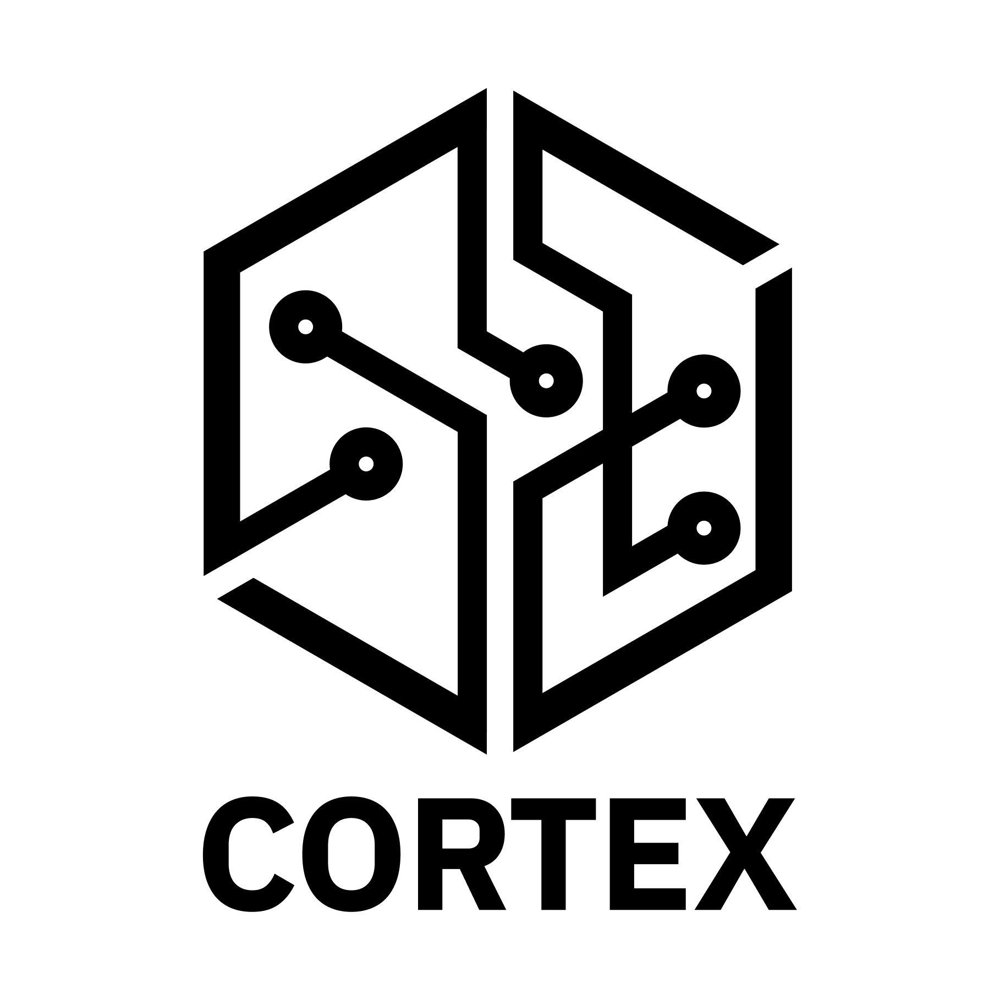

<!--
# SPDX-FileCopyrightText: Copyright 2024 SAP SE or an SAP affiliate company and cobaltcore-dev contributors
#
# SPDX-License-Identifier: Apache-2.0
-->

Cortex
======
[](https://api.reuse.software/info/github.com/cobaltcore-dev/cortex)
<a href="https://github.com/cobaltcore-dev/cortex"></a>

Cortex is an intelligent service for initial placement and scheduling of compute workloads within an [OpenStack](https://www.openstack.org/) cloud environment. It is designed to improve resource usage in a data center by making smart(er) decisions about where to place VMs, with future support planned for storage and network workloads.


Efficient and balanced resource utilization is key for cloud infrastructure providers to maintain operational performance and cost-effectiveness. In a dynamic cloud environment where workloads are constantly being created, moved, and deleted, a smart placement can help avoid resource bottlenecks and ensure high availability.

OpenStack provides core services for managing compute, storage, and network resources in a cloud environment ([learn more](https://docs.openstack.org/de/security-guide/introduction/introduction-to-openstack.html)). Cortex extends the scheduling logic of these services by adding a layer of intelligence that can make more informed decisions about where to place workloads based on the current state of the data center.

## Features

- **Data sync:** Flexible framework to sync metrics and placement information of a data center.
- **Knowledge extraction**: Logic to extract simple or advanced knowledge ("features") from the synced data.
- **Smart scheduling:** Fast and scalable scheduling pipeline for VMs based on the extracted knowledge.

## Documentation

Read the full documentation at [docs/readme.md](docs/readme.md).

## Roadmap

See our [roadmap](https://github.com/orgs/cobaltcore-dev/projects/14) and [issue tracker](https://github.com/cobaltcore-dev/cortex/issues) for upcoming features and improvements.

## Quickstart

### 1. Tilt Values Setup

Copy the example secrets values file. This file is used for local development and overrides the Helm chart values provided in [values.yaml](helm/cortex/values.yaml) for your local testing setup.
```bash
cp cortex.secrets.example.yaml "${HOME}/cortex.secrets.yaml"
```

> [!WARNING]
> It is recommended to put the secrets file somewhere outside of the project directory. In this way, it won't be accidentally committed to the repository.

After copying the file, fill in the necessary values.

Then, tell tilt where to find your secrets file:
```bash
export TILT_VALUES_PATH="${HOME}/cortex.secrets.yaml"
```

### 2. Running Tilt

Run the tilt setup in minikube:
```bash
minikube start && tilt up
```

Point your browser to http://localhost:10350/ - if you did everything correctly, you should see the cortex services spin up in the browser.

### 3. Simulate Nova Requests

To simulate Nova requests to your Cortex instance in Tilt, you can run the following command:
```bash
go run commands/fillup/fillup.go
```

The script will show where random new VMs would be placed.

## Support, Feedback, Contributing

This project is open to feature requests/suggestions, bug reports etc. via [GitHub issues](https://github.com/cobaltcore-dev/cortex/issues). Contribution and feedback are encouraged and always welcome. For more information about how to contribute, the project structure, as well as additional contribution information, see our [Contribution Guidelines](CONTRIBUTING.md).

## Security / Disclosure
If you find any bug that may be a security problem, please follow our instructions at [in our security policy](https://github.com/SAP/<your-project>/security/policy) on how to report it. Please do not create GitHub issues for security-related doubts or problems.

## Code of Conduct

We as members, contributors, and leaders pledge to make participation in our community a harassment-free experience for everyone. By participating in this project, you agree to abide by its [Code of Conduct](https://github.com/SAP/.github/blob/main/CODE_OF_CONDUCT.md) at all times.

## Licensing

Copyright 2024-2025 SAP SE. Please see our [LICENSE](LICENSE) for copyright and license information. Detailed information including third-party components and their licensing/copyright information is available [via the REUSE tool](https://api.reuse.software/info/github.com/cobaltcore-dev/cortex).
