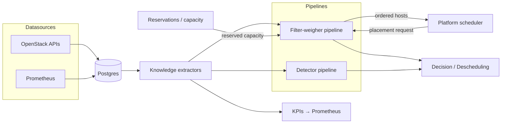

<!--
# SPDX-FileCopyrightText: Copyright SAP SE or an SAP affiliate company and cobaltcore-dev contributors
#
# SPDX-License-Identifier: Apache-2.0
-->

# What is Cortex?

Cortex is a Kubernetes operator that makes smarter placement decisions for cloud workloads. Instead
of scheduling with only the point-in-time facts a cloud platform's own scheduler sees, Cortex
continuously ingests operational data, distills it into reusable *knowledge*, and runs that knowledge
through configurable *pipelines* to influence where a workload lands — or to recommend moving one that
is already placed.

This page explains the problem Cortex solves, the components it ships as, and the single arc that
everything else in the book elaborates on. If you are impatient to run it, skip ahead to
[Local development with Tilt](07-local-development-with-tilt.md) and come back.

## Why a scheduling operator

A cloud platform's built-in scheduler (Nova for compute, Cinder for block storage, and so on) decides
placement from the state it can cheaply observe at request time. That state is narrow: it rarely
reflects historical load, cross-project commitments, hardware health trends, or capacity that is
promised but not yet consumed. Encoding that richer picture into each platform scheduler is hard and
couples policy to the platform.

There is also a *fragmentation* problem. In a typical OpenStack cloud, placement intelligence is
scattered across several independent schedulers — one inside Nova for compute, one inside Cinder for
block storage, one inside Manila for shares, network-locality logic in Neutron. Each has its own
extension mechanism, its own configuration surface, and its own copy of concerns that recur
everywhere: how to weigh load, how to respect capacity commitments, how to keep related workloads
together or apart. Improving placement means making the same change in several codebases, in several
different ways — and cross-service objectives (placing a VM near the storage it will attach, spreading
a tenant's resources across failure domains) have no single place to live at all.

Cortex takes a different stance: it treats *placement intelligence* as its own concern, deployed
beside the platform and shared across domains. The platform still owns the workload lifecycle; Cortex
supplies a better ordering of candidates (or a descheduling recommendation) built from data the
platform does not track. Because the intelligence lives outside the platform, the same model serves
compute, storage, bare metal, and Kubernetes pods, and generic scheduling logic (load balancing,
anti-affinity) is written once and reused, while domain-specific logic is layered on top.

The alternative — keep improving each platform's *own* scheduler and glue the results together — was
weighed and set aside. A hybrid like that spreads the same concerns back across every service's extension
mechanism, gives cross-service objectives nowhere central to live, and leaves each improvement to be
re-implemented per platform. A single scheduling brain, external to the platforms, is what makes the
shared logic and the cross-domain view possible at all.

> [!NOTE]
> Consolidating the logic in one operator is what makes *cross-domain* placement possible in
> principle — reasoning about compute and storage together in a single decision. Today each domain is
> scheduled independently; joint cross-domain scheduling is a future direction, not current behaviour.

## The three components

Cortex is delivered as three separately deployed components:

- **cortex core** — the `manager` binary (`cmd/manager`), packaged through the `cortex` library chart
  and the per-domain bundles (`cortex-nova`, `cortex-cinder`, `cortex-manila`, `cortex-ironcore`,
  `cortex-pods`). This runs the controllers, the knowledge pipeline, and the external scheduler API.
- **cortex-postgres** — the datastore for ingested facts and derived knowledge, a custom Postgres
  image rendered by the `cortex-postgres` library chart. See
  [Postgres and tooling](06-postgres-and-tooling.md).
- **cortex-shim** — the `shim` binary (`cmd/shim`), packaged through the `cortex-shim` library and the
  `cortex-placement-shim` bundle, presenting an OpenStack Placement-API-compatible surface. See
  [The Placement API shim](../03-reservations-and-inventory/05-placement-api-shim.md).

The next page, [Architecture at a glance](02-architecture-at-a-glance.md), explains how one binary
serves every domain and how its custom resources and controllers fit together.

## The end-to-end flow

Everything Cortex does follows one arc: raw facts become knowledge, knowledge feeds pipelines, and
pipelines emit decisions the platform acts on.

1. **Datasources** pull raw facts from OpenStack APIs and Prometheus into Postgres. See
   [Datasources](../04-knowledge-database/02-datasources.md).
2. **Knowledge extractors** turn those raw rows into features — the reusable, query-ready facts a
   pipeline step consumes. See [Feature extraction](../04-knowledge-database/03-feature-extraction.md).
3. **Reservations** hold capacity that is promised but not yet consumed — customer commitments,
   failover headroom, and in-flight placements — so a pipeline treats reserved space as unavailable
   even before a workload lands on it. See
   [Reservations overview](../03-reservations-and-inventory/01-reservations-overview.md).
4. **Filter-weigher pipelines** answer a live placement request: filters remove unsuitable hosts,
   weighers score the survivors, and the platform receives a re-ordered candidate list. See
   [The scheduling engine](../02-external-scheduler-api/01-the-scheduling-engine.md).
5. **Detector pipelines** run on a schedule to spot already-placed workloads that should move, emitting
   descheduling recommendations.
6. **KPIs** publish knowledge as Prometheus metrics for dashboards and alerting. See
   [KPIs and the Metrics API](../04-knowledge-database/04-kpis-and-metrics-api.md).

## How this relates to Cortex

This arc *is* Cortex — every feature chapter in this book slots into one of its stages. Chapter 2
covers the pipelines and the scheduler API; Chapter 3 covers reservations and inventory; Chapter 4
covers the datasource-to-KPI knowledge database. Keep the diagram above in mind as a map: whenever a
later page introduces a component, locate it on the arc first.

## Next

[Prev: Chapter 1 — Getting started](readme.md) · [Next: Architecture at a glance »](02-architecture-at-a-glance.md)
