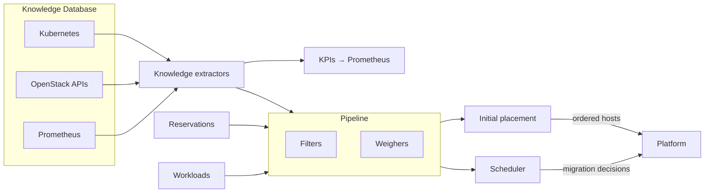

<!--
# SPDX-FileCopyrightText: Copyright SAP SE or an SAP affiliate company and cobaltcore-dev contributors
#
# SPDX-License-Identifier: Apache-2.0
-->

# What is Cortex?

Cortex is a modular and extensible service for initial placement and scheduling in large-scale cloud computing environments.
It covers multiple scheduling domains, such as compute, storage, network, and GPU, and uses pipelines to compose scheduling logic and enable cross-domain decisions.
Cortex is designed for large-scale, production environments where placement and scheduling decisions must be made timely, with low configuration effort and a minimal resource footprint.

## Motivation

Scheduling in large-scale cloud infrastructures remains challenging.
OpenStack services such as Nova, Manila, and Cinder each expose a dedicated scheduler, but they are limited to initial placement within a single domain and do not perform continuous rebalancing.
They also do not coordinate across domains, which prevents cross-domain scheduling logic such as considering storage locality when placing compute workloads.
Moreover, these systems have no concept of in-advance resource commitments, where a user reserves capacity for future use before the workload exists.

More broadly, common schedulers address domains in isolation, rely on declared resource requests rather than real-time infrastructure telemetry, and provide no unified support for both initial placement and continuous scheduling.

*Initial placement* refers to the first assignment of a workload to a target resource, such as binding a VM to a hypervisor, a volume to a storage backend when they are created.
*Scheduling* is the subsequent, continuous process of reassessing and reallocating resources to maintain stability, balance utilization, and meet operational constraints and objectives.

Cortex addresses these gaps in a unified system.
It prioritizes simplicity, speed, and scale.
Rather than pursuing globally optimal solutions via learning-based approaches or mixed-integer programming, which often require substantial computational resources and introduce additional system complexity, Cortex relies on algorithmic and heuristic logic that yields fast and approximate solutions sufficient in practice.

## Decision Model

Scheduling decisions are based on two logical requirement classes.

**Filters** enforce hard constraints, such as hardware compatibility, affinity rules, and capacity limits, and reduce the set of valid placement candidates.
Filters are applied first and ordered by cost and selectivity to minimize decision latency.

**Weighers** apply soft objectives, such as resource utilization and locality, by ordering the remaining candidates.
Individual weighers may fail without risking valid placement, but this can lead to sub-optimal decisions.

Filters and weighers are chained into **pipelines**, which are evaluated deterministically.
Given identical input, a pipeline always yields reproducible results, which simplifies debugging, validation, and operational reasoning.
Pipelines draw on a unified knowledge base that aggregates real-time infrastructure telemetry across domains.

## Multi-Pipeline Architecture

Initial placement and scheduling must handle workloads with conflicting objectives.
Within the SAP Cloud Infrastructure, for example, SAP S/4HANA workloads are bin-packed, general-purpose workloads are load-balanced, and high-availability workloads are scheduled to dedicated hosts.
Implementing these strategies within a single decision path introduces complexity and reduces transparency.

Cortex addresses this through a multi-pipeline architecture.
Workloads are organized into logical groups based on their dominant scheduling objective, and each group is managed by a dedicated pipeline.
Filters and weighers are reusable and composable across pipelines, implemented once and instantiated per pipeline, each operating without shared state.
Pipelines are intentionally kept short and explicit to ensure maintainability and traceability of scheduling decisions.

## Resource Reservations

Cortex handles both commitment reservations for long-term customers and failover capacity for high-availability scenarios.
Both are treated as active workloads using the same pipeline logic, avoiding duplication of scheduling logic.

**Commitment reservations** model customer commitments per flavor group using tokens.
Each token initially reserves capacity equal to the maximum flavor of the group.
Cortex uses the largest-fit algorithm to preserve guarantees while minimizing fragmentation.

**Failover reservations** ensure that sufficient capacity is available to restart VMs when a host fails.
Failover slots are reserved atomically at placement time, ahead of actual failover events, and are shared among eligible VMs.
The number of tolerated host failures is configurable per flavor group.

Cortex acts as the central authority for capacity management and serves as the basis for capacity forecasting and hardware delivery planning.

## Implementation

Cortex is implemented as a Kubernetes-native system with a declarative design.
Core abstractions such as pipelines and scheduling decisions are defined as Custom Resource Definitions (CRDs).
State and configuration are managed through Kubernetes objects, enabling idempotent reconciliation.
This allows operators to inspect, debug, manage, and extend Cortex with standard Kubernetes tooling, and avoids introducing proprietary APIs or hiding relevant state and audit details in databases.

Cortex is open source under the Apache license.

## The end-to-end flow

Everything Cortex does follows one arc: raw facts become knowledge, knowledge feeds pipelines, and
pipelines emit decisions the platform acts on.

```mermaid
flowchart LR
    subgraph DB[Knowledge Database]
        K8S[Kubernetes]
        OS[OpenStack APIs]
        PM[Prometheus]
    end
    K[Knowledge extractors]
    RES[Reservations]
    WORK[Workloads]

    subgraph PIPE[Pipeline]
        F[Filters]
        W[Weighers]
    end

    IP[Initial placement]
    SC[Scheduler]
    PLAT[Platform]

    K8S & OS & PM --> K
    K --> PIPE
    K --> KPI[KPIs → Prometheus]
    RES --> PIPE
    WORK --> PIPE
    PIPE --> IP
    PIPE --> SC
    IP -->|ordered hosts| PLAT
    SC -->|migration decisions| PLAT
```

1. **Datasources** pull raw facts from Kubernetes, APIs, and Prometheus and persist them in Kubernetes. See
   [Datasources](../04-knowledge-database/02-datasources.md).
2. **Knowledge extractors** turn those raw rows into features — the reusable, query-ready facts a
   pipeline step consumes. See [Feature extraction](../04-knowledge-database/03-feature-extraction.md).
3. **Reservations** hold resource capacity that is allocated in advance, such as customer commitments, failover headroom, and in-flight placements — so a pipeline treats reserved space as unavailable
   even before a workload lands on it. See
   [Reservations overview](../03-reservations-and-inventory/01-reservations-overview.md).
4. **Workloads** are the entities being scheduled, such as VMs, volumes, bare-metal nodes, and more. Both
   initial placement and continuous scheduling decisions are made on their behalf.
5. **Pipelines** consist of Filters and Weighers and provide a declarative and composable way to configure hard constraints and soft objectives. See
   [The scheduling engine](../02-external-scheduler-api/01-the-scheduling-engine.md).
6. **KPIs** publish knowledge as Prometheus metrics for dashboards and alerting. See
   [KPIs and the Metrics API](../04-knowledge-database/04-kpis-and-metrics-api.md).

This arc *is* Cortex — every feature chapter in this book slots into one of its stages. Chapter 2
covers the pipelines and the scheduler API; Chapter 3 covers reservations and inventory; Chapter 4
covers the datasource-to-KPI knowledge database. Keep the diagram above in mind as a map: whenever a
later page introduces a component, locate it on the arc first.

## Cortex in the CobaltCore ecosystem

Cortex is not a standalone product; it is the placement brain of a larger open-source platform.

- **CobaltCore** ([cobaltcore.dev](https://cobaltcore.dev/)) is the platform Cortex ships as part of —
  "infrastructure management for cloud-native and traditional workloads," pairing Kubernetes-native
  orchestration with OpenStack-compatible APIs (Nova, Neutron, Cinder, Keystone, Glance). Alongside
  Cortex it includes services such as a unified management frontend and an observability stack, all
  operated declaratively through operators and Helm charts. Cortex is the component that makes the
  platform's placement decisions smarter, using data the individual OpenStack schedulers do not track.
- **ApeiroRA** ([apeirora.eu](https://apeirora.eu/)), the Apeiro Reference Architecture, is the wider
  initiative CobaltCore belongs to: an open blueprint for a sovereign European **cloud-edge continuum**,
  developed as SAP's contribution to the IPCEI-CIS and governed for the long term under **NeoNephos**
  (part of the Linux Foundation Europe). Cortex's cloud-native, declarative approach is what lets it fit
  a construction-kit architecture built on open standards rather than proprietary lock-in.
- **Downstream services build on Cortex.** Because its scheduling is exposed as a reusable, declarative
  control plane, higher-level services delegate placement to it. **Thalamus**
  ([docs](https://cobaltcore-dev.github.io/thalamus/main/)) — a sovereign, Kubernetes-native LLM
  inference service — uses Cortex for orchestration, a concrete example of Cortex extending the platform
  well beyond OpenStack compute.

In short: Cortex reaches down into the imperative OpenStack world to gather state and influence
placement, and reaches up into the cloud-native CobaltCore/ApeiroRA ecosystem that consumes its
decisions.

## Next

[Prev: Chapter 1 - Getting started](readme.md) · [Next: Architecture at a glance »](02-architecture-at-a-glance.md)
