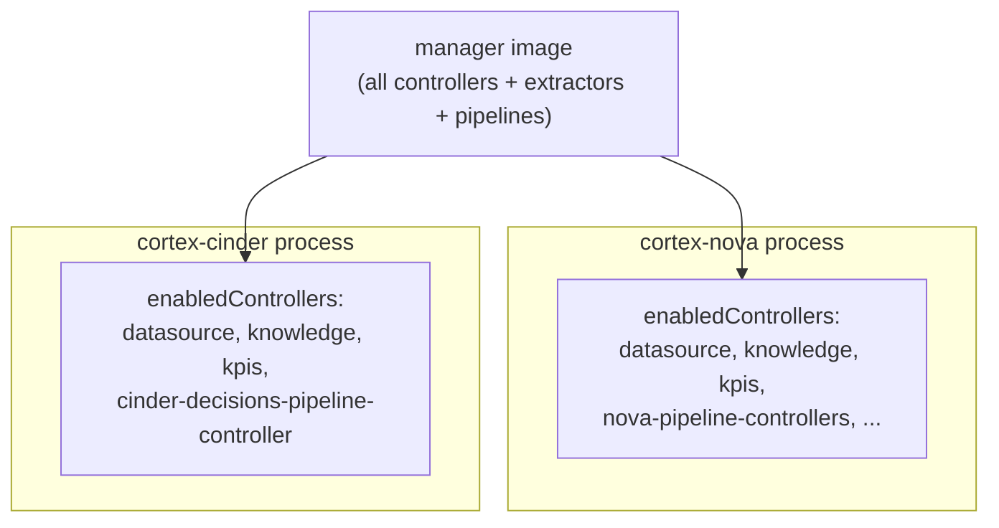
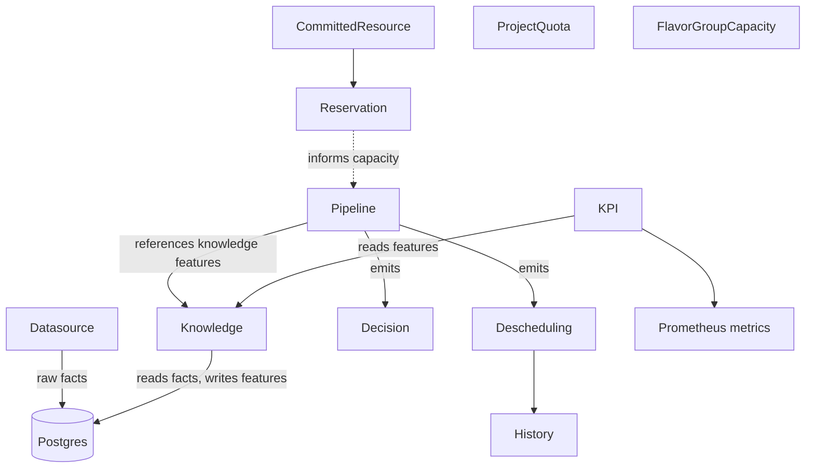

<!--
# SPDX-FileCopyrightText: Copyright SAP SE or an SAP affiliate company and cobaltcore-dev contributors
#
# SPDX-License-Identifier: Apache-2.0
-->

# Architecture at a glance

The previous page described *what* Cortex does. This page describes *how it is put together*: one
binary that serves every domain, a set of custom resources reconciled by controllers, and a design
principle — advise, don't replace — that shapes every integration. Understanding these three ideas up
front makes the feature chapters much easier to read.

## One binary, many deployments: the modular monolith

The `manager` binary is a *modular monolith*: one image contains every controller, every knowledge
extractor, and every pipeline type, but a given process runs only the subset selected by
`enabledControllers` and `enabledTasks`. There is no separate build per domain — a `cortex-nova`
deployment and a `cortex-cinder` deployment run the same binary with different lists switched on.

This keeps the code in one place — a step added for Nova is instantly available to any domain — while
letting each deployment stay small and purpose-built. The single-binary design is deliberately
decoupled from *how many* deployments you run. The straightforward shape is one Cortex deployment per
region handling every domain; the shape Cortex is built for, and the strategic target, is **one
deployment per domain**. Splitting by domain buys fault isolation (a crash loop in the storage
scheduler cannot take compute scheduling down), security isolation (each deployment holds only the
credentials its domain needs), and independent evolution (domains upgrade on their own cadence).

> [!NOTE]
> The trade-off of splitting by domain is that cross-domain decisions would then span process
> boundaries — which is why joint cross-domain scheduling remains a future direction rather than
> something the current split-by-domain deployment does today.

The exact `enabledControllers` and `enabledTasks` values are the `conf` struct each manager loads via
`pkg/conf`; see the defaults in the bundle `values.yaml` files under `helm/`.

### A point on two spectrums

The modular monolith is a deliberate midpoint, not a fixed destination. It is worth seeing it as a choice
on two independent spectrums, because Cortex is designed to move along both incrementally rather than
commit to an endpoint up front.

*How the code is structured*, from most to least coupled:

| | Internal architecture | Where Cortex sits |
|---|---|---|
| Monolith | one process, one shared codebase, no internal boundaries | — |
| **Modular monolith** | one binary, clear module boundaries, subset switched on per process | **today** |
| Distributed monolith | modules split across processes but still tightly coupled | a step toward services |
| Microservices | each domain its own independently deployable service | possible future |

*How it is deployed*, from most to least shared:

| | Deployment shape |
|---|---|
| Single deployment | one Cortex handles every domain in a region |
| Per-domain deployment | one deployment per domain (the shape Cortex is built for) |
| Shared-core | domains share a common core deployment with thin per-domain fronts |
| Shared-database | separate deployments backed by a shared datastore |

Because the internal boundaries already exist as modules, a domain can be peeled out into its own process
(moving right on the first spectrum) without a rewrite, and deployments can be consolidated or split
(moving on the second) by changing configuration rather than code. The book describes the modular-monolith,
per-domain point Cortex occupies now; treat the rest of each spectrum as directions it can grow into, not
claims about a current topology.

## Everything is a cluster-scoped custom resource

Cortex is a Kubebuilder operator: its behaviour is authored as Kubernetes custom resources and
reconciled by controllers. All Cortex kinds live in the API group `cortex.cloud/v1alpha1` and are
**cluster-scoped** — there is no per-namespace placement policy; policy is a property of the cluster
(and, in multicluster, of the availability zone). Cortex owns eleven kinds:

`Datasource`, `Knowledge`, `KPI`, `Pipeline`, `Decision`, `Descheduling`, `History`, `Reservation`,
`CommittedResource`, `ProjectQuota`, `FlavorGroupCapacity`.

It also *consumes but does not own* external kinds: `Hypervisor` (`kvm.cloud.sap/v1`) and IronCore's
`Machine`, `MachinePool`, and `MachineClass` (`compute.ironcore.dev/v1alpha1`).

- A **Datasource** declares where raw facts come from and lands them in Postgres.
- A **Knowledge** resource declares a feature extraction over those facts.
- A **Pipeline** wires ordered filter/weigher (or detector) steps that consume features and produces
  **Decision** / **Descheduling** outputs; **History** records past decisions.
- **KPI** turns features into Prometheus metrics.
- **Reservation**, **CommittedResource**, **ProjectQuota**, and **FlavorGroupCapacity** model
  promised-but-unconsumed capacity and quota (Chapter 3).

Every field of every kind is defined on the Go types under `api/v1alpha1/*_types.go`; the generated
CRD manifests are under `helm/library/cortex/files/crds/` (regenerate with `make generate`).

### How a change propagates

The controllers form a chain, each reacting to the resource before it:

1. A `Datasource` reconcile ingests raw facts on its sync schedule.
2. Knowledge controllers re-run affected extractors, writing fresh features.
3. Pipeline controllers pick up new features on the next placement request (filter-weigher) or the
   next scheduled run (detector).

Which controllers and tasks actually run is chosen per deployment through `enabledControllers` and
`enabledTasks`. A `cortex-nova` bundle enables the datasource, knowledge, KPI, and Nova pipeline
controllers; a `cortex-cinder` bundle enables the Cinder pipeline controller instead.

### The plugin model

Pipeline steps, knowledge extractors, and datasources are all *named* — a resource references a step
by name, and the binary resolves the name to code. There are three registration styles:

- **Scheduling plugins** (filters, weighers, detectors) **self-register** via `init()` into
  package-level `Index` maps of factory functions. Importing the package registers the step.
- **Knowledge extractors and KPIs** are registered in **hand-maintained static maps** — a step is
  available only if it has an entry.
- **Datasources** are dispatched by a **typed switch / map** keyed on the datasource kind.

A per-domain admission webhook validates a `Pipeline` when it is applied: it **rejects** a step whose
parameters are invalid or a step of the wrong kind for the pipeline type, but an **unknown step name is
admitted with a warning and ignored** — surfaced on the resource's `All Steps Known` (`AllStepsIndexed`)
condition rather than blocking the apply, so a rollout can reference a step a newer binary will add. To add
a step, see [Extend Cortex](../02-external-scheduler-api/07-extending-cortex.md); to inspect and edit a
deployed pipeline, see
[The scheduling engine](../02-external-scheduler-api/01-the-scheduling-engine.md#inspecting-and-editing-a-pipeline).

## Advise, don't replace

The principle that ties the architecture together is that **Cortex never owns the workload
lifecycle**. For Nova it hooks in as an *external scheduler*: the platform calls Cortex, Cortex
returns an ordering, and the platform proceeds. The platform still creates, tracks, and destroys
workloads; Cortex only re-orders the candidate hosts (or recommends a move). Operators keep escape
hatches — forced destinations bypass the pipeline entirely.

This delegation contract is the subject of
[The scheduling engine](../02-external-scheduler-api/01-the-scheduling-engine.md), where it is
explained in full. For now, hold onto the idea: Cortex is the home for scheduling *logic*, never for
scheduling *state*.

## How this relates to Cortex

These three ideas — one binary switched per deployment, a graph of cluster-scoped CRDs, and advisory
delegation — are the frame for the whole book. When a later chapter says "enable the
`capacity-controller`", it means add that string to `enabledControllers` on a manager that already
runs the shared datasource/knowledge stack. When it says "apply a `Pipeline`", it means author a
custom resource whose step names resolve to registered plugins. And when it says Cortex "recommends" a
placement, it means exactly that — the platform still decides.

## Next

[Prev: What is Cortex?](01-what-is-cortex.md) · [Next: CI/CD and packaging »](03-cicd-and-packaging.md)
