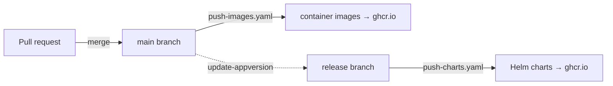

<!--
# SPDX-FileCopyrightText: Copyright SAP SE or an SAP affiliate company and cobaltcore-dev contributors
#
# SPDX-License-Identifier: Apache-2.0
-->

# CI/CD and packaging

Cortex ships as container images and Helm charts, built and published by GitHub Actions workflows
under `.github/workflows/`. This page explains what is produced, which branch produces it, and the
quality gates every change passes. You do not need to run any of this to use Cortex — but knowing the
pipeline explains where the images and charts you deploy come from, and what CI will check when you
open a pull request.

## What gets built

Cortex publishes three container images to the GitHub Container Registry (`ghcr.io`), one per
component introduced on the [previous pages](02-architecture-at-a-glance.md):

| Image | Built from | Contains |
|---|---|---|
| `ghcr.io/cobaltcore-dev/cortex` | `cmd/manager` | The `manager` binary (all controllers, extractors, pipelines). |
| `ghcr.io/cobaltcore-dev/cortex-shim` | `cmd/shim` | The `shim` binary. |
| `ghcr.io/cobaltcore-dev/cortex-postgres` | `postgres/` | The custom Postgres image (see [Postgres and tooling](06-postgres-and-tooling.md)). |

Each image is published with a build-provenance attestation (`actions/attest-build-provenance`), so a
consumer can verify the image was built by this repository's CI rather than substituted.

## The two-branch release model

Images and charts are released by **separate workflows on separate branches**, which keeps code
changes and packaging changes independent:

- **`push-images.yaml`** runs on every push to **`main`** and builds the container images. The
  Postgres and shim images are only rebuilt when their own paths change; the manager image builds each
  time.
- **`push-charts.yaml`** runs on pushes to the **`release`** branch and packages and publishes the
  Helm charts (library charts and bundles), keyed off which `Chart.yaml` files changed.
- **`update-appversion.yml`** bridges the two: after images publish, it bumps the charts' `appVersion`
  to match the newly published `latest` image and opens a pull request with that change.

> [!NOTE]
> Because charts publish from `release` and images from `main`, a chart version and the image it
> references advance on their own schedules. The `appVersion` bump PR is what keeps a released chart
> pointing at a real, published image.

## Quality gates on every change

Several workflows run on pull requests and act as gates. The ones worth knowing when you contribute:

| Workflow | Runs | Checks |
|---|---|---|
| `test.yaml` | push to `main` and PRs | `go test` with coverage over `./internal/...`, using a real Postgres container. |
| `lint.yaml` | push to `main`, PRs, manual | Runs `make crds deepcopy lint-fix` and **fails if it produces a git diff** — i.e. generated code and CRDs must be committed and up to date — then `golangci-lint`. |
| `reuse.yaml` | push and PRs | [REUSE](https://reuse.software/) license compliance: every file must carry an SPDX license header. |
| `codeql.yaml` | push/PR to `main`, weekly | CodeQL security analysis of the Go code. |
| `helm-lint.yaml` | PRs to `release` | `chart-testing` lint of changed charts. |

> [!IMPORTANT]
> `lint.yaml` regenerates CRDs and deepcopy code and fails on any diff. Always run `make generate`
> (or `make all`) and commit the result before opening a PR — see [Make targets](05-make-targets.md).
> Likewise, every new file needs the SPDX header (the four-line comment block at the top of this file)
> or `reuse.yaml` will fail.

A couple of workflows are pure automation rather than gates: `rebuild-postgres.yaml` rebuilds the
Postgres image daily and opens a PR if doing so reduces CVEs, and the `claude-*` workflows run
assistant automation. There is no separate DCO / sign-off gate in this repository.

## How this relates to Cortex

The pipeline is the bridge between the source tree you edit and the artifacts you deploy in later
chapters. When [Install a domain bundle](08-installing-a-domain-bundle.md) tells you to
`helm install cortex-nova`, that bundle came from `push-charts.yaml` and pulls the manager image built
by `push-images.yaml`. When you extend Cortex, `lint.yaml` and `reuse.yaml` are the checks your PR
must pass. The next page looks at the charts themselves.

## Next

[Prev: Architecture at a glance](02-architecture-at-a-glance.md) · [Next: The Helm charts »](04-helm-charts.md)
