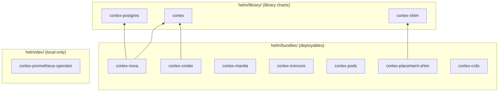

<!--
# SPDX-FileCopyrightText: Copyright SAP SE or an SAP affiliate company and cobaltcore-dev contributors
#
# SPDX-License-Identifier: Apache-2.0
-->

# The Helm charts

Cortex is deployed with Helm. The charts live under `helm/` and are organized into three tiers, so
that generic templates are written once and each deployment is a thin, domain-specific bundle on top.
This page explains the layout, the convention that lets a bundle depend on a local library chart, and
one wrinkle worth understanding early: a single bundle can run more than one manager. The exhaustive
list of values keys lives in the `values.yaml` files under `helm/library/**` (the library defaults)
and each bundle's own `values.yaml` under `helm/bundles/**`.

## Three tiers: library ← bundles ← dev



- **`helm/library/`** holds the *library charts* — `cortex` (the manager), `cortex-shim`, and
  `cortex-postgres`. These carry the shared templates and defaults; you never install them directly.
- **`helm/bundles/`** holds the *bundles* — the charts you actually install. Each bundle depends on
  one or more library charts and stylizes them for a domain: `cortex-nova`, `cortex-cinder`,
  `cortex-manila`, `cortex-ironcore`, `cortex-pods`, `cortex-placement-shim`, and `cortex-crds`.
- **`helm/dev/`** holds charts used only for local development (e.g. `cortex-prometheus-operator`).

> [!IMPORTANT]
> `cortex-crds` must be installed **first**, once per cluster — the `cortex.cloud/v1alpha1` CRDs must
> exist before any manager starts. See
> [Install a domain bundle](08-installing-a-domain-bundle.md).

## The `# from:` convention

A bundle's `Chart.yaml` references its dependencies by their published OCI location so that a released
bundle pulls released library charts:

```yaml
dependencies:
  # from: file://../../library/cortex
  - name: cortex
    repository: oci://ghcr.io/cobaltcore-dev/cortex/charts
    version: 0.4.3
    alias: cortex-scheduling-controllers
```

The `# from: file://…` comment above each dependency records where that chart lives *locally*. Three
helper scripts use it:

- **`helm/replace-oci-refs.sh`** rewrites the `oci://…` `repository` to the local `file://…` path from
  the `# from:` comment, so you can render a bundle against your working-tree library charts instead of
  the published ones.
- **`helm/sync.sh`** pulls any missing `.tgz` dependencies named in a `Chart.yaml` into the chart's
  `charts/` directory (`helm pull`).
- **`helm/cmp.sh`** compares two packaged `.tgz` charts by unpacking and diffing their contents, since
  tarball checksums differ even when the contents match — used to tell whether a chart actually
  changed.

> [!NOTE]
> Keep the `# from:` comment in sync with the real library path. The scripts key off it, and CI's
> chart lint (`helm-lint.yaml`, see [CI/CD and packaging](03-cicd-and-packaging.md)) runs against the
> bundles.

## A bundle can run more than one manager

Recall from [Architecture at a glance](02-architecture-at-a-glance.md) that the manager is a modular
monolith — one binary, different controllers switched on. A bundle exploits this by depending on the
same `cortex` library chart *more than once*, under different aliases, to run several managers with
different `enabledControllers`. `cortex-nova` is the clearest example:

```yaml
dependencies:
  - name: cortex-postgres
    # ...
  - name: cortex
    alias: cortex-knowledge-controllers   # one manager: datasource/knowledge/kpi
  - name: cortex
    alias: cortex-scheduling-controllers  # another manager: Nova pipelines + API
```

So a `cortex-nova` install brings up **two** manager Deployments (a knowledge manager and a scheduling
manager) plus a Postgres, all from the one bundle. Values for each manager are set under its subchart
alias — for example `cortex-scheduling-controllers.conf.enabledControllers`. This is why the values
reference talks about `<subchart>.conf` rather than a single top-level `conf`.

## How this relates to Cortex

The chart tiers mirror the architecture: the `cortex` library chart *is* the modular-monolith manager
packaged for Helm, and each bundle is one point in the "one deployment per domain" design from the
previous page. When Chapter 8 walks through installing a bundle, and when the reference lists
`<subchart>.conf.enabledControllers`, both are describing this structure. The published versions of
these charts come from the `release` branch via `push-charts.yaml`.

## Next

[Prev: CI/CD and packaging](03-cicd-and-packaging.md) · [Next: Make targets »](05-make-targets.md)
