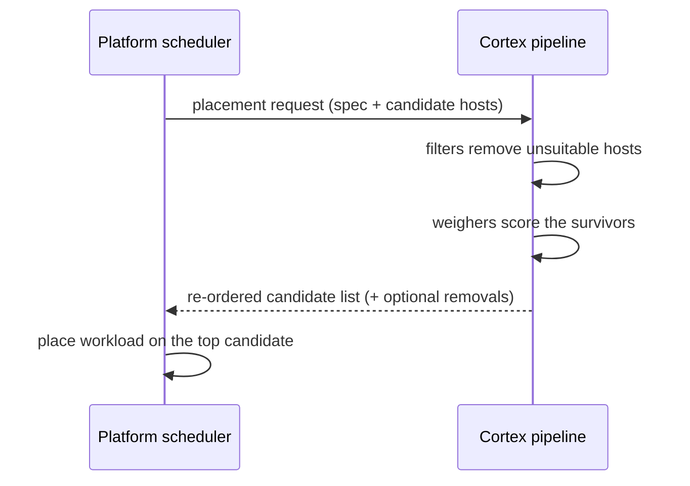
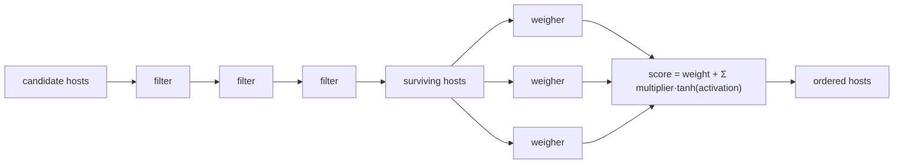

<!--
# SPDX-FileCopyrightText: Copyright SAP SE or an SAP affiliate company and cobaltcore-dev contributors
#
# SPDX-License-Identifier: Apache-2.0
-->

# The scheduling engine

Every domain Cortex schedules for — Nova, Manila, Cinder, pods, IronCore — reuses the same engine. Learn
it once here and the per-domain pages that follow can stay short: they only need to say which steps
they ship and how they hook into their platform. This page explains the delegation contract that frames
everything, the filter/weigher model for live placement, the scoring formula, and the detector model
for descheduling.

## The delegation contract

Cortex is an *external* scheduler. Today it advises rather than owning the workload lifecycle — the
principle introduced in
[Architecture at a glance](../01-getting-started/02-architecture-at-a-glance.md). For a live placement,
the platform asks Cortex to reorder a candidate list; the platform then acts on the answer:



Cortex receives the candidates *the platform already considers valid* and returns a better ordering (and
may drop hosts it deems unsuitable). In today's model it does not invent hosts, place the workload, or
track it afterwards. Operators keep escape hatches — a **forced destination** bypasses the pipeline
entirely, so an operator override always wins over Cortex's opinion.

> [!NOTE]
> This delegation contract describes the current, advisory-first integration. Cortex is in transition
> to becoming the *authoritative* scheduler for the platform, running filters against its own knowledge
> (the Hypervisor CRD, and a planned VM CRD) rather than reordering a list the platform hands it. The
> pipeline shape below is unchanged; what shifts is how much of the placement decision originates in
> Cortex. See ["Advise, don't replace — for now"](../01-getting-started/02-architecture-at-a-glance.md#advise-dont-replace--for-now).

### Advisory before drop-in

How tightly the platform binds itself to Cortex's answer is a spectrum, and integrations are meant to move
along it in two phases:

- **Advisory.** Cortex *reorders* the candidate list the platform would have used anyway. If Cortex is
  slow or unavailable, the platform can fall back to its own ordering — Cortex is off the critical path.
  This is where a new integration starts: it can be observed and tuned without being able to break
  placement.
- **Delegation (drop-in).** Once trusted, Cortex becomes the platform's scheduler for that domain — a
  drop-in replacement whose answer the platform takes directly. The gain is that Cortex's richer knowledge
  fully drives placement; the cost is that Cortex is now on the critical path and must be treated as such.

The two phases share exactly the same pipeline; what changes is whether the platform treats Cortex's
output as a hint or as the decision.

### Initial placement is not ongoing scheduling

A platform's "scheduler" typically decides only *initial placement* — where a workload lands when it is
first created. Keeping a workload well-placed over its lifetime (rebalancing a workload whose neighbours
got noisy, draining a host) is a separate, ongoing activity. Cortex covers both, but as two pipeline
shapes: a filter-weigher pipeline answers the initial-placement request described above, and a **detector
pipeline** (below) handles ongoing scheduling by recommending moves. They share heuristics — the same
knowledge and often the same weighers — but run at different times and produce different outputs, so it is
worth keeping the two ideas distinct.

## Filters and weighers

A **filter-weigher pipeline** answers a live placement request in two stages, both defined in the shared
`internal/scheduling/lib`:



- **Filters run sequentially.** Each filter *removes* hosts that fail its rule — a host rejected by one
  filter is gone and later filters never see it. Order can matter for cost (put cheap, high-rejection
  filters first) but not for correctness: the result is the set intersection of every filter's "kept"
  set.
- **Weighers run in parallel.** Each surviving host starts from a base **weight**, and every weigher
  emits an **activation** for that host — a signed number expressing how much this weigher likes or
  dislikes it. The activations are combined into a final score.

The scoring formula squashes each weigher's activation through `tanh` before applying that weigher's
`multiplier`, so no single weigher can dominate the sum no matter how large its raw activation:

```
score(host) = weight + Σ_w  multiplier_w · tanh(activation_w(host))
```

`tanh` bounds each term to `(-1, +1)`, so a weigher's influence is capped at ±`multiplier`. Hosts are
returned highest score first.

> [!NOTE]
> This is why weighers can be developed independently and combined freely: each contributes a bounded,
> additive term. Tuning placement is largely a matter of setting each weigher's `multiplier` in the
> `Pipeline` resource — see the `Pipeline` type in `api/v1alpha1/pipeline_types.go`.

## Detectors and descheduling

Not every decision is about a *new* workload. A **detector pipeline** runs on a schedule and inspects
*already-placed* workloads, emitting **descheduling** recommendations — "this workload would be better
off somewhere else." Detectors are the pipeline shape behind the `Descheduling` CRD
(`api/v1alpha1/descheduling_types.go`): where a filter-weigher pipeline reorders candidates
for one incoming request, a detector sweeps the current placement and flags what should move. As with
initial placement, the recommendation is advisory — Cortex records it; the platform (or an operator)
decides whether to act.

## How steps are named and registered

Pipeline steps are referenced by **name** from a `Pipeline` (or descheduling) custom resource, and the
manager resolves each name to code. Scheduling steps — filters, weighers, and detectors — **self-register**
via `init()` into package-level `Index` maps of factory functions: importing the package that defines a
step is what makes its name resolvable. A per-domain admission webhook validates a `Pipeline` on create
and update, but it does *not* reject an unknown step name: an unrecognized name is **admitted with a
warning and then ignored** at run time, so a pipeline can safely reference a step that a newer binary will
add without breaking the rollout. What the webhook *does* reject is a known step whose parameters are
invalid, or a step of the wrong kind for the pipeline `type` (a detector in a filter-weigher pipeline, or
a filter/weigher in a detector pipeline), or an unknown `type`. The next section shows both outcomes in
practice. (Knowledge extractors and KPIs use hand-maintained maps instead — see
[Architecture at a glance](../01-getting-started/02-architecture-at-a-glance.md).)

## Inspecting and editing a pipeline

A `Pipeline` is a cluster-scoped custom resource (`api/v1alpha1/pipeline_types.go`), so there is no
namespace to pass. List what is deployed:

```bash
kubectl get pipelines
```

```
NAME                                  DOMAIN   TYPE             ALL STEPS READY   ALL STEPS KNOWN   PIPELINE READY
kvm-general-purpose-load-balancing    nova     filter-weigher   True              True              True
kvm-descheduler                       nova     detector         True              True              True
```

The three status columns come from the pipeline's conditions and answer different questions:

- **All Steps Known** (`AllStepsIndexed`) — every step *name* referenced in the spec resolves to code in
  the running binary. This is the column that goes `False` when a pipeline references a step the binary
  does not have (the same case the webhook only *warns* about) — the unknown step is silently ignored, so
  watch this condition rather than assuming a successful apply means every step is active.
- **All Steps Ready** (`AllStepsReady`) — the known steps are initialized and ready to run.
- **Pipeline Ready** (`Ready`) — the pipeline as a whole is usable.

Read the full spec and conditions with:

```bash
kubectl get pipeline kvm-general-purpose-load-balancing -o yaml
```

### Adding or removing a filter or weigher

A filter-weigher pipeline lists its steps in two ordered blocks — `filters` run first and sequentially,
then `weighers` score in parallel. Each step is matched to registered code **by `name`**; a weigher may
carry an optional `multiplier`:

```yaml
apiVersion: cortex.cloud/v1alpha1
kind: Pipeline
metadata:
  name: kvm-general-purpose-load-balancing
spec:
  schedulingDomain: nova
  type: filter-weigher
  filters:
    - name: filter_correct_az
    - name: filter_has_enough_capacity      # order matters: cheap, high-rejection filters first
  weighers:
    - name: kvm_binpack
      multiplier: 1.0
    - name: kvm_prefer_smaller_hosts
      multiplier: 0.5
```

To change the pipeline, edit the resource and re-apply — add a step by inserting it in the list (position
sets filter order), remove one by deleting its entry:

```bash
kubectl edit pipeline kvm-general-purpose-load-balancing
# or
kubectl apply -f kvm-general-purpose-load-balancing.yaml
```

### What the webhook does on that edit

The per-domain admission webhook (`internal/scheduling/lib/pipeline_webhook.go`) runs on every create and
update and has two distinct behaviours:

- **Rejected** — the apply fails with a validation error if a step's `params` are invalid, if a step is
  the wrong kind for the `type` (e.g. a `detectors:` entry in a `filter-weigher` pipeline, or a
  `filters:`/`weighers:` entry in a `detector` pipeline), or if the `type` itself is unknown:

  ```
  Error from server (Forbidden): error when applying: admission webhook "..." denied the request:
  pipeline is invalid: weigher "kvm_binpack": <parameter error>; detectors are not allowed in a filter/weigher pipeline
  ```

- **Admitted with a warning** — an unknown step *name* does not block the apply; the resource is accepted
  and the unknown step is ignored:

  ```
  Warning: unknown weigher "kvm_typo": this weigher will be ignored
  pipeline.cortex.cloud/kvm-general-purpose-load-balancing configured
  ```

  This is deliberate: it lets a pipeline reference a step a newer binary will introduce without breaking a
  staged rollout. The consequence surfaces on the resource itself — its **All Steps Known** condition goes
  `False` — so after an edit, confirm that column is `True` rather than trusting that the apply succeeded.

This engine is the machinery under stage 4 and 5 of the [end-to-end flow](../01-getting-started/01-what-is-cortex.md):
filter-weigher pipelines answer live requests, detector pipelines produce descheduling recommendations.
Every weigher and filter reads *features* produced by the knowledge database ([Chapter 4](../04-knowledge-database/readme.md)),
and capacity a pipeline must respect comes from reservations ([Chapter 3](../03-reservations-and-inventory/readme.md)).
The remaining pages in this chapter are each just a set of steps plugged into this engine for one
platform — starting with the one Cortex was built for first, Nova.

## Next

[Prev: Chapter 2 — The external scheduler API](readme.md) · [Next: Nova smart scheduling »](02-nova-smart-scheduling.md)
