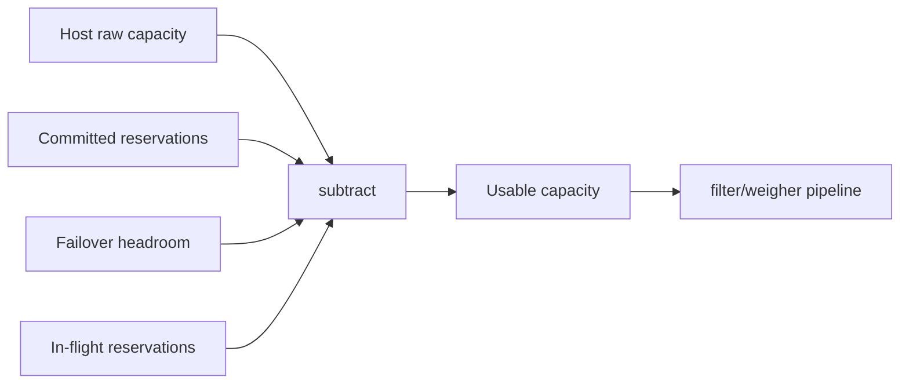

<!--
# SPDX-FileCopyrightText: Copyright SAP SE or an SAP affiliate company and cobaltcore-dev contributors
#
# SPDX-License-Identifier: Apache-2.0
-->

# Reservations overview

Placement is not only about *where a workload could go right now* — it is also about *space that is
promised but not yet consumed*. A **Reservation** models that promised space so the scheduler treats it as
unavailable and never hands it to someone else. This page introduces the three kinds of reservation and
the single idea that unites them: subtract promised space from usable capacity *before* a pipeline scores
hosts.

## Promised space is subtracted from usable capacity

A filter-weigher pipeline ([Chapter 2](../02-external-scheduler-api/readme.md)) asks "how much room does
each host have?" Reservations change the answer: a host's *usable* capacity for a new request is its raw
capacity minus everything already reserved on it.



The rest of this chapter is about *how* each kind of reservation is created and maintained; this page is
about *what* they are.

## The three kinds

### Committed-resource reservations

These come from **customer commitments** synced from Limes — capacity a customer has paid to have
available. Cortex turns each commitment into a `CommittedResource` resource and reserves capacity for it so
scheduling honours the promise. Memory commitments reserve an actual *slot* on a host; CPU-only commitments
are checked arithmetically against headroom. This is the subject of
[Committed-resource reservations](02-committed-resource-reservations.md).

### Failover reservations

These reserve **headroom for evacuation**: if a host fails, its workloads need somewhere to land. Cortex
pre-clears space to absorb up to `m` simultaneous host failures, shared across the protected workloads
rather than duplicated per workload. This is the subject of
[Failover reservations for KVM HA](03-failover-reservations.md).

### In-flight reservations

These prevent **double-spend during the placement window**. Many requests race for the same finite
capacity; the moment Cortex recommends a host, a parallel request could try to claim the same slot. An
in-flight reservation blocks that capacity from "decided" until "running", then releases it. The
`inflight-reservation-controller` maintains these.

> [!NOTE]
> The reasoning here is pessimistic by necessity: because concurrent requests race, Cortex assumes a slot
> it just recommended is already taken until the placement is realized or abandoned. In-flight
> reservations are the persistence layer behind the scheduler's concurrency handling —
> [Concurrency and in-flight reservations](04-concurrency-and-in-flight-reservations.md) explains the
> races they defend against and how the scheduler serializes around them.

## Inspecting reservations

All three kinds are the same cluster-scoped `Reservation` CRD (`api/v1alpha1/reservation_types.go`),
distinguished by a `reservations.cortex.cloud/type` label. List them:

```bash
kubectl get reservations
```

```
TYPE                 HOST      READY   RESOURCEGROUP   PROJECT     AZ     ENDTIME
committed-resource   node-042  True    mem-large       proj-1234   az-a   2026-12-01T00:00:00Z
failover             node-017  True                                az-a
```

`Type` tells the three apart; `Host` (`.status.host`) is where the reservation is held. Filter to one kind
with the label, and read the full spec/status — including per-kind allocation detail — with `-o yaml`:

```bash
kubectl get reservations -l reservations.cortex.cloud/type=committed-resource
kubectl get reservation <name> -o yaml
```

## What reservations do and do not do today

> [!IMPORTANT]
> Cortex creates and tracks reservations so the scheduler treats reserved space as unavailable. Hard
> *enforcement* — actively refusing a placement that would eat into another tenant's committed slot — is a
> planned direction. Treat today's behaviour as **reserving and reporting**, not blocking.

The controllers involved are enabled per deployment in `enabledControllers` (and, for commitments, a
`commitments-sync-task` in `enabledTasks`): `committed-resource-reservations-controller`,
`inflight-reservation-controller`, `failover-reservations-controller`, `capacity-controller`, and
`quota-controller`. Their exact configuration is the `conf` struct the manager loads via `pkg/conf`;
see the defaults in the bundle `values.yaml` files under `helm/`.

## How this relates to Cortex

Reservations are the "reserved capacity" input to the [end-to-end flow](../01-getting-started/01-what-is-cortex.md):
they feed the filter-weigher pipelines so a weigher like Nova's `kvm_committed_resource_reservation`
([Nova smart scheduling](../02-external-scheduler-api/02-nova-smart-scheduling.md)) can bias away from
reserved space. Each reservation kind is a variant of the `Reservation` CRD, defined in
`api/v1alpha1/reservation_types.go`. The next page goes deep on the most involved kind —
committed resources and the Limes quota/capacity controllers that support them.

## Next

[Prev: Chapter 3 — Reservations and inventory](readme.md) · [Next: Committed-resource reservations »](02-committed-resource-reservations.md)
