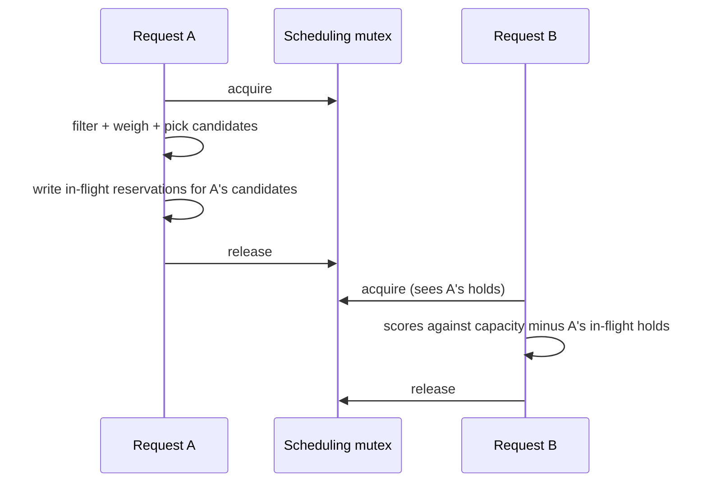

<!--
# SPDX-FileCopyrightText: Copyright SAP SE or an SAP affiliate company and cobaltcore-dev contributors
#
# SPDX-License-Identifier: Apache-2.0
-->

# Concurrency and in-flight reservations

Committed and failover reservations model space promised *ahead of time*. This page is about the other
source of promised space: the sliver of time between the moment Cortex **recommends** a host and the
moment the platform **confirms** the workload actually landed there. During that window Cortex is
uncertain where the workload will end up, and other requests are scheduling in parallel. **In-flight
reservations** are how Cortex stays correct across that uncertainty. This page explains the races they
defend against, how Cortex learns what the platform actually did, and the mutex that serializes the whole
thing.

## Why concurrency is hard here

Cortex *recommends*; the platform *executes* (the delegation contract from
[The scheduling engine](../02-external-scheduler-api/01-the-scheduling-engine.md)). That split creates two
gaps that a single-request view hides:

- **Location uncertainty.** Cortex returns an *ordered list* of candidates, not a single host. The
  platform normally takes the top one, but it may fall through to a lower candidate — so until the
  platform reports back, Cortex does not know which host the workload is on.
- **A feedback gap.** Confirmation of the final location arrives later, asynchronously, and sometimes not
  at all (a request can be abandoned). Between recommendation and confirmation, Cortex has to act on a
  guess.

On its own that is tolerable. Under **concurrency** it is not: many requests are being scored at the same
time against the same finite capacity, each one making its own guess, and their guesses can collide.

## The races

Three distinct collisions can happen if concurrent requests are scored against stale capacity:

- **Anti-affinity race.** Two members of the same anti-affinity group are scheduled at nearly the same
  moment. Each request, scoring in isolation, sees the *other* member as not-yet-placed and picks the same
  best host — landing two workloads together that were required to be apart.
- **Capacity-versus-reservation race.** A pay-as-you-go workload is scored against a host whose free space
  is really being held for a committed reservation. If the reservation's hold is not yet visible, the
  pay-as-you-go workload consumes the space the reservation was promising.
- **Reservation-slot double-booking.** Two requests both target the same reservation slot, each unaware
  the other is about to claim it, and both are told it is theirs.

The common root is the same in all three: a request scored a host using a capacity picture that did not
yet reflect a placement another request had already set in motion.

## In-flight reservations: making a pending placement visible

The fix is to make an *unconfirmed* placement subtract from usable capacity immediately, exactly as a
committed or failover reservation does — so the next request scores against the world as it will be, not
as it was. Cortex writes an **in-flight reservation** the moment it recommends, before the platform has
confirmed anything:

- **One reservation per candidate.** Because Cortex does not know which candidate the platform will pick,
  it reserves for the candidates it handed back, not just the top one. For a migration it also reserves
  the **source** host, so the space being vacated is not treated as free before the move completes.
- **Same-workload exclusion.** When a later request scores capacity, it must ignore the in-flight
  reservations that belong to *this same workload* (matched by the workload's own identifier) — otherwise
  a workload would appear to compete with itself and be pushed off every host it was just offered.
- **TTL expiry.** An in-flight reservation is a guess with a shelf life. If confirmation never arrives, it
  expires after a time-to-live and releases its capacity, so an abandoned request cannot strand space
  forever.

## Learning what the platform actually did

In-flight reservations are only half the story: they express Cortex's *guess*, and the guess has to be
reconciled with reality. Two feedback channels close that loop:

- **Exclusion hints on the request.** When the platform retries a placement, it tells Cortex which hosts
  it has already ruled out (an `ignore_hosts`-style list). Cortex feeds those forward so the next scoring
  round does not re-offer a host the platform has already rejected.
- **Watching the reservation resources.** Cortex watches its own reservation resources and reconciles
  in-flight state against confirmed placements as they arrive — promoting a guess to a confirmed slot when
  the platform lands where expected, and dropping the other per-candidate guesses for that workload.

Because the platform's retry behaviour is not uniform, the number of candidates Cortex offers is matched
to how the caller retries:

| Caller retry behaviour | Candidate strategy |
|---|---|
| Tries the first host, then a bounded set of alternates | Offer a small set of candidates, reserve each |
| Retries repeatedly, growing its `ignore_hosts` set each time | Offer a single best candidate; the exclusion list drives the next attempt |
| Tries only the first host and does not retry | Offer a single candidate, chosen with a little randomness so a burst does not stampede one host |

Matching the offer to the retry pattern keeps the in-flight reservations Cortex writes close to what the
platform will actually attempt, so fewer guesses have to be expired unused.

## The serialization mechanism

Feedback and TTLs keep the *steady state* correct, but the races above happen in a window measured in
milliseconds — two requests scoring literally at once. To close that window, Cortex holds a **mutex across
the whole scheduling pipeline *and* the creation of the in-flight reservations**, not just around the
capacity read. A request filters, weighs, picks its candidates, and writes their in-flight reservations
before the next request begins scoring. By the time the second request reads capacity, the first request's
holds are already in place — so the second request scores against a world that includes them, and the
collision cannot form.

Serializing the pipeline trades some scheduling throughput for correctness. It is a deliberate choice: a
placement decision is cheap to compute but expensive to get wrong, and the alternative — letting requests
race and repairing collisions after the fact — is exactly the failure this whole mechanism exists to
prevent.

> [!NOTE]
> This describes the concurrency design behind the `inflight-reservation-controller` and the scheduler's
> handling of parallel requests. As with the other reservation kinds, in-flight reservations *reserve and
> report* — the enforcement is that concurrent requests see each other's holds, not that a placement is
> hard-refused. See [Reservations overview](01-reservations-overview.md).

## How this relates to Cortex

In-flight reservations are the third term subtracted from usable capacity in
[Reservations overview](01-reservations-overview.md), and the one that only exists because Cortex is an
*advisor*: an owner of the workload lifecycle would know where each workload is, but Cortex must infer it
from what it recommended and what the platform reports. That is why the same recommend-don't-execute
contract that shapes the [scheduling engine](../02-external-scheduler-api/01-the-scheduling-engine.md)
reappears here as a concurrency problem. With every kind of reserved capacity now covered, the final page
of this chapter turns from capacity Cortex *reserves* to inventory Cortex intends to *serve*: the
Placement API shim.

## Next

[Prev: Failover reservations](03-failover-reservations.md) · [Next: The Placement API shim »](05-placement-api-shim.md)
