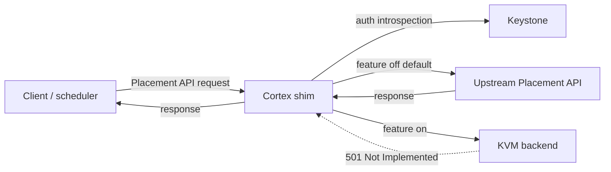

<!--
# SPDX-FileCopyrightText: Copyright SAP SE or an SAP affiliate company and cobaltcore-dev contributors
#
# SPDX-License-Identifier: Apache-2.0
-->

# The Placement API shim

The Cortex shim presents an interface that speaks the OpenStack Placement API, sitting between clients and
a real Placement service. It exists so Cortex can *observe* — and eventually *serve* — the placement
traffic that shapes scheduling, without any client having to know Cortex is there. This page explains why
the shim is a separate component, how a request flows through it, what it does today (passthrough) versus
the KVM backend it is built for, and how it is deployed and kept alive.

## Why a separate shim

The Placement API is a hot path: schedulers hit it constantly to learn about resource providers,
inventories, and allocations. Cortex wants visibility into that traffic and, over time, the ability to
answer parts of it from its own knowledge — for example, a KVM-aware backend. Building that into the
manager would couple a latency-sensitive proxy to the manager's reconcile loops. Instead the shim is a
distinct binary (`shim`, chart `cortex-placement-shim`) tuned for request serving and resilience.

The deeper motivation is that Cortex wants to become *hypervisor-aware* without asking any client to know
it exists. Placement is the natural seam: clients already speak it, so a component that speaks the same
protocol can sit in front of the real Placement service and be indistinguishable from it. That lets Cortex,
over time, serve the parts of the placement world it understands best — KVM hosts, whose authoritative
state Cortex intends to hold in Kubernetes-native custom resources — while transparently forwarding
everything else (VMware, bare metal) to upstream Placement.

## Request flow: passthrough by default

The shim exposes the Placement API endpoint groups. Each group is independently switchable between two
modes via `features.*` toggles:



- **Passthrough (default, toggle off)** — the request is proxied unchanged to upstream Placement and the
  response returned to the client. Clients behave exactly as if talking to Placement directly.
- **KVM backend (toggle on)** — the request is meant to be answered from Cortex's own model.

> [!WARNING]
> The KVM backend is **not yet implemented**. Any endpoint group whose toggle is `true` currently returns
> `501 Not Implemented`. Leave the toggles at their default `false` for pure passthrough.

The eleven toggles are per endpoint group — `root`, `resourceProviders`, `traits`,
`resourceProviderTraits`, `resourceClasses`, `inventories`, `aggregates`, `allocations`, `usages`,
`allocationCandidates`, and `reshaper` — so an operator can migrate one surface at a time once the backend
exists.

## Routing by provider, not by caller

A Placement request is either *about a specific resource provider* (read this provider's inventory, write
that provider's allocations) or *aggregated* across many (list all providers, or all candidates that could
satisfy a request). The shim's routing follows that split:

- **Per-provider requests** are routed by the identity of the *provider* the request concerns — which
  hypervisor it is about — not by which client sent it. A KVM host would be answered from Cortex's model; a
  non-KVM provider is forwarded upstream.
- **Aggregated (list) requests** cannot be routed to a single place, so the shim fans out, collects the
  pieces, and merges them into one response.

Keying on the provider rather than the caller keeps access uniform: whether Nova, Neutron, or another
service is asking, the same provider yields the same answer, so the shim needs no per-client model of who
may see what.

Routing by provider — rather than by *service* — is also forced by how Placement models the world.
Different services do not own disjoint slices of the resource-provider tree: a compute host's provider and
the network providers layered onto it (for example, bandwidth providers modelled as children of the
compute-node provider) live in **one shared topology** that Nova and Neutron both read. There is no clean
"Nova traffic here, Neutron traffic there" split to route on, because a single provider subtree is
relevant to several services at once. The provider is the only stable key that every caller agrees on.

## One endpoint, layered like an onion

Because the shim is protocol-compatible, the intended deployment repoints the service catalog at it
*globally* — every client in the region resolves Placement to the shim. Steering only some clients would
create two disagreeing views of the same world; a single endpoint gives everyone one consistent state. The
trade-off is blast radius: one shared endpoint is also one thing that, if it misbehaves, affects everyone —
which is why the safety design matters.

The shim is layered like an onion, and a request peels off at the outermost layer that can answer it. A
request the shim can forward without understanding — anything destined for upstream — peels off early and
never touches the KVM-modelling layers. That is deliberate: a non-KVM request's fate does not depend on the
health of the KVM-serving code. Meta endpoints (the microversion handshake, known resource classes, known
traits) describe the *vocabulary* of Placement itself; upstream remains authoritative for them and the shim
forwards them, which is why even the planned shim is a *partial* replacement.

## Planned: the KVM backend and cutover

Everything above describes the shape the shim is built for. The KVM-serving backend that fills it in is not
implemented yet. The intended design, for context:

- **CRD-backed inventory and allocations.** Cortex would hold the authoritative inventory *and
  allocations* for KVM hosts in its own custom resources — allocations recorded on the workload's own
  (VM) resource — and serve provider-specific endpoints from that state instead of forwarding. This is
  more demanding than caching: Placement clients expect **read-after-write** (an allocation written by one
  call is visible to the next) and the platform's conductor validates a provider's **consumer generation**
  on write to detect concurrent modification. So the store backing a provider the shim *serves* has to be
  strongly consistent for that provider, not eventually consistent — a written allocation must be
  immediately readable and its generation must advance monotonically.
- **A reconciling cutover.** Moving a surface from upstream to Cortex would be a reconciliation, not a flag
  flip: a sync-controller brings Cortex's model and upstream into agreement by **reading the Placement
  API** (never the underlying Placement database, so it depends only on the public contract), exposes the
  remaining divergence as **delta metrics** so operators watch it shrink toward zero, and supports moving
  in **both directions** so a migration can be rolled back as safely as it was rolled forward. The
  controller *reconciles* the two views continuously rather than replaying a one-shot dump — a reconciled
  surface that drifts is pulled back into agreement instead of silently diverging.

> [!NOTE]
> This section describes planned behaviour. Today the shim is a passthrough proxy with the auth and
> resilience properties below; no endpoint is served from a Cortex-owned KVM model yet.

## Deploying the shim

Point the shim at upstream Placement (and, for auth, Keystone) under the `cortex-shim.conf` block — the
bundle imports the `cortex-shim` library under that alias:

```yaml
# values.yaml
cortex-shim:
  conf:
    placementURL: https://placement.example.com
    keystoneURL: https://keystone.example.com
```

```bash
helm install cortex-placement-shim helm/bundles/cortex-placement-shim --values values.yaml
```

The shim starts with `--placement-shim` and `--self-heal` on by default. With no `features.*` toggles set,
every group proxies to upstream — send a request through the API bind address (`:8080` by default) and you
get the upstream response back.

> [!IMPORTANT]
> Leader election must stay disabled for the shim — the binary errors out if `--leader-elect` is set, and
> the chart does not expose a toggle. The flags are defined in `cmd/shim/main.go`.

## Authentication

When an `auth` block is configured, the shim introspects the caller's `X-Auth-Token` against Keystone and
checks it against ordered policies (`METHOD /path` → allowed roles, optional project scope). First match
wins; no match denies with `403`; an empty role list makes an endpoint public. Introspection results are
cached for `tokenCacheTTL`. When `auth` is absent, all requests pass through unauthenticated.

```yaml
cortex-shim:
  conf:
    auth:
      tokenCacheTTL: 5m
      policies:
        - pattern: "GET /resource_providers"
          roles:
            - name: reader
        - pattern: "PUT /resource_providers/*"
          roles:
            - name: admin
              projectScope:
                from: query
                param: project_id
```

> [!NOTE]
> `projectScope` is an object, not a boolean. `from` selects where the project ID is read — `query` (with
> `param`), `body` (with `field`), or `header` — and Cortex checks the caller's token is scoped to that
> project. Omit `projectScope` for a role that is not project-scoped.

## Self-healing supervisor

The shim's controller-manager (cache + controllers) is not on the request path, but the request path must
stay up even if the manager cannot reach the apiserver. With `--self-heal` (default **on**) the manager
runs under the [supervisor](../06-cortex-library/09-supervisor.md), which rebuilds it with backoff
on failure, while the REST API, liveness probe, and metrics endpoint run in a durable outer process. The
pod does not crash on apiserver or cache hiccups; a looping manager is surfaced through
`cortex_placement_shim_manager_up`.

In self-heal mode the metrics server is plain `promhttp` (no TLS/authz), so `--metrics-secure` and
`--metrics-cert-path` are rejected when metrics are enabled. Set `--self-heal=false` for coupled mode,
where a manager failure exits the process.

## How this relates to Cortex

The shim is the third Cortex component ([What is Cortex?](../01-getting-started/01-what-is-cortex.md)) and
the piece through which Cortex intends to become the *authority* for inventory, not just an advisor on
placement. Today it is a resilient, auth-aware passthrough proxy; its planned KVM backend would let it
serve provider data from Cortex-owned CRDs, closing the loop with the reservations and knowledge of the
rest of this book. With inventory covered, the next chapter turns to where all these features get their
facts: the knowledge database.

## Next

[Prev: Concurrency and in-flight reservations](04-concurrency-and-in-flight-reservations.md) · [Next: Chapter 4 — The knowledge database »](../04-knowledge-database/readme.md)
