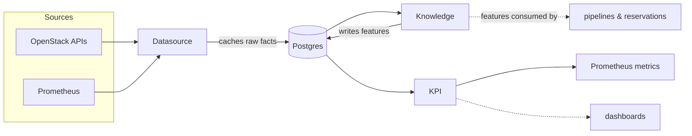

<!--
# SPDX-FileCopyrightText: Copyright SAP SE or an SAP affiliate company and cobaltcore-dev contributors
#
# SPDX-License-Identifier: Apache-2.0
-->

# The knowledge flow

Everything Cortex decides rests on *knowledge*: a continuously refreshed picture of the environment,
distilled from raw operational data into query-ready facts. This page gives the end-to-end shape of that
flow — datasource to feature to KPI — so the pages that follow can each go deep on one stage. If you read
[What is Cortex?](../01-getting-started/01-what-is-cortex.md), this is the left-hand half of that arc,
examined closely.

## Three stages, three CRDs

Knowledge moves through three named custom resources, each reconciled by its own controller:

1. A **Datasource** declares where raw facts come from — an OpenStack API or Prometheus — and caches them
   into Postgres on a sync interval. Covered in [Datasources](02-datasources.md).
2. A **Knowledge** resource declares a named *extractor* that reads those raw rows and writes enriched
   **features** back to Postgres. Covered in [Feature extraction](03-feature-extraction.md).
3. A **KPI** turns features into Prometheus gauges for dashboards and alerts. Covered in
   [KPIs and the Metrics API](04-kpis-and-metrics-api.md).

The features written in stage 2 are the query-ready facts every pipeline step and reservation controller
reads — the join between this chapter and the rest of the book.

## Why the intermediate "feature" step

Cortex could feed raw datasource rows straight to pipeline steps, but it deliberately does not. Extracting
features first means the expensive work — joining a hypervisor's inventory with its usage, computing a
utilization percentage, aggregating a metric over a window — happens *once*, on a schedule, and is stored.
A pipeline step then reads a ready-made feature instead of recomputing it on every placement request. It
also means a feature can be reused: many weighers can read the same `host-utilization` feature without each
re-deriving it.

## How a change propagates

The three controllers form a chain, each reacting to the resource before it (the general pattern from
[Architecture at a glance](../01-getting-started/02-architecture-at-a-glance.md)):

1. A `Datasource` reconcile ingests raw facts on its sync schedule, writing rows to Postgres.
2. Knowledge controllers re-run affected extractors, writing fresh features.
3. KPIs re-publish, and pipeline/detector steps pick up the new features on their next run.

A `Knowledge` resource names its input datasources in `dependencies.datasources`, and those datasources
must exist and be Ready before the extractor runs — the dependency is explicit, so the chain is
deterministic.

## How this relates to Cortex

This flow is the supply side for every decision in the book: the weighers of
[Chapter 2](../02-external-scheduler-api/readme.md) read features, the reservation controllers of
[Chapter 3](../03-reservations-and-inventory/readme.md) read datasource facts and features, and the
overcommit controller of [Chapter 5](../05-hypervisor-lifecycle/readme.md) acts on them. The three CRDs
here are defined field-by-field on the Go types under `api/v1alpha1/*_types.go`. The next page starts
at the source: datasources.

## Next

[Prev: Chapter 4 — The knowledge database](readme.md) · [Next: Datasources »](02-datasources.md)
