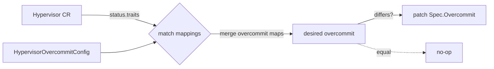

<!--
# SPDX-FileCopyrightText: Copyright SAP SE or an SAP affiliate company and cobaltcore-dev contributors
#
# SPDX-License-Identifier: Apache-2.0
-->

# Automated overcommit management

Overcommit — telling a hypervisor it may hand out more virtual CPU or memory than it physically has — is a
lever operators normally set by hand, per host, and forget. Cortex turns it into a reconciled policy: you
describe *which kinds of host get which ratios* once, and the overcommit controller keeps every matching
`Hypervisor` custom resource set to that ratio, across clusters, as the fleet changes. This is the first
step of managing hypervisor lifecycle from Cortex rather than out-of-band.

## A policy, not a per-host setting

The `hypervisor-overcommit-controller` (`internal/scheduling/nova/hypervisor_overcommit_controller.go`) reads
a `HypervisorOvercommitConfig` — a list of *mappings*, each saying "hosts matching this trait get these
overcommit ratios":

```yaml
overcommitMappings:
  - hasTrait: COMPUTE_STATUS_ENABLED
    overcommit:
      cpu: 4.0
      memory: 1.5
  - hasntTrait: CUSTOM_HANA
    overcommit:
      cpu: 8.0
```

Each mapping has an `overcommit` map (resource name → ratio) and exactly one trait gate:

- **`hasTrait`** — the mapping applies to a hypervisor whose `status.traits` *contains* that trait.
- **`hasntTrait`** — the mapping applies to a hypervisor that *lacks* that trait.

The two are mutually exclusive and one is required: the config's `Validate()` rejects a mapping with both
set or neither. Ratios must be `>= 1.0` (an overcommit below 1.0 would under-report real capacity), and a
value below that is a validation *error* — the config is rejected, not silently ignored. Mappings are applied
in order, and a later mapping overrides an earlier one for the same resource, so you can layer a broad
default under a narrow exception.

> [!NOTE]
> The config is loaded from the manager's mounted configuration (`conf.GetConfig`, reading
> `/etc/config/conf.json` merged with secrets) — the same ConfigMap-backed mechanism every controller uses,
> not a separate CRD. See [the `conf` package](../06-cortex-library/04-conf.md).

## What the controller does

On each reconcile of a `Hypervisor`, the controller walks the mappings, collects the `overcommit` maps of
every one whose trait gate matches, merges them (later wins), and sets the result as the hypervisor's
*desired* overcommit:



It writes `spec.overcommit` on the `Hypervisor` and patches only when the desired map differs from what is
already there — an unchanged reconcile is a no-op, so the controller is quiet in steady state.

The `Hypervisor` kind here is **not** a Cortex CRD — it belongs to the OpenStack Hypervisor Operator
(`kvm.cloud.sap/v1`), and its traits come from Placement. The controller watches these across clusters via
`WatchesMulticluster` ([multicluster client](../06-cortex-library/01-multicluster-client.md)): it requires a
multicluster client and reacts to create/update/delete events from remote clusters, so a home Cortex can
drive overcommit on hypervisors that live in remote AZ clusters.

## How this relates to Cortex

Overcommit management is where Cortex stops only *advising* and starts *writing* infrastructure state — it
owns the `spec.overcommit` field of every matching hypervisor. It leans on the same
[multicluster client](../06-cortex-library/01-multicluster-client.md) as the rest of Cortex to reach remote
hypervisors, and it feeds back into scheduling: the overcommit ratios it sets change how much capacity the
[Nova pipeline](../02-external-scheduler-api/02-nova-smart-scheduling.md) and the
[capacity KPIs](../04-knowledge-database/05-infrastructure-dashboard.md) believe each host has. The next
chapter goes under the hood of the `pkg/` library that makes cross-cluster reconciliation like this possible.

## Next

[Prev: Chapter 5 — Hypervisor lifecycle management](readme.md) · [Next: Chapter 6 — The Cortex library »](../06-cortex-library/readme.md)
