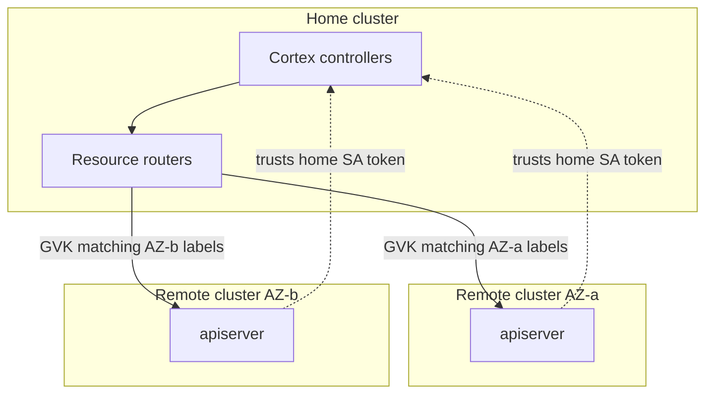
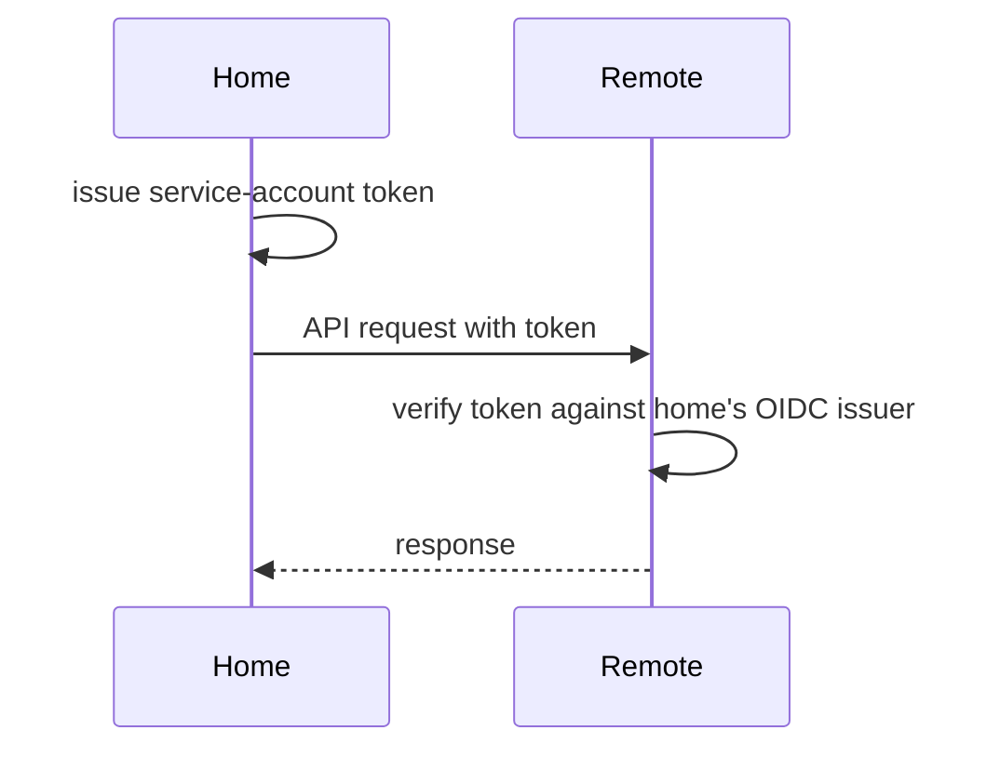

<!--
# SPDX-FileCopyrightText: Copyright SAP SE or an SAP affiliate company and cobaltcore-dev contributors
#
# SPDX-License-Identifier: Apache-2.0
-->

# The multicluster client

Cortex can operate across several Kubernetes clusters, treating them as one logical control plane while
keeping each resource kind physically owned by the cluster responsible for it. The `pkg/multicluster`
package is what makes this transparent: it presents an ordinary controller-runtime `client.Client` whose
reads and writes are routed to the right cluster behind the scenes. This page explains why Cortex spans
clusters, how the router decides where a call goes, and how trust between clusters is established.

## Why span clusters

Large clouds are partitioned — by availability zone, region, or failure domain — and it is often
desirable to keep the state describing a partition physically in that partition. At the same time,
placement logic wants a single, coherent view. Cortex reconciles these by designating a **home** cluster
that runs the controllers and one or more **remote** clusters that hold partition-local resources, with
the multicluster client routing each kind to the cluster that owns it.

Keeping partition state in its partition is the same fault-isolation and independent-evolution argument
that motivates splitting Cortex by domain
([Architecture at a glance](../01-getting-started/02-architecture-at-a-glance.md)). A partition that owns
its own resources continues to hold correct state when another partition, or the link to it, is down; a
failure's blast radius is bounded to the partition where it happened. Each partition can be drained,
upgraded, or replaced on its own schedule. The cost is that the home controllers must treat
cross-cluster access as fallible and routed rather than local and free — which is exactly what the
routing and trust model below makes explicit.

## Home and remote clusters



- The **home** cluster runs the manager and its controllers.
- **Remote** clusters expose their apiservers to the home cluster and are configured to *trust the home
  cluster's service-account tokens*, so the home controllers can read and write remote resources with
  their own identity.

## Routing by GVK and labels

Routing is expressed through resource routers: for each Group/Version/Kind, the client knows which
cluster serves it, matched by a set of labels. The label set is arbitrary — it commonly encodes the
availability zone, but Cortex does not special-case AZ; any labels that uniquely identify a remote work.
The `apiservers` config block declares this:

- `apiservers.home.gvks` — the GVKs the home cluster serves directly.
- `apiservers.remotes[]` — per remote, its `host`, `caCert`, the `gvks` it serves, and the `labels` used
  to route to it.

Two rules follow from how the router works:

- **Every GVK must be declared.** A GVK used through the multicluster client must appear under
  `home.gvks` or exactly one remote's `gvks`; an undeclared GVK is an error, not a silent fallthrough.
- **Writes route by label; reads fan out.** Write operations (Create/Update/Delete/Patch) go to the
  single remote whose `labels` match the object. Reads have no single owner, so a read (List/Get) fans
  out across the home cluster and every remote serving that GVK, and the results are merged.

When a controller reads or writes a routed kind, the router transparently directs the call. Every key is
part of the `conf` struct the manager loads via [the `conf` package](03-conf.md); see the multicluster
defaults in the bundle `values.yaml` files under `helm/`.

> [!NOTE]
> A remote may set `insecureSkipTLSVerify: true` to skip verification of its apiserver certificate. This
> is meant for apiservers whose CA rotates frequently and does not chain to a stable root; it is mutually
> exclusive with `caCert`. Prefer a pinned `caCert` wherever the CA is stable.

## How trust is established

The home controllers act on remote clusters using their *own* service-account identity — there is no
shared kubeconfig and no external identity provider. Each remote is configured to trust the home
cluster's service-account token issuer as an OIDC provider: the home cluster issues a token, and the
remote apiserver verifies it against the home cluster's OIDC issuer.



A `ClusterRoleBinding` on each remote grants those home service accounts access to the routed kinds —
without it, requests reach the remote but are denied with `403`.

## Wiring up a deployment

Setting up multicluster comes down to establishing that trust and declaring the routing:

1. **Expose the home OIDC issuer** and grant service-account issuer discovery on the home cluster, so
   remotes can verify home-issued tokens.
2. **Grant access on each remote** — apply the remote `ClusterRoleBinding` and install the `cortex-crds`
   bundle so the routed kinds exist there.
3. **Declare the routing** under `apiservers.remotes[]` in the manager config. Because `global.conf` is a
   Helm *global*, it merges into every manager subchart, so one block configures the whole deployment:

   ```yaml
   global:
     conf:
       apiservers:
         remotes:
           - host: https://remote-az-a-apiserver:6443
             gvks:
               - kvm.cloud.sap/v1/Hypervisor
               - kvm.cloud.sap/v1/HypervisorList
               - cortex.cloud/v1alpha1/History
               - cortex.cloud/v1alpha1/HistoryList
             labels:
               availabilityZone: az-a
             caCert: |
               <the remote's CA certificate>
   ```

On startup the manager logs one routing line per GVK per remote — a quick way to confirm the config was
picked up:

```
INFO  adding remote cluster for resource  {"gvk": "kvm.cloud.sap/v1, Kind=Hypervisor", "host": "https://remote-az-a-apiserver:6443", "labels": {"availabilityZone":"az-a"}}
```

The [walkthrough below](#walkthrough-multicluster-with-kind) works through all three steps concretely on
local clusters.

## Walkthrough: multicluster with kind

The rest of this page is a hands-on companion to the concepts above: it stands up a full Cortex
multicluster environment on your laptop — a **home** cluster running the controllers and two **remote**
clusters (`az-a` and `az-b`) that own their own resources — using three local
[kind](https://kind.sigs.k8s.io/) clusters. You then send a scheduling request through Cortex and watch
the resulting `History` land on the remote cluster that owns it, seeing the home/remote routing described
above work end to end.

This is a learning-oriented walkthrough on throwaway clusters. Every command is spelled out inline, along
with the YAML it applies — copy each block in order and read along as you go.

### What you will need

- [kind](https://kind.sigs.k8s.io/), `kubectl`, [Helm 3](https://helm.sh/docs/intro/install/),
  [Tilt](https://docs.tilt.dev/install.html), `curl`, and `python3` (for pretty-printing JSON).
- Docker with enough headroom for three small clusters.
- A checkout of the Cortex repository, with your shell in its root. Some commands use paths relative to
  the repo root, so run them from there.

### Step 1 — Create the environment

#### Create the home cluster

The home cluster runs the controllers. Its API server is configured as an OIDC issuer so the remotes can
verify home-issued service-account tokens. Create it from this `kind` config:

```bash
kind create cluster --config - <<'EOF'
kind: Cluster
apiVersion: kind.x-k8s.io/v1alpha4
name: cortex-home
nodes:
  - role: worker
  - role: control-plane
    extraPortMappings:
    - containerPort: 6443
      hostPort: 8443
    kubeadmConfigPatches:
      - |
        kind: ClusterConfiguration
        apiServer:
          extraArgs:
            service-account-issuer: "https://host.docker.internal:8443"
            service-account-jwks-uri: "https://host.docker.internal:8443/openid/v1/jwks"
          certSANs:
            - api-proxy
            - api-proxy.default.svc
            - api-proxy.default.svc.cluster.local
            - localhost
            - 127.0.0.1
            - host.docker.internal
EOF
```

Grant anonymous access to the service-account-issuer discovery endpoint so the remotes can fetch the home
cluster's OIDC configuration:

```bash
kubectl --context kind-cortex-home apply -f - <<'EOF'
apiVersion: rbac.authorization.k8s.io/v1
kind: ClusterRoleBinding
metadata:
  name: grant-cortex-remote-oidc-access
subjects:
- kind: User
  apiGroup: rbac.authorization.k8s.io
  name: system:anonymous
roleRef:
  kind: ClusterRole
  name: system:service-account-issuer-discovery
  apiGroup: rbac.authorization.k8s.io
EOF
```

Store the home CA at `/tmp/root-ca-home.pem` so the remotes can verify home-issued tokens:

```bash
kubectl --context kind-cortex-home --namespace kube-system \
  get configmap extension-apiserver-authentication \
  -o jsonpath="{.data['client-ca-file']}" > /tmp/root-ca-home.pem
```

#### Create the two remote clusters

Each remote is configured to trust the home cluster as an OIDC provider (`oidc-issuer-url`,
`oidc-client-id`) and mounts the home CA you just saved. The two configs differ only in their name and
host port (`8444` for `az-a`, `8445` for `az-b`).

```bash
kind create cluster --config - <<'EOF'
kind: Cluster
apiVersion: kind.x-k8s.io/v1alpha4
name: cortex-remote-az-a
nodes:
  - role: control-plane
    extraPortMappings:
    - containerPort: 6443
      hostPort: 8444
    extraMounts:
      - hostPath: /tmp/root-ca-home.pem
        containerPath: /etc/ca-certificates/root-ca.pem
    kubeadmConfigPatches:
      - |
        kind: ClusterConfiguration
        apiServer:
          extraArgs:
            oidc-client-id: "https://host.docker.internal:8443" # = audience
            oidc-issuer-url: "https://host.docker.internal:8443"
            oidc-username-claim: sub
            oidc-ca-file: /etc/ca-certificates/root-ca.pem
          certSANs:
            - api-proxy
            - api-proxy.default.svc
            - api-proxy.default.svc.cluster.local
            - localhost
            - 127.0.0.1
            - host.docker.internal
EOF
```

```bash
kind create cluster --config - <<'EOF'
kind: Cluster
apiVersion: kind.x-k8s.io/v1alpha4
name: cortex-remote-az-b
nodes:
  - role: control-plane
    extraPortMappings:
    - containerPort: 6443
      hostPort: 8445
    extraMounts:
      - hostPath: /tmp/root-ca-home.pem
        containerPath: /etc/ca-certificates/root-ca.pem
    kubeadmConfigPatches:
      - |
        kind: ClusterConfiguration
        apiServer:
          extraArgs:
            oidc-client-id: "https://host.docker.internal:8443" # = audience
            oidc-issuer-url: "https://host.docker.internal:8443"
            oidc-username-claim: sub
            oidc-ca-file: /etc/ca-certificates/root-ca.pem
          certSANs:
            - api-proxy
            - api-proxy.default.svc
            - api-proxy.default.svc.cluster.local
            - localhost
            - 127.0.0.1
            - host.docker.internal
EOF
```

Grant the home controllers' service-account tokens `cluster-admin` on each remote. The subject names
combine the home OIDC issuer with each controller's service account:

```bash
for CTX in kind-cortex-remote-az-a kind-cortex-remote-az-b; do
kubectl --context "$CTX" apply -f - <<'EOF'
apiVersion: rbac.authorization.k8s.io/v1
kind: ClusterRoleBinding
metadata:
  name: grant-cortex-cluster-admin
subjects:
- kind: User
  apiGroup: rbac.authorization.k8s.io
  name: "https://host.docker.internal:8443#system:serviceaccount:default:cortex-nova-knowledge-controller-manager"
- kind: User
  apiGroup: rbac.authorization.k8s.io
  name: "https://host.docker.internal:8443#system:serviceaccount:default:cortex-nova-scheduling-controller-manager"
- kind: User
  apiGroup: rbac.authorization.k8s.io
  name: "https://host.docker.internal:8443#system:serviceaccount:default:cortex-ironcore-controller-manager"
- kind: User
  apiGroup: rbac.authorization.k8s.io
  name: "https://host.docker.internal:8443#system:serviceaccount:default:cortex-pods-controller-manager"
- kind: User
  apiGroup: rbac.authorization.k8s.io
  name: "https://host.docker.internal:8443#system:serviceaccount:default:cortex-placement-shim"
roleRef:
  kind: ClusterRole
  name: cluster-admin
  apiGroup: rbac.authorization.k8s.io
EOF
done
```

#### Install the CRDs

Install the `cortex-crds` bundle on each remote:

```bash
kubectl config use-context kind-cortex-remote-az-a
helm install helm/bundles/cortex-crds --generate-name
kubectl config use-context kind-cortex-remote-az-b
helm install helm/bundles/cortex-crds --generate-name
```

Install the external `Hypervisor` CRD on all three clusters:

```bash
curl -L https://raw.githubusercontent.com/cobaltcore-dev/openstack-hypervisor-operator/refs/heads/main/charts/openstack-hypervisor-operator/crds/kvm.cloud.sap_hypervisors.yaml > /tmp/hypervisor-crd.yaml
kubectl --context kind-cortex-home apply -f /tmp/hypervisor-crd.yaml
kubectl --context kind-cortex-remote-az-a apply -f /tmp/hypervisor-crd.yaml
kubectl --context kind-cortex-remote-az-b apply -f /tmp/hypervisor-crd.yaml
```

#### Configure routing and start Cortex

Store each remote's CA so the home controllers can verify the remote API servers:

```bash
kubectl --context kind-cortex-remote-az-a --namespace kube-system \
  get configmap extension-apiserver-authentication \
  -o jsonpath="{.data['client-ca-file']}" > /tmp/root-ca-remote-az-a.pem
kubectl --context kind-cortex-remote-az-b --namespace kube-system \
  get configmap extension-apiserver-authentication \
  -o jsonpath="{.data['client-ca-file']}" > /tmp/root-ca-remote-az-b.pem
```

Write a Tilt overrides file that declares the two remotes under `global.conf.apiservers.remotes` — each
with its `host`, `gvks`, routing `labels` (the AZ), and inlined `caCert`. The `caCert` values are spliced
in from the CA files you just saved:

```bash
export TILT_OVERRIDES_PATH=/tmp/cortex-values.yaml
tee $TILT_OVERRIDES_PATH <<EOF
global:
  conf:
    apiservers:
      remotes:
      - host: https://host.docker.internal:8444
        gvks:
        - kvm.cloud.sap/v1/Hypervisor
        - kvm.cloud.sap/v1/HypervisorList
        - cortex.cloud/v1alpha1/History
        - cortex.cloud/v1alpha1/HistoryList
        labels:
          availabilityZone: cortex-remote-az-a
        caCert: |
$(cat /tmp/root-ca-remote-az-a.pem | sed 's/^/          /')
      - host: https://host.docker.internal:8445
        gvks:
        - kvm.cloud.sap/v1/Hypervisor
        - kvm.cloud.sap/v1/HypervisorList
        - cortex.cloud/v1alpha1/History
        - cortex.cloud/v1alpha1/HistoryList
        labels:
          availabilityZone: cortex-remote-az-b
        caCert: |
$(cat /tmp/root-ca-remote-az-b.pem | sed 's/^/          /')
EOF
```

> [!NOTE]
> The overrides use `global.conf`, which is a Helm *global* — it merges into every manager subchart's
> configuration. This is why one `apiservers` block configures the whole deployment. The `apiservers`
> config shape is the `conf` struct loaded via `pkg/conf`.

Seed sample hypervisors into the remotes. Each remote gets two hypervisors labelled with its own zone:

```bash
kubectl --context kind-cortex-remote-az-a apply -f - <<'EOF'
apiVersion: kvm.cloud.sap/v1
kind: Hypervisor
metadata:
  name: hypervisor-1-az-a
  labels:
    topology.kubernetes.io/zone: cortex-remote-az-a
---
apiVersion: kvm.cloud.sap/v1
kind: Hypervisor
metadata:
  name: hypervisor-2-az-a
  labels:
    topology.kubernetes.io/zone: cortex-remote-az-a
EOF

kubectl --context kind-cortex-remote-az-b apply -f - <<'EOF'
apiVersion: kvm.cloud.sap/v1
kind: Hypervisor
metadata:
  name: hypervisor-1-az-b
  labels:
    topology.kubernetes.io/zone: cortex-remote-az-b
---
apiVersion: kvm.cloud.sap/v1
kind: Hypervisor
metadata:
  name: hypervisor-2-az-b
  labels:
    topology.kubernetes.io/zone: cortex-remote-az-b
EOF
```

Start Cortex in the home cluster with Tilt, using the overrides you exported:

```bash
kubectl config use-context kind-cortex-home
tilt up
```

Leave Tilt running. When its resources go green, the home cluster's controllers are live and aware of
both remotes. In another terminal, confirm the routing was picked up:

```bash
kubectl --context kind-cortex-home logs deploy/cortex-nova-scheduling-controller-manager \
  | grep "adding remote cluster"
```

Expected — one line per GVK per remote:

```
INFO  adding remote cluster for resource  {"gvk": "kvm.cloud.sap/v1, Kind=Hypervisor", "host": "https://host.docker.internal:8444", "labels": {"availabilityZone":"cortex-remote-az-a"}}
```

### Step 2 — Send a scheduling request

With Tilt still up, work through the following in another terminal.

#### Apply the test pipeline

This is a minimal `filter-weigher` pipeline with `createHistory: true` and a single `filter_correct_az`
step (no weighers, so surviving hosts keep their input order):

```bash
kubectl --context kind-cortex-home apply -f - <<'EOF'
apiVersion: cortex.cloud/v1alpha1
kind: Pipeline
metadata:
  name: multicluster-test
spec:
  schedulingDomain: nova
  description: Minimal test pipeline for the multicluster guide.
  type: filter-weigher
  createHistory: true
  filters:
    - name: filter_correct_az
  weighers: []
EOF
```

### Step 3 — Clean up

Tear everything down — the three kind clusters and the temporary CA and override files under `/tmp`:

```bash
kind delete cluster --name cortex-home
kind delete cluster --name cortex-remote-az-a
kind delete cluster --name cortex-remote-az-b
rm -f /tmp/root-ca-home.pem \
    /tmp/root-ca-remote-az-a.pem \
    /tmp/root-ca-remote-az-b.pem \
    /tmp/cortex-values.yaml \
    /tmp/hypervisor-crd.yaml
```

By the end you have seen the mechanisms described above run end to end: one **home** cluster driving
controllers over any number of **remote** clusters that physically own routed resources; remotes trusting
the home cluster by verifying its service-account tokens against the home OIDC issuer, with no external
identity provider; and routing declared once under `apiservers` so **writes** go to the single remote
whose labels match while **reads** fan out and merge.

## Failure surfaces

Two conditions are specific to multicluster and worth monitoring:

- **Remote reachability** — `cortex_multicluster_remote_apiserver_reachable` reports per-remote
  connectivity. The shim bundle ships `CortexPlacementShimRemoteApiserverUnreachable`, which fires when a
  remote apiserver stops responding.
- **Cross-cluster name conflicts** — because kinds are cluster-scoped, the same name appearing in two
  clusters is a conflict; `cortex_multicluster_cross_cluster_name_conflicts_total` counts them. The nova
  bundle ships `CortexNovaMulticlusterNameConflicts` and the shim bundle
  `CortexPlacementShimMulticlusterNameConflicts` — both defined in each bundle's `templates/alerts.yaml`,
  firing on the metric registered through [the `monitoring` package](06-monitoring-package.md).
- **`403` from a remote** — the request authenticated but the remote `ClusterRoleBinding` does not grant
  the home service account access to that kind. Check the binding installed in step 2 above.

## How this relates to Cortex

The multicluster client is why a single Cortex control plane can schedule for a partitioned cloud: the
[hypervisor overcommit controller](../05-hypervisor-lifecycle/01-automated-overcommit.md), for example,
watches `Hypervisor` CRs across every remote through this client, and the placement shim reports remote
reachability. Because it presents a standard `client.Client`, controllers are written as if everything
were local — the routing, fan-out, and trust are all handled here. The next page covers the other half
of that abstraction: the cache overlay that keeps those routed reads consistent during a reconcile.

## Next

[Prev: Chapter 6 — The Cortex library](readme.md) · [Next: The controller-runtime client cache »](02-controller-runtime-cache.md)
