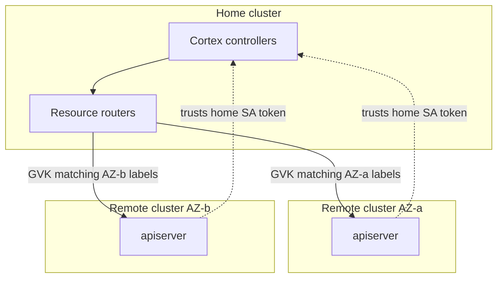
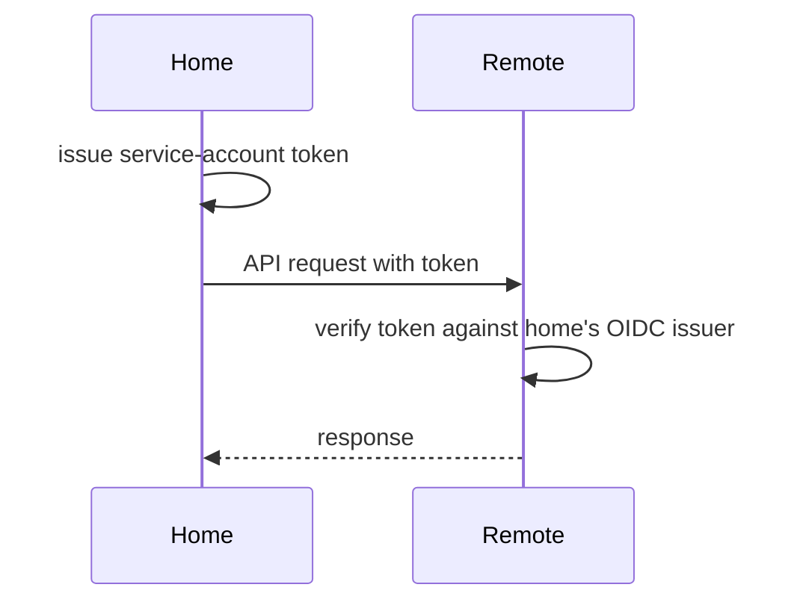

<!--
# SPDX-FileCopyrightText: Copyright SAP SE or an SAP affiliate company and cobaltcore-dev contributors
#
# SPDX-License-Identifier: Apache-2.0
-->

# The multicluster client

Cortex can operate across several Kubernetes clusters, treating them as one logical control plane while
keeping each resource kind physically owned by the cluster responsible for it. The `pkg/multicluster`
package is what makes this transparent: it presents an ordinary controller-runtime `client.Client` whose
reads and writes are routed to the right cluster behind the scenes. This page explains why Cortex spans
clusters, how the router decides where a call goes, and how trust between clusters is established.

## Why span clusters

Large clouds are partitioned — by availability zone, region, or failure domain — and it is often
desirable to keep the state describing a partition physically in that partition. At the same time,
placement logic wants a single, coherent view. Cortex reconciles these by designating a **home** cluster
that runs the controllers and one or more **remote** clusters that hold partition-local resources, with
the multicluster client routing each kind to the cluster that owns it.

Keeping partition state in its partition is the same fault-isolation and independent-evolution argument
that motivates splitting Cortex by domain
([Architecture at a glance](../01-getting-started/02-architecture-at-a-glance.md)). A partition that owns
its own resources continues to hold correct state when another partition, or the link to it, is down; a
failure's blast radius is bounded to the partition where it happened. Each partition can be drained,
upgraded, or replaced on its own schedule. The cost is that the home controllers must treat
cross-cluster access as fallible and routed rather than local and free — which is exactly what the
routing and trust model below makes explicit.

## Home and remote clusters



- The **home** cluster runs the manager and its controllers.
- **Remote** clusters expose their apiservers to the home cluster and are configured to *trust the home
  cluster's service-account tokens*, so the home controllers can read and write remote resources with
  their own identity.

## Routing by GVK and labels

Routing is expressed through resource routers: for each Group/Version/Kind, the client knows which
cluster serves it, matched by a set of labels. The label set is arbitrary — it commonly encodes the
availability zone, but Cortex does not special-case AZ; any labels that uniquely identify a remote work.
The `apiservers` config block declares this:

- `apiservers.home.gvks` — the GVKs the home cluster serves directly.
- `apiservers.remotes[]` — per remote, its `host`, `caCert`, the `gvks` it serves, and the `labels` used
  to route to it.

Two rules follow from how the router works:

- **Every GVK must be declared.** A GVK used through the multicluster client must appear under
  `home.gvks` or exactly one remote's `gvks`; an undeclared GVK is an error, not a silent fallthrough.
- **Writes route by label; reads fan out.** Write operations (Create/Update/Delete/Patch) go to the
  single remote whose `labels` match the object. Reads have no single owner, so a read (List/Get) fans
  out across the home cluster and every remote serving that GVK, and the results are merged.

When a controller reads or writes a routed kind, the router transparently directs the call. Every key is
part of the `conf` struct the manager loads via [the `conf` package](04-conf.md); see the multicluster
defaults in the bundle `values.yaml` files under `helm/`.

> [!NOTE]
> A remote may set `insecureSkipTLSVerify: true` to skip verification of its apiserver certificate. This
> is meant for apiservers whose CA rotates frequently and does not chain to a stable root; it is mutually
> exclusive with `caCert`. Prefer a pinned `caCert` wherever the CA is stable.

## How trust is established

The home controllers act on remote clusters using their *own* service-account identity — there is no
shared kubeconfig and no external identity provider. Each remote is configured to trust the home
cluster's service-account token issuer as an OIDC provider: the home cluster issues a token, and the
remote apiserver verifies it against the home cluster's OIDC issuer.



A `ClusterRoleBinding` on each remote grants those home service accounts access to the routed kinds —
without it, requests reach the remote but are denied with `403`.

## Wiring up a deployment

Setting up multicluster comes down to establishing that trust and declaring the routing:

1. **Expose the home OIDC issuer** and grant service-account issuer discovery on the home cluster, so
   remotes can verify home-issued tokens.
2. **Grant access on each remote** — apply the remote `ClusterRoleBinding` and install the `cortex-crds`
   bundle so the routed kinds exist there.
3. **Declare the routing** under `apiservers.remotes[]` in the manager config. Because `global.conf` is a
   Helm *global*, it merges into every manager subchart, so one block configures the whole deployment:

   ```yaml
   global:
     conf:
       apiservers:
         remotes:
           - host: https://remote-az-a-apiserver:6443
             gvks:
               - kvm.cloud.sap/v1/Hypervisor
               - kvm.cloud.sap/v1/HypervisorList
               - cortex.cloud/v1alpha1/History
               - cortex.cloud/v1alpha1/HistoryList
             labels:
               availabilityZone: az-a
             caCert: |
               <the remote's CA certificate>
   ```

On startup the manager logs one routing line per GVK per remote — a quick way to confirm the config was
picked up:

```
INFO  adding remote cluster for resource  {"gvk": "kvm.cloud.sap/v1, Kind=Hypervisor", "host": "https://remote-az-a-apiserver:6443", "labels": {"availabilityZone":"az-a"}}
```

The [multicluster-with-kind walkthrough](02-multicluster-with-kind.md) walks through all
three steps concretely on local clusters.

## Failure surfaces

Two conditions are specific to multicluster and worth monitoring:

- **Remote reachability** — `cortex_multicluster_remote_apiserver_reachable` reports per-remote
  connectivity. The shim bundle ships `CortexPlacementShimRemoteApiserverUnreachable`, which fires when a
  remote apiserver stops responding.
- **Cross-cluster name conflicts** — because kinds are cluster-scoped, the same name appearing in two
  clusters is a conflict; `cortex_multicluster_cross_cluster_name_conflicts_total` counts them. The nova
  bundle ships `CortexNovaMulticlusterNameConflicts` and the shim bundle
  `CortexPlacementShimMulticlusterNameConflicts` — both defined in each bundle's `templates/alerts.yaml`,
  firing on the metric registered through [the `monitoring` package](07-monitoring-package.md).
- **`403` from a remote** — the request authenticated but the remote `ClusterRoleBinding` does not grant
  the home service account access to that kind. Check the binding installed in step 2 above.

## How this relates to Cortex

The multicluster client is why a single Cortex control plane can schedule for a partitioned cloud: the
[hypervisor overcommit controller](../05-hypervisor-lifecycle/01-automated-overcommit.md), for example,
watches `Hypervisor` CRs across every remote through this client, and the placement shim reports remote
reachability. Because it presents a standard `client.Client`, controllers are written as if everything
were local — the routing, fan-out, and trust are all handled here. The next page covers the other half
of that abstraction: the cache overlay that keeps those routed reads consistent during a reconcile.

## Next

[Prev: Chapter 6 — The Cortex library](readme.md) · [Next: Multicluster with kind (walkthrough) »](02-multicluster-with-kind.md)
