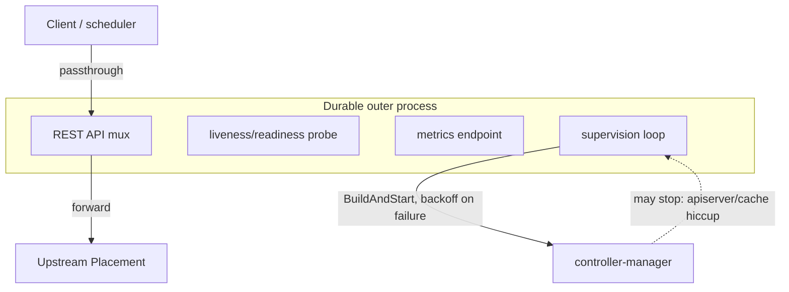

<!--
# SPDX-FileCopyrightText: Copyright SAP SE or an SAP affiliate company and cobaltcore-dev contributors
#
# SPDX-License-Identifier: Apache-2.0
-->

# The `supervisor` package

The [Placement API shim](../03-reservations-and-inventory/05-placement-api-shim.md) sits on a hot path:
schedulers hit it constantly, and it forwards most of that traffic to upstream OpenStack Placement. That
request path must stay up *even when the shim's Kubernetes controller-manager cannot* — for instance when
it loses connectivity to a local or remote apiserver. `pkg/shim/supervisor` is what decouples the two, so
a manager problem never takes down message passthrough.

## The problem: the manager owns the HTTP servers

In controller-runtime, the manager owns every long-lived HTTP server as a `Runnable` — the REST API, the
liveness/readiness probe, the metrics endpoint. That coupling is fine for a normal controller, but it is
wrong for a proxy: if the manager stops (say it lost its apiserver connection), those servers stop with
it, the liveness probe fails, and Kubernetes restarts the pod — killing in-flight passthrough traffic
that had nothing to do with the apiserver. A component whose *job* is to forward requests cannot afford to
have its request path die because a control-plane watch went stale.

## How it works: bind once outside, rebuild the manager inside

`supervisor` runs a **self-healing controller-manager** for a shim while keeping the shim's HTTP surface
alive independently of the manager's lifecycle. It breaks the coupling in two moves:

- It binds the liveness/readiness probe, the REST API mux, and (optionally) the metrics endpoint **once**
  in the outer process, so they survive across manager restarts. The probe reports healthy as long as the
  *process* is up — pod liveness reflects the process, not the apiserver. The request path therefore keeps
  forwarding even while the manager is down.
- It runs a supervision loop that rebuilds and restarts a fresh manager via a caller-supplied
  `BuildAndStart`, with capped, jittered backoff, instead of crashing the pod when the manager returns.

So a lost apiserver connection becomes a *degraded* state (the manager loops, retrying) rather than an
*outage* (the pod crash-loops). Passthrough continues throughout.

> [!NOTE]
> Because the metrics server runs in the durable outer process, in self-heal mode it is plain `promhttp`
> (no TLS/authz), and a looping manager is surfaced through `cortex_placement_shim_manager_up` rather than
> by the pod going unready.

## How this relates to Cortex

The package is deliberately shim-agnostic so future shims can reuse it; today the
[Placement API shim](../03-reservations-and-inventory/05-placement-api-shim.md) is its user, enabled by
`--self-heal` (on by default). It is the resilience half of the shim's design: the shim page explains
*what* the shim serves, this package explains *why a control-plane hiccup does not stop it serving*. That
closes the tour of `pkg/` — and the book. From here, the code and its generated CRD/godoc reference are
the authoritative next stop.

## Next

[Prev: The `task` package](09-task.md) · [Contents](../readme.md)
