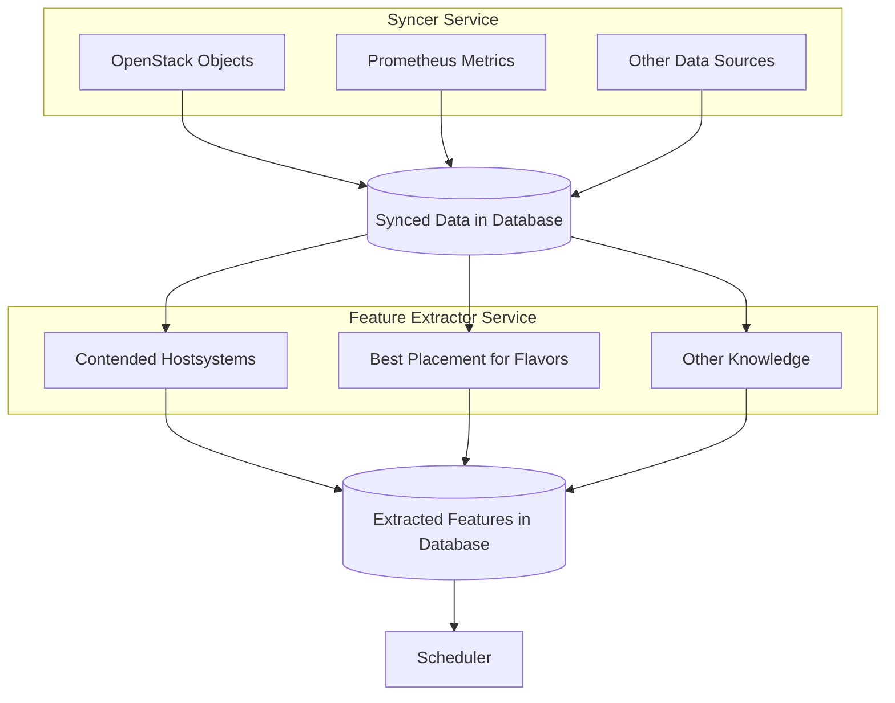

Architecture Decision Record 001

---

# Event-Based Feature Extraction

## Background

Currently we have an architecture as given in the diagram above:

- The syncer service fetches data from remote sources (prometheus, openstack, in the future maybe kubernetes, ...) and inserts it into the database. Note that the synced data may be raw and unprocessed, such as prometheus timeline data.
- The feature extractor reads this unprocessed data from the database and extracts features from it. Features provide a condensed, optimized knowledge for scheduling. For example, they can combine information from multiple data sources so that this information is not recalculated on each scheduler execution.
- The scheduler uses this knowledge to make weighing/filtering decisions. Ideally, only the features relevant for this request (e.g. best placement for this flavor) are queried from the database, providing rapid scheduling decisions.

Now, the more recent the provided features are, the better the scheduling decision can be made. For example, if a large vm flavor is placed on one of the hosts, this influences directly how future vms should be placed. In this case, the "best placement for flavors" feature (see above) needs to be recalculated as soon as possible.

However, currently the feature extraction and syncing are run completely without knowledge of each other, in a 1-minute cycle. Thus, information that was synced may only propagate to the features after this cycle was restarted again. This may lead to inconsistencies i.e. to bad scheduling, and in the worst case, failed scheduling.

## Proposed Solution

Instead of executing the feature extraction periodically, the proposed solution would be to extract the features as soon as the underlying data has changed. This means that the syncer needs to communicate data changes to the feature extractor. Furthermore, the feature extractor needs to know which part of the dataset has changed, to not re-calculate all features. Furthermore, the update should propagate if [a feature depends on another feature](https://github.com/cobaltcore-dev/cortex/blob/d1698cfa7a07a1eafacfc56dd2545ee1e28da40b/helm/cortex/values.yaml#L269).

Cons:
- Added complexity to the syncer and the feature extractor
- Syncer + feature extractor are no longer completely isolated except shared db usage
- Need to consider mqtt triggers when implementing new extractors/syncers

Pros:
- Features that rarely change are not unnecessarily recalculated
- Quicker response to changes in the underlying data, potentially less inconsistencies
- Concept can be extended in the future, e.g. notifying the syncer when to fetch new data

The following implementation options are available.

### Implementation Option 1: Use Message Broker

Add an message broker into the architecture and connect the syncer + feature extractor with it. Updates to data can be published on topics. Topics are defined in a consistent way, e.g. `triggers/sync/openstack/nova/types/hypervisors` when hypervisors change. All new syncer plugins and feature extractor plugins follow this schema.

E.g., VerneMQT (MQTT) is a message broker that could be used.

> [!NOTE]  
> We use RabbitMQ now.

Cons:
- Need to add mqtt broker and maintain that (operational overhead)

Pros:
- Existing service separation can stay for now, no refactoring of the structure needed
- Decoupling & loose coupling, communicate via well-defined mqtt topics
- Lightweight implementation

### Implementation Option 2: Merge Syncer and Feature Extractor

Merge the syncer and feature extractor service to one service (e.g. "", "")

Cons:
- Loss of service separation, we make it much harder to separate the services later on
- Needs refactoring of the go modules, since they are separated by scheduler/syncer/features currently

Pros:
- The feature extraction can be directly called, avoiding mapping layer to topics between.
- Simpler to maintain since no mqtt broker is required

### Implementation Option 3: Replace the Syncer and Feature Extractors with a Generic Distribution Task Pipeline

Let's replace the syncer and feature extractor and replace with distributed task scheduling. Syncers would be periodic tasks (that can then also run with different frequencies). Feature extractors are executed once their precondition tasks are completed. This could be implemented, for example, with something like https://github.com/celery/celery.

High level design:
* We have a controller managing a task queue
* We have n worker that execute the tasks

Cons:
- Highest complexity, at least initially
- Need some kind of task dependency declaration similar to option 1
- Added task queue and controller logic or use additional framework that needs to be maintained
- Need to consider execution waiting times (delays) and priorities
- If implemented with golang also needs a shared kv-storage or message queue, similar to option 1
- Highest change effort, requires the most rebuilding

Pros:
- Task handling automated by queue, tasks are spawned on the fly as needed
- Generic task configuration, e.g. execute task A every 30 sec while task B every 10 min
- Separation between periodic task and triggered tasks

### Implementation Option 4: Keep As-Is

We accept that we are somewhat outdated as the syncer runs "only" once every 1 minute. This option needs to be considered, as it is unclear if the optimization is needed at the moment.

Cons:
- No potential performance improvement, risk of inconsistencies with features that need to be timely
- No support for future logic like "scheduler spawned VM" --> "monitor VM in OpenStack" --> "spawned" --> "resync"

Pros:
- No change effort
- No additional services introduced into the architecture that need to be maintained
- Current service isolation persists

## Decision and Consequences

Among the available options, **Option 1: Message Broker** was chosen as the immediate solution. This approach allows us to move forward with minimal disruption to the current architecture while addressing the need for event-driven design. MQTT will be used as the message broker, making it a mandatory component of the system.

However, **Option 3: Generic Distribution Task Pipeline** is recognized as a more robust and scalable long-term solution. While it offers significant flexibility and automation, it is currently considered overkill due to its high complexity and the substantial effort required for implementation.
As the system evolves and the demand for more advanced task handling grows, we will re-evaluate the design (e.g., **Option 3**) when it becomes necessary.
