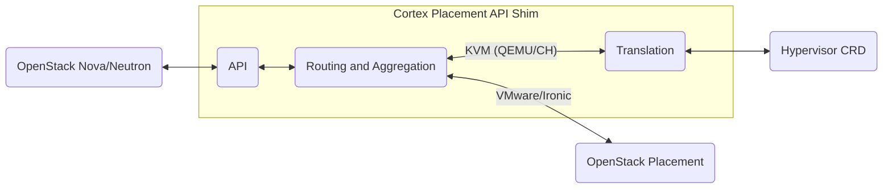

Architecture Decision Record 002

---

# Placement API Shim

[Placement](https://github.com/openstack/placement) is OpenStack's resource inventory service. It provides an API to query the inventory of resources in the OpenStack cloud, such as compute nodes, their available resources, and the current resource usage. In the OpenStack realm, Placement is used by [Nova](https://github.com/openstack/nova) to carry out virtual machine scheduling, as well as [Neutron](https://github.com/openstack/neutron) for network resource allocation.

As part of the [CobaltCore](https://cobaltcore-dev.github.io/docs/) stack, we provide a Placement-like API shim, which translates requests from Nova and Neutron to the [Hypervisor CRD](https://github.com/cobaltcore-dev/openstack-hypervisor-operator) based on the KVM stack provided by [IronCore](https://ironcore.dev/), [Gardener](https://gardener.cloud/) and [Garden Linux](https://gardenlinux.io/). This means, instead of managing resource inventories in Placement's database, the Hypervisor CRD is used to track resource allocations and hypervisor capabilities.

## Passthrough

Placement maintains hypervisors of various kinds, such as [Ironic](https://github.com/openstack/ironic) or VMware vCenter Servers, not only KVM. However, only KVM hypervisors can be managed by the cortex placement api shim. This means, when Nova or Neutron ask for VMware or Ironic resource providers, the shim needs to forward this request to another Placement instance. We call this the passthrough, and it looks like this:

After a request was received by the API, it is processed in two ways depending on the kind of endpoint that was requested:

1. **Aggregated forwarding**: For requests that ask for a list of resource providers, such as `GET /resource_providers`, the shim needs to forward the request to both the KVM translation and the passthrough. The responses from both sides are then aggregated and returned to the caller.
2. **Per-request forwarding**: For requests that ask for a specific resource provider, such as `GET /resource_providers/{uuid}`, the shim needs to determine if the requested resource provider is managed by the KVM translation or the passthrough. This can be done by checking the UUID of the resource provider against a list of known KVM resource providers. If it is a KVM resource provider, the request is forwarded to the translation; otherwise, it is forwarded to the OpenStack Placement instance.

The translational layer is responsible for translating the requests and responses between the OpenStack Placement API and the Hypervisor CRD. This includes mapping resource provider attributes, inventory, and allocations to the corresponding fields in the Hypervisor CRD.
