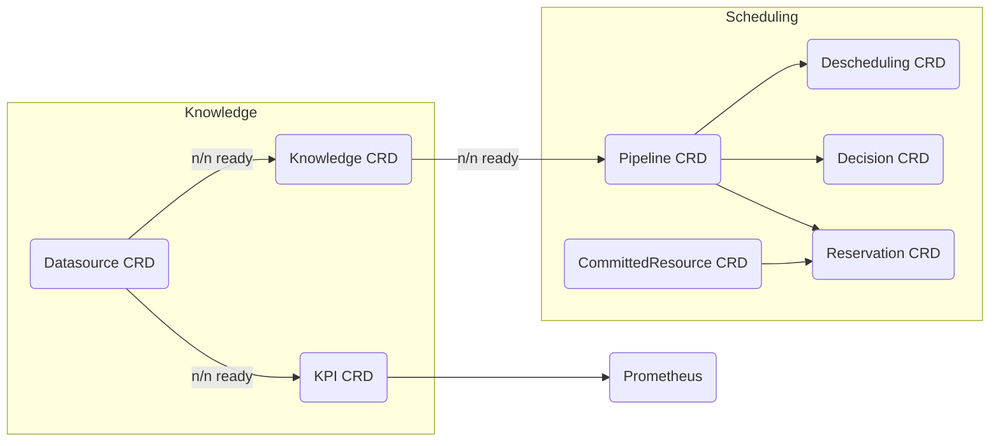

# APIs

## Custom Resource Definitions (CRDs)

With cortex CRDs you can control cortex and see which actions are performed. Cortex CRDs are split into two domains: `knowledge` and `scheduling`.



### Datasources

```bash
kubectl get datasource
```

With datasources you can configure which raw data is ingested into the cortex system. For example, if you want cortex to download a metric from a prometheus endpoint, you create a new datasource and configure the sync interval. The synced data is stored in the datasource's status.

When cortex sees new datasources, it will start downloading and expose how many objects were downloaded in the datasource's status. If cortex encounters an issue syncing, it will expose this as a status condition on the status objects as well. In this way you can keep track of which datasources have been synced, and which not. Use the timestamps provided by the resource to check if the data is recent enough to be processed further.

### Knowledges

```bash
kubectl get knowledge
```

Knowledges provide condensed information from raw data. In the knowledge spec, you define which underlying datasources are needed to extract this information, and put a reference to the cortex plugin which implements the extraction logic. Knowledges can also depend on other knowledges. Using these dependencies cortex will automatically update knowledges whose underlying data has changed.

Compared to datasources, knowledges represent only condensed information and their data is stored directly in the Kubernetes resource status after the extraction has completed. This allows other cortex components to fetch these objects in a timely manner to reuse them for scheduling or analysis. Based on the knowledge status other components of cortex can check if the feature extraction has already completed and if the data can be used.

### KPIs

```bash
kubectl get kpis
```

KPIs expose metrics for knowledges. They contain a reference to the prometheus metric implementation which ingests the extracted knowledge object(s) and outputs generated metrics. This allows cortex to expose counters, gauges, histograms and more.

Once the resource is created cortex will mount the KPI into the prometheus metrics endpoint and expose the implemented metrics.

### Pipelines

```bash
kubectl get pipelines
```

Pipelines bundle scheduling steps together. Filters are mandatory, while weighers and detectors are optional.

The state of the pipeline is propagated automatically through the states of its steps. Check the pipeline state object to determine if the pipeline can currently be executed or not.

Pipeline behavior has two configuration layers: static per-step params defined in the Pipeline CRD YAML (thresholds, weights, traits), and call-time `Options` set by the controller invoking the pipeline (e.g. whether to record history, lock reservations, or skip VM allocation accounting). See [Pipeline Scheduling Options](configurable-pipeline-concept.md) for details.

### Decisions

```bash
kubectl get decisions
```

Decisions are generated when pipelines are executed with an appropriate request, such as an initial placement request for a virtual machine. Decisions contain the input data necessary to determine a valid workload placement and a reference to the external resource that is managed, such as a virtual machine id.

In its state, decisions reflect the outcome of the pipeline execution, for example the generated weights for each scheduling step. This outcome is reflected back to the caller of the pipeline. In addition, decisions provide a human-readable explanation why the workload was placed at this specific location.

### Reservations

```bash
kubectl get reservations
```

Reservations take away space for a workload that is expected to be spawned in the future. They specify which kind of resource is allocated, how much, and on which workload host. During scheduling, reservations are considered in addition to the running workload, creating a feedback loop where reservations influence follow-up scheduling decisions.

The reservation state reflects where this reservation is currently placed as outcome of a pipeline decision.

### CommittedResources

```bash
kubectl get committedresources
```

CommittedResources are a Kubernetes-native way to configure resource commitments (memory, CPU) for scheduling domains. They represent a guaranteed allocation of resources within a project and availability zone, and drive the automatic creation and management of Reservation slots.

A CommittedResource goes through the following lifecycle states:

- **planned**: StartTime not yet reached; no resources guaranteed, no Reservation slots created.
- **pending**: StartTime reached; awaiting confirmation, no Reservation slots yet.
- **guaranteed**: StartTime not reached yet; resources are guaranteed starting from StartTime, Reservation slots are kept in sync.
- **confirmed**: StartTime reached; resources are actively guaranteed, Reservation slots are kept in sync.
- **superseded**: Replaced by another commitment; resources released, Reservation slots removed.
- **expired**: Past EndTime; resources released, Reservation slots removed.

Key fields include `commitmentUUID`, `flavorGroupName`, `resourceType` (memory or cores), `amount`, `availabilityZone`, `projectID`, and time bounds (`startTime`, `endTime`). Only confirmed and guaranteed commitments result in active Reservation slots. Memory commitments drive flavor-based Reservation slot creation, while core commitments are verified arithmetically without creating Reservation slots.

The status tracks the accepted amount, usage information (assigned VMs and used amount), and standard Kubernetes conditions for observability.

For more details on how committed resources interact with reservations, see [committed resource reservations](reservations/committed-resource-reservations.md).

### Deschedulings

```bash
kubectl get deschedulings
```

Deschedulings are triggered when a descheduler pipeline containing descheduler steps detects workloads to move away from their current host. They provide an unambiguous reference to the resource to be descheduled.

The descheduling state tracks the progress of a descheduling, i.e. if the workload is just beginning to be descheduled or if the process was already completed, successfully or unsuccessfully.
