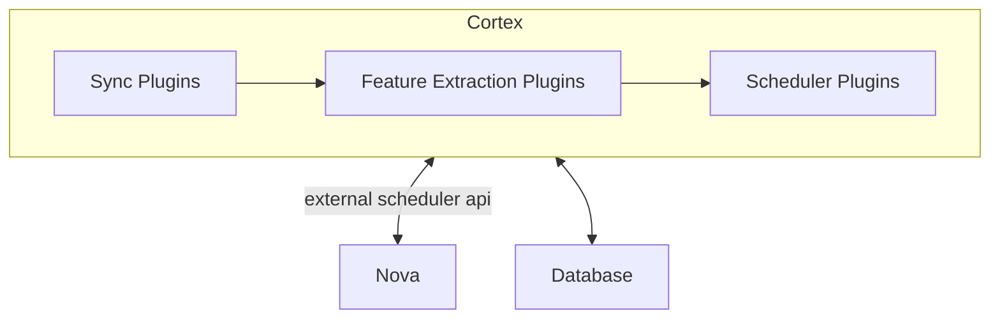
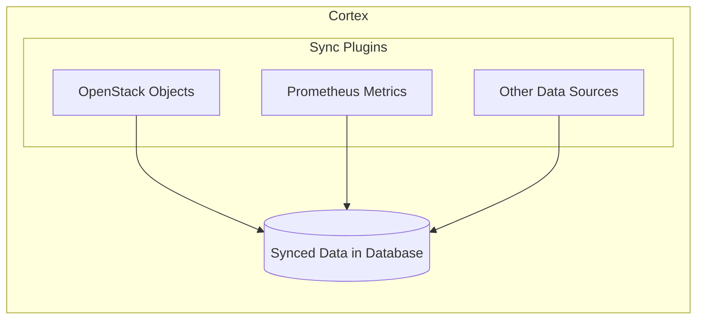
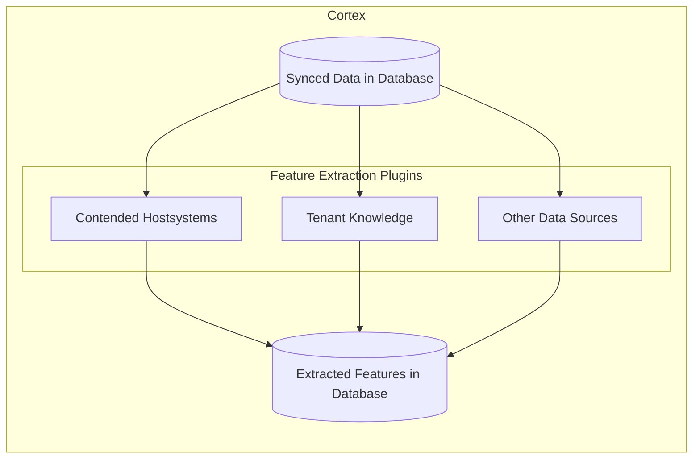
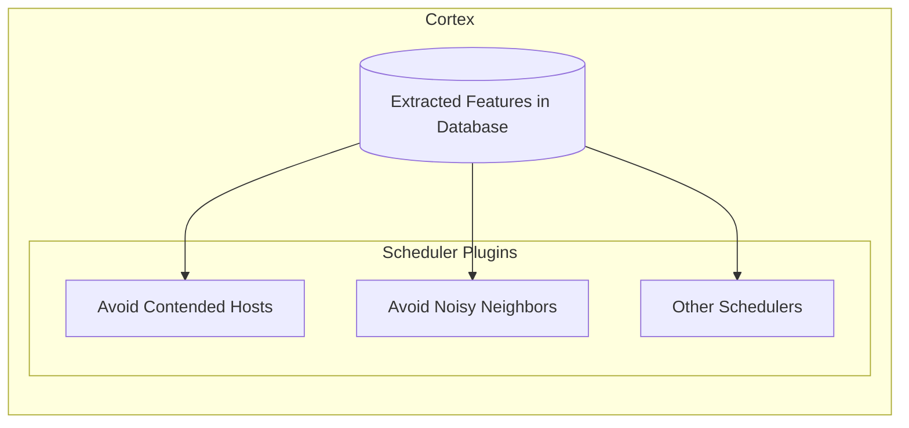

# Architecture Guide

This guide provides an overview of the Cortex architecture, its components, and how they interact.

## Integration

Cortex is integrated with Nova, OpenStack's compute service. When new VMs are created or existing ones moved, Nova selects the right compute host as follows:

1. **Filtering Phase:** Nova retrieves all possible compute hosts. Hosts on which the VM cannot be placed are filtered out.
2. **Weighing Phase:** Nova ranks the remaining hosts based on a set of criteria.
3. **Scheduling Phase:** Nova orders the hosts based on the ranking and schedules the VM on the highest-ranked host. If this process fails, Nova moves to the next host in the list.

Cortex inserts an additional step:

```diff
1. Filtering Phase
2. Weighing Phase
+ 3. Call Cortex
4. Scheduling Phase
```

Cortex receives the list of possible hosts and their weights from Nova. It then calculates a new ranking based on the current state of the data center and returns the updated list to Nova. Nova then continues with the scheduling phase.

> [!NOTE]
> Since, by default, Nova does not support calling an external service, this functionality needs to be added like in [SAP's fork of Nova](https://github.com/sapcc/nova/blob/stable/xena-m3/nova/scheduler/external.py).

## Components

Cortex consists of three main modules: Sync, Feature Extraction, and Scheduler. Each module is implemented as a set of plugins that can be customized and extended. The Sync module is responsible for syncing data from different sources, such as OpenStack and Prometheus. The Feature Extraction module extracts knowledge from the synced data, and the Scheduler module uses this knowledge to make intelligent scheduling decisions.



Cortex's plugin architecture allows for easy extension and customization of the scheduling logic. New scheduling steps can be added to the pipeline, and existing ones can be modified or removed. The same applies to the knowledge extraction logic, which can be adjusted to extract different features from the data center. The data sync framework is also flexible and can be adapted to sync data from different sources.

### Sync Plugins

Sync plugins are responsible for syncing data from various sources into the Cortex database. This data can include information about the current state of the data center, such as the number of VMs running on each host, the amount of CPU and memory used, and other relevant metrics.



Note: Sync plugins are run together in a loop to keep the database up to date with the latest information from the data center. By default, Cortex supports syncing Prometheus metrics or OpenStack objects. The retrieved data is inserted into a database for feature extraction.

### Feature Extraction Plugins

While sync plugins retrieve primary data from external sources and store it in the database, feature extraction plugins take this primary data and calculate additional features that are used by the scheduler to make intelligent decisions.

In addition, while the synced data may be raw and unprocessed, the extracted features will be directly retrieved by the scheduler to make decisions, meaning they must be condensed and rapid to access. This will ensure that the service can handle the high demand of a data center.

While the features should be simple and fast to access, they can be complex and require a lot of processing to calculate. Features can be simple metrics like average CPU usage or more complex features like tenant behavior patterns.



Feature extractor plugins can define **dependencies** to syncer plugins or other features. These dependencies are specified through the service config and are validated on service startup. Thus, features that require other features to be present can be calculated in the correct order. In addition, features that are independent of each other can be calculated in parallel.

### Scheduler Plugins

Scheduler plugins use the extracted features from the database to make intelligent scheduling decisions. They can implement different scheduling strategies, such as avoiding contended hosts or noisy neighbors, to improve resource utilization and performance in the data center.



Scheduler plugins can define **dependencies** to feature extraction plugins. These dependencies are specified through the service config and are validated on service startup.

The scheduler plugins are executed in parallel to speed up the scheduling process. To make a combined scheduling decision, each scheduler plugin must return a map of weights for hosts. Like in neural networks, these weights are added together using an activation function to determine the final ranking of the hosts. Hosts discarded from the weight map are filtered out, similar to the filtering phase in Nova.

## Conclusion

With its modular architecture, Cortex provides a flexible and extensible framework for enhancing the scheduling logic of OpenStack. It focuses on the logic behind data syncing, feature/knowledge extraction, and scheduling, while providing a lightweight framework to customize and extend these components to meet specific requirements.
