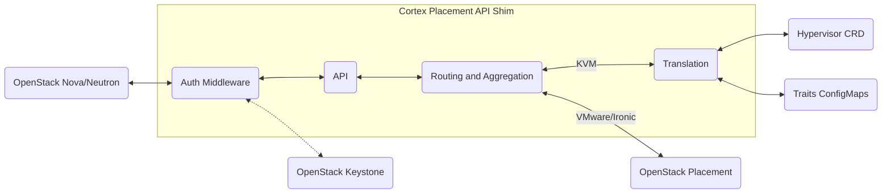

# Architecture Guide

This guide provides an overview of the Cortex architecture, its components, and how they interact.

## Architecture Decision Records (ADRs)

See the [Architecture Decision Records](./adrs) for more detailed information on specific architectural decisions.

## External Scheduler Delegation

Cortex can be integrated with scheduling services like Nova, OpenStack's compute service. Cortex is integrated in a delegation mode, which means the following.

When new VMs are created or existing ones moved, Nova selects the right compute host as follows:

1. **Filtering Phase:** Nova retrieves all possible compute hosts. Hosts on which the VM cannot be placed are filtered out.
2. **Weighing Phase:** Nova ranks the remaining hosts based on a set of criteria.
3. **Scheduling Phase:** Nova orders the hosts based on the ranking and schedules the VM on the highest-ranked host. If this process fails, Nova moves to the next host in the list.

Cortex inserts an additional step:

```diff
1. Filtering Phase
2. Weighing Phase
+ 3. Call Cortex
4. Scheduling Phase
```

Cortex receives the list of possible hosts and their weights from Nova. It then calculates a new ranking based on the current state of the data center and returns the updated list to Nova. Nova then continues with the scheduling phase.

> [!NOTE]
> Since, by default, Nova does not support calling an external service, this functionality needs to be added like in [SAP's fork of Nova](https://github.com/sapcc/nova/blob/stable/2023.2-m3/nova/scheduler/external.py).

## Placement API Shim

[Placement](https://github.com/openstack/placement) is OpenStack's resource inventory service. It provides an API to query the inventory of resources in the OpenStack cloud, such as compute nodes, their available resources, and the current resource usage. In the OpenStack realm, Placement is used by [Nova](https://github.com/openstack/nova) to carry out virtual machine scheduling, as well as [Neutron](https://github.com/openstack/neutron) for network resource allocation.

As part of the [CobaltCore](https://cobaltcore-dev.github.io/docs/) stack, we provide a Placement-like API shim, which translates requests from Nova and Neutron to the [Hypervisor CRD](https://github.com/cobaltcore-dev/openstack-hypervisor-operator) based on the KVM stack provided by [IronCore](https://ironcore.dev/), [Gardener](https://gardener.cloud/) and [Garden Linux](https://gardenlinux.io/). This means, instead of managing resource inventories in Placement's database, the Hypervisor CRD is used to track resource allocations and hypervisor capabilities.

### Feature Modes

Each endpoint group of the shim is controlled by a **feature mode** in the Helm configuration (`features.<endpoint>`). There are three modes:

| Mode | Description |
|---|---|
| `passthrough` | Forward all requests to upstream Placement without any shim logic. This is the default for every endpoint when unset. |
| `hybrid` | Combine upstream Placement with local CRD data. Upstream must be available; the shim keeps CRD state in sync to prepare for cutover. |
| `crd` | Serve requests exclusively from the Hypervisor CRD and local Kubernetes resources. No upstream Placement dependency is required. |

The following endpoint groups each have their own mode field:

| Helm key | Endpoints affected |
|---|---|
| `features.resourceProviders` | `/resource_providers` and sub-resources |
| `features.root` | `GET /` |
| `features.traits` | `/traits` |
| `features.resourceProviderTraits` | `/resource_providers/{uuid}/traits` |
| `features.resourceClasses` | `/resource_classes` |
| `features.inventories` | `/resource_providers/{uuid}/inventories` |
| `features.aggregates` | `/resource_providers/{uuid}/aggregates` |
| `features.allocations` | `/allocations` |
| `features.usages` | `/usages` |
| `features.allocationCandidates` | `/allocation_candidates` |
| `features.reshaper` | `/reshaper` |

This per-endpoint granularity allows operators to adopt CRD-backed behavior incrementally, migrating one endpoint group at a time from `passthrough` through `hybrid` to `crd`.

Endpoint groups that have not yet implemented `hybrid` or `crd` logic return **501 Not Implemented** when set to those modes.

### Passthrough

Placement maintains hypervisors of various kinds, such as [Ironic](https://github.com/openstack/ironic) or VMware vCenter Servers, not only KVM. However, only KVM hypervisors can be managed by the Cortex Placement API Shim. This means, when Nova or Neutron ask for VMware or Ironic resource providers, the shim needs to forward this request to another Placement instance. We call this the passthrough, and it looks like this:


```mermaid
graph LR;
    nn(OpenStack Nova/Neutron) <--> auth
    subgraph shim [Cortex Placement API Shim]
    auth(Auth Middleware) <--> api(API)
    api <--> router(Routing and Aggregation)
    router <-- KVM --> tl
    tl(Translation)
    end
    auth <-.-> ks(OpenStack Keystone)
    router <-- VMware/Ironic --> pl(OpenStack Placement)
    tl <--> crd(Hypervisor CRD)
    tl <--> cm(Traits ConfigMaps)
```

After a request was received by the API, it is processed in two ways depending on the kind of endpoint that was requested:

1. **Aggregated forwarding**: For requests that ask for a list of resource providers, such as `GET /resource_providers`, the shim needs to forward the request to both the KVM translation and the passthrough. The responses from both sides are then aggregated and returned to the caller.
2. **Per-request forwarding**: For requests that ask for a specific resource provider, such as `GET /resource_providers/{uuid}`, the shim needs to determine if the requested resource provider is managed by the KVM translation or the passthrough. This can be done by checking the UUID of the resource provider against a list of known KVM resource providers. If it is a KVM resource provider, the request is forwarded to the translation; otherwise, it is forwarded to the OpenStack Placement instance.

The translation layer is responsible for translating the requests and responses between the OpenStack Placement API and the Hypervisor CRD. This includes mapping resource provider attributes, inventory, and allocations to the corresponding fields in the Hypervisor CRD.

Upstream connectivity is optional at startup: if the upstream Placement API is unreachable, the shim logs a warning and continues booting. This allows the shim to operate in a standalone CRD-backed mode when upstream is not available.

### CRD-Backed Resource Providers

When `features.resourceProviders` is set to `hybrid` or `crd`, the shim serves KVM resource providers directly from Kubernetes Hypervisor CRDs rather than forwarding to upstream Placement. This is the core architectural shift: KVM hypervisor inventory lives in Kubernetes instead of in Placement's database.

The shim supports the full CRUD surface for resource providers:

- **GET /resource_providers**: In `hybrid` mode, lists resource providers by merging KVM hypervisors from Kubernetes with non-KVM providers from upstream Placement. The merge is based on UUID: if a hypervisor CRD exists with the same OpenStack ID as an upstream provider, the CRD-backed version takes precedence. In `crd` mode, lists only from Kubernetes without contacting upstream.
- **GET /resource_providers/{uuid}**: Looks up the UUID against indexed Hypervisor CRDs first. If found, returns the translated provider. In `hybrid` mode, if not found, forwards to upstream; in `crd` mode, returns 404.
- **POST /resource_providers**: Checks the requested name and UUID against existing Hypervisor CRDs. Returns `409 Conflict` if the name or UUID collides with a KVM hypervisor, preventing shadow providers from being created in upstream Placement. In `hybrid` mode, if no collision, the request is forwarded to upstream; in `crd` mode, non-KVM providers are rejected with 404.
- **PUT /resource_providers/{uuid}**: Same collision detection as POST. Updates that would rename a KVM-managed provider are rejected with `409 Conflict`. Non-KVM providers are forwarded to upstream in `hybrid` mode or rejected with 404 in `crd` mode.
- **DELETE /resource_providers/{uuid}**: Prevents deletion of CRD-backed KVM providers by returning `409 Conflict`. Non-KVM providers are forwarded to upstream in `hybrid` mode or rejected with 404 in `crd` mode.

For efficient lookups, the shim indexes Hypervisor CRDs on three fields: `status.hypervisorId` (the OpenStack UUID), `metadata.uid` (the Kubernetes UID), and `metadata.name`. These indexes are registered at startup via the multicluster client, enabling O(1) lookups by any of these keys.

### Root Endpoint

The `GET /` endpoint returns a version discovery document. The behavior depends on the mode set in `features.root`:

- **passthrough**: Forwards to upstream Placement as-is.
- **hybrid**: Fetches the version document from upstream and computes the **version intersection** with the local static configuration. The result uses the higher minimum version and the lower maximum version, yielding the narrowest compatible window. If the ranges don't overlap, the local config is returned as-is.
- **crd**: Returns the static version discovery document from the `versioning` config section without contacting upstream.

Both `hybrid` and `crd` modes require a `versioning` config block with `id`, `minVersion`, `maxVersion`, and `status`.

### Traits

When `features.traits` is set to `hybrid` or `crd`, the shim serves OpenStack Placement traits from a single Kubernetes ConfigMap instead of forwarding to upstream. The ConfigMap name is set by `traits.configMapName` in the shim config and is owned by the shim.

On startup, a `TraitSyncer` initializes the ConfigMap (creating it if it does not exist). In the background, the syncer periodically fetches traits from upstream placement (every 60 seconds with jitter) and writes them into the ConfigMap, keeping the local view in sync.

The trait endpoints support the full OpenStack Placement traits API:
- `GET /traits` returns a sorted list from the ConfigMap, with optional filtering via the `name` query parameter (`in:TRAIT_A,TRAIT_B` or `startswith:CUSTOM_`).
- `GET /traits/{name}` checks the ConfigMap for existence.
- `PUT /traits/{name}` creates custom traits (only `CUSTOM_*` prefixed names are allowed).
- `DELETE /traits/{name}` removes custom traits.

Writes to the ConfigMap are serialized across replicas using a Kubernetes Lease-backed distributed lock (see `pkg/resourcelock`). This prevents concurrent writes from corrupting the ConfigMap data.

In **hybrid** mode, PUT and DELETE requests are forwarded to upstream placement via the `forwardWithHook` pattern; on success, the trait is eagerly added to or removed from the local ConfigMap so the local view is immediately consistent. GET requests in hybrid mode are also forwarded to upstream. In **crd** mode, traits are served exclusively from the local ConfigMap with no upstream dependency.

### Authentication

The shim includes an optional Keystone token validation middleware, configured via the `auth` section in the Helm values. When enabled, every incoming request is checked against a policy table before reaching the handler.

**Policy evaluation** is first-match: each policy rule specifies an HTTP method and path pattern (e.g., `GET /usages`, `* /*`) and the roles that grant access. If no policy matches the request, it is denied with `403 Forbidden`. Policies with an empty roles list mark the path as publicly accessible.

**Role-based access** supports two scoping modes:
- **Unscoped**: The token must contain the named role, regardless of project.
- **Project-scoped**: The token's project ID must match a project ID extracted from the request. The project ID can be extracted from a URL query parameter or a top-level JSON body field, configurable per role.

**Token caching**: Validated tokens are cached in memory with SHA-256 hashed keys and a configurable TTL (default 5 minutes). The cache uses `singleflight` to deduplicate concurrent introspection calls for the same token, avoiding thundering-herd problems when many requests arrive with the same token simultaneously.
