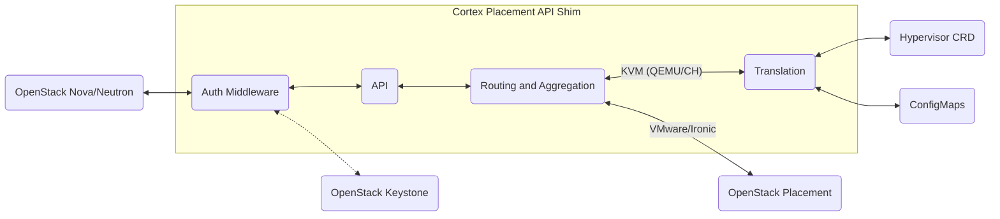

# Architecture Guide

This guide provides an overview of the Cortex architecture, its components, and how they interact.

## Architecture Decision Records (ADRs)

See the [Architecture Decision Records](./adrs) for more detailed information on specific architectural decisions.

## External Scheduler Delegation

Cortex can be integrated with scheduling services like Nova, OpenStack's compute service. Cortex is integrated in a delegation mode, which means the following.

When new VMs are created or existing ones moved, Nova selects the right compute host as follows:

1. **Filtering Phase:** Nova retrieves all possible compute hosts. Hosts on which the VM cannot be placed are filtered out.
2. **Weighing Phase:** Nova ranks the remaining hosts based on a set of criteria.
3. **Scheduling Phase:** Nova orders the hosts based on the ranking and schedules the VM on the highest-ranked host. If this process fails, Nova moves to the next host in the list.

Cortex inserts an additional step:

```diff
1. Filtering Phase
2. Weighing Phase
+ 3. Call Cortex
4. Scheduling Phase
```

Cortex receives the list of possible hosts and their weights from Nova. It then calculates a new ranking based on the current state of the data center and returns the updated list to Nova. Nova then continues with the scheduling phase.

> [!NOTE]
> Since, by default, Nova does not support calling an external service, this functionality needs to be added like in [SAP's fork of Nova](https://github.com/sapcc/nova/blob/stable/2023.2-m3/nova/scheduler/external.py).

## Placement API Shim

[Placement](https://github.com/openstack/placement) is OpenStack's resource inventory service. It provides an API to query the inventory of resources in the OpenStack cloud, such as compute nodes, their available resources, and the current resource usage. In the OpenStack realm, Placement is used by [Nova](https://github.com/openstack/nova) to carry out virtual machine scheduling, as well as [Neutron](https://github.com/openstack/neutron) for network resource allocation.

As part of the [CobaltCore](https://cobaltcore-dev.github.io/docs/) stack, we provide a Placement-like API shim, which translates requests from Nova and Neutron to the [Hypervisor CRD](https://github.com/cobaltcore-dev/openstack-hypervisor-operator) based on the KVM stack provided by [IronCore](https://ironcore.dev/), [Gardener](https://gardener.cloud/) and [Garden Linux](https://gardenlinux.io/). This means, instead of managing resource inventories in Placement's database, the Hypervisor CRD is used to track resource allocations and hypervisor capabilities.

### Passthrough

Placement maintains hypervisors of various kinds, such as [Ironic](https://github.com/openstack/ironic) or VMware vCenter Servers, not only KVM. However, only KVM hypervisors can be managed by the Cortex Placement API Shim. This means, when Nova or Neutron ask for VMware or Ironic resource providers, the shim needs to forward this request to another Placement instance. We call this the passthrough, and it looks like this:


```mermaid
graph LR;
    nn(OpenStack Nova/Neutron) <--> auth
    subgraph shim [Cortex Placement API Shim]
    auth(Auth Middleware) <--> api(API)
    api <--> router(Routing and Aggregation)
    router <-- KVM (QEMU/CH) --> tl
    tl(Translation)
    end
    auth <-.-> ks(OpenStack Keystone)
    router <-- VMware/Ironic --> pl(OpenStack Placement)
    tl <--> crd(Hypervisor CRD)
    tl <--> cm(ConfigMaps)
```

After a request is received, it passes through optional Keystone authentication and is then processed in two ways depending on the kind of endpoint:

1. **Aggregated forwarding**: For requests that ask for a list of resource providers, such as `GET /resource_providers`, the shim fetches results from both upstream placement and Kubernetes Hypervisor CRDs, then merges them. On UUID or name collisions, the Kubernetes version wins.
2. **Per-request forwarding**: For requests that ask for a specific resource provider, such as `GET /resource_providers/{uuid}`, the shim checks whether the UUID belongs to a KVM hypervisor managed by Kubernetes. If so, the response is translated from the Hypervisor CRD; otherwise, the request is forwarded to upstream placement.

The translation layer is responsible for translating the requests and responses between the OpenStack Placement API and the Hypervisor CRD. This includes mapping resource provider attributes, inventory, and allocations to the corresponding fields in the Hypervisor CRD.

### Feature Gates

Each major category of CRD-backed endpoint is controlled by a feature flag in the shim configuration under `conf.features`. When a flag is disabled, the corresponding handlers act as a pure passthrough to upstream placement. This allows incremental rollout of CRD-backed behavior.

| Feature Flag | Default | Effect when enabled |
|---|---|---|
| `enableResourceProviders` | `false` | Resource provider CRUD endpoints serve KVM hypervisors from Kubernetes, merged with upstream results. Creates and deletes of providers that collide with KVM hypervisors are rejected with 409 Conflict. |
| `enableRoot` | `false` | `GET /` returns a static version discovery document from Helm config instead of forwarding to upstream. This allows the shim to serve its root endpoint even when upstream placement is unreachable. |
| `enableTraits` | `false` | Trait endpoints (`GET /traits`, `GET/PUT/DELETE /traits/{name}`) serve from a local ConfigMap-based trait store instead of forwarding to upstream. |

See `internal/shim/placement/shim.go` for the full configuration schema.

### Resource Provider Endpoints

When `enableResourceProviders` is true, the shim uses Kubernetes field indexes on Hypervisor CRDs (defined in `internal/shim/placement/field_index.go`) to quickly look up hypervisors by their OpenStack UUID, Kubernetes UID, or name. These indexes power the core operations:

- **List** (`GET /resource_providers`): Fetches the full list from upstream placement, fetches all Hypervisor CRDs from Kubernetes, applies Placement API query filters (uuid, name, member_of, in_tree, required traits, resources) to the Kubernetes results, then merges the two lists. On UUID or name collisions, the Kubernetes hypervisor wins and the upstream entry is dropped.
- **Show** (`GET /resource_providers/{uuid}`): Looks up the UUID in Kubernetes first. If found, translates the Hypervisor CRD to a Placement API resource provider response. If not found, forwards to upstream.
- **Create** (`POST /resource_providers`): Checks whether the requested name or UUID conflicts with an existing KVM hypervisor. If so, returns 409 Conflict to prevent shadow providers in upstream placement. Otherwise forwards the create to upstream.
- **Update** (`PUT /resource_providers/{uuid}`): KVM hypervisor names are immutable and cannot have parents, so rename or re-parent attempts return 409 Conflict. No-op updates return the current state.
- **Delete** (`DELETE /resource_providers/{uuid}`): KVM hypervisors cannot be deleted through the Placement API. Returns 409 Conflict.

### Traits Endpoints

When `enableTraits` is true, the shim manages traits locally using two Kubernetes ConfigMaps instead of relying on upstream placement:

- **Static ConfigMap** (name from `conf.traits.configMapName`): Managed by Helm. Contains the baseline set of standard OpenStack traits provisioned at deploy time.
- **Dynamic ConfigMap** (name + `-custom` suffix): Created and managed by the shim at runtime. Stores custom traits (those prefixed with `CUSTOM_`).

Trait operations:
- **List** (`GET /traits`): Merges traits from both ConfigMaps and returns a sorted list. Supports `name` query parameter filters: `in:TRAIT_A,TRAIT_B` for exact matches and `startswith:CUSTOM_` for prefix matches.
- **Show** (`GET /traits/{name}`): Returns 204 if the trait exists in either ConfigMap, 404 otherwise.
- **Create** (`PUT /traits/{name}`): Only CUSTOM_ traits can be created. Acquires a distributed lock, writes to the dynamic ConfigMap, and best-effort syncs the trait to upstream placement so forwarded endpoints can reference it.
- **Delete** (`DELETE /traits/{name}`): Only CUSTOM_ traits can be deleted. Standard traits return 400.

Write operations on the dynamic ConfigMap are serialized across replicas using the `pkg/resourcelock` library (see [Distributed Locking](#distributed-locking) below).

### Authentication Middleware

The shim supports optional Keystone token validation, configured via the `conf.auth` section. When enabled, every incoming request is checked against a configurable policy table before reaching any handler.

**Policy evaluation** works as first-match: the ordered list of policies is scanned for the first entry whose HTTP method and path pattern match the request. If no policy matches, the request is denied with 403 Forbidden. If a matching policy has no roles defined, the endpoint is considered public. Otherwise, the request must carry a valid `X-Auth-Token` header.

**Token validation** calls Keystone's `GET /v3/auth/tokens` endpoint using the shim's own service credentials. Validated tokens are cached in memory using SHA-256 hashed keys. Cache entries are evicted when either the Keystone token expires or the configurable `tokenCacheTTL` (default 5 minutes) elapses. Concurrent introspection requests for the same token are deduplicated using a singleflight group, preventing thundering-herd scenarios.

**Project-scoped authorization** allows policies to require that the token's project ID matches a project ID extracted from the request. The project ID can be extracted from a URL query parameter (`from: "query"`) or a top-level JSON body field (`from: "body"`).

See `internal/shim/placement/auth.go` and `internal/shim/placement/auth_keystone.go` for implementation details.

### Upstream Resilience

The shim is designed to remain functional even when upstream placement is unreachable. At startup, the shim tests connectivity to upstream placement but continues starting if the connection fails. Feature-gated endpoints that serve from Kubernetes or ConfigMaps (resource providers, traits, root) work independently of upstream availability. Only forwarded requests to upstream will fail with 502 Bad Gateway when the upstream is down.

### Distributed Locking

The `pkg/resourcelock` package provides a lightweight distributed locking mechanism backed by Kubernetes `coordination.k8s.io/v1` Lease objects. The placement shim uses this to serialize writes to the custom traits ConfigMap across replicas.

The lock algorithm:
1. **Lease does not exist** — create it to acquire the lock.
2. **Lease exists but is expired** — update it to claim ownership.
3. **Lease exists and is valid** — wait and retry until a configurable timeout, then return `ErrLockHeld`.

Locks are short-lived (default 15-second lease duration) and are deleted on release. This is simpler than full leader-election: locks protect a single write operation rather than long-running ownership. Create and update conflicts from racing replicas are retried transparently within the timeout window.
