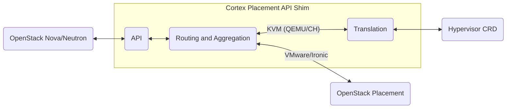

# Architecture Guide

This guide provides an overview of the Cortex architecture, its components, and how they interact.

## Architecture Decision Records (ADRs)

See the [Architecture Decision Records](./adrs) for more detailed information on specific architectural decisions.

## External Scheduler Delegation

Cortex can be integrated with scheduling services like Nova, OpenStack's compute service. Cortex is integrated in a delegation mode, which means the following.

When new VMs are created or existing ones moved, Nova selects the right compute host as follows:

1. **Filtering Phase:** Nova retrieves all possible compute hosts. Hosts on which the VM cannot be placed are filtered out.
2. **Weighing Phase:** Nova ranks the remaining hosts based on a set of criteria.
3. **Scheduling Phase:** Nova orders the hosts based on the ranking and schedules the VM on the highest-ranked host. If this process fails, Nova moves to the next host in the list.

Cortex inserts an additional step:

```diff
1. Filtering Phase
2. Weighing Phase
+ 3. Call Cortex
4. Scheduling Phase
```

Cortex receives the list of possible hosts and their weights from Nova. It then calculates a new ranking based on the current state of the data center and returns the updated list to Nova. Nova then continues with the scheduling phase.

> [!NOTE]
> Since, by default, Nova does not support calling an external service, this functionality needs to be added like in [SAP's fork of Nova](https://github.com/sapcc/nova/blob/stable/2023.2-m3/nova/scheduler/external.py).

## Placement API Shim

[Placement](https://github.com/openstack/placement) is OpenStack's resource inventory service. It provides an API to query the inventory of resources in the OpenStack cloud, such as compute nodes, their available resources, and the current resource usage. In the OpenStack realm, Placement is used by [Nova](https://github.com/openstack/nova) to carry out virtual machine scheduling, as well as [Neutron](https://github.com/openstack/neutron) for network resource allocation.

As part of the [CobaltCore](https://cobaltcore-dev.github.io/docs/) stack, we provide a Placement-like API shim, which translates requests from Nova and Neutron to the [Hypervisor CRD](https://github.com/cobaltcore-dev/openstack-hypervisor-operator) based on the KVM stack provided by [IronCore](https://ironcore.dev/), [Gardener](https://gardener.cloud/) and [Garden Linux](https://gardenlinux.io/). This means, instead of managing resource inventories in Placement's database, the Hypervisor CRD is used to track resource allocations and hypervisor capabilities.

### Passthrough

Placement maintains hypervisors of various kinds, such as [Ironic](https://github.com/openstack/ironic) or VMware vCenter Servers, not only KVM. However, only KVM hypervisors can be managed by the Cortex Placement API Shim. This means, when Nova or Neutron ask for VMware or Ironic resource providers, the shim needs to forward this request to another Placement instance. We call this the passthrough, and it looks like this:


```mermaid
graph LR;
    nn(OpenStack Nova/Neutron) <--> api
    subgraph shim [Cortex Placement API Shim]
    api(API) <--> router(Routing and Aggregation)
    router <-- KVM (QEMU/CH) --> tl
    tl(Translation)
    end
    router <-- VMware/Ironic --> pl(OpenStack Placement)
    tl <--> crd(Hypervisor CRD)
```

After a request was received by the API, it is processed in two ways depending on the kind of endpoint that was requested:

1. **Aggregated forwarding**: For requests that ask for a list of resource providers, such as `GET /resource_providers`, the shim needs to forward the request to both the KVM translation and the passthrough. The responses from both sides are then aggregated and returned to the caller.
2. **Per-request forwarding**: For requests that ask for a specific resource provider, such as `GET /resource_providers/{uuid}`, the shim needs to determine if the requested resource provider is managed by the KVM translation or the passthrough. This can be done by checking the UUID of the resource provider against a list of known KVM resource providers. If it is a KVM resource provider, the request is forwarded to the translation; otherwise, it is forwarded to the OpenStack Placement instance.

The translation layer is responsible for translating the requests and responses between the OpenStack Placement API and the Hypervisor CRD. This includes mapping resource provider attributes, inventory, and allocations to the corresponding fields in the Hypervisor CRD.

### Authentication Middleware

The shim can enforce Keystone token validation on its endpoints via a configurable policy table. When enabled, every incoming request is matched against an ordered list of rules before reaching any handler.

**How it works:**

1. Each rule (a *policy*) has a `METHOD /path` pattern and a list of required roles. A trailing `/*` in the path acts as a wildcard. `*` as the method matches any HTTP verb. Rules are evaluated in order; the **first match wins** (deny-by-default if nothing matches).
2. A rule with an empty role list means the endpoint is publicly accessible — no token required.
3. For rules with roles, the shim reads the `X-Auth-Token` header and looks up the token in an in-memory cache (keyed by SHA-256 hash). On a cache miss, it calls Keystone's token introspection endpoint using a `singleflight` group to collapse concurrent requests for the same token into one upstream call.
4. Validated tokens are cached for the configured `tokenCacheTTL` (default: `5m`) or until the Keystone-reported expiry, whichever comes first.
5. For **project-scoped roles**, the rule can additionally require that the project ID embedded in the token matches a project ID found in the request — extracted from either a URL query parameter (`from: query`) or a top-level JSON body field (`from: body`). This allows tenant-scoped endpoints like `GET /usages?project_id=<id>` to be restricted to tokens belonging to that specific project.

**Example configuration snippet (Helm values):**

```yaml
auth:
  tokenCacheTTL: "5m"
  policies:
    - pattern: "GET /"
      roles: null  # publicly accessible
    - pattern: "GET /usages"
      roles:
        - name: cloud_compute_admin
        - name: compute_viewer
          projectScope:
            from: query   # token's project must match ?project_id= query param
    - pattern: "GET /*"
      roles:
        - name: cloud_compute_admin
        - name: cloud_compute_viewer
    - pattern: "* /*"
      roles:
        - name: cloud_compute_admin
```

When `auth` is absent from the configuration, the middleware is disabled and all requests are passed through without validation.

### Traits API

The shim provides feature-gated `/traits` endpoints that serve OpenStack Placement trait data directly from Kubernetes ConfigMaps, rather than forwarding to the upstream Placement instance. This is controlled by `features.enableTraits` in the Helm values.

**Two ConfigMaps are used:**

| ConfigMap | Content | Managed by |
|-----------|---------|------------|
| `<configMapName>` (static) | Standard traits declared in Helm values (`traits.static`) | Helm — recreated on each deploy |
| `<configMapName>-custom` (dynamic) | `CUSTOM_*` traits created at runtime via `PUT /traits/{name}` | The shim at runtime |

**Read path (`GET /traits`, `GET /traits/{name}`):** Both ConfigMaps are merged in memory and the combined set is returned. The `GET /traits` endpoint supports `name=in:A,B` (exact list) and `name=startswith:PREFIX` filters.

**Write path (`PUT /traits/{name}`, `DELETE /traits/{name}`):**

Only traits whose name begins with `CUSTOM_` may be created or deleted; attempts to modify standard traits are rejected with `400 Bad Request`.

Writes use **Lease-based distributed locking** (`pkg/resourcelock`) to serialize access across shim replicas:

```
1. Fast path: check if trait already exists in either ConfigMap (no lock needed).
2. If not found: acquire a Kubernetes Lease lock named <configMapName>-custom-lock.
3. Under the lock: re-read (double-check), then create/update/delete the dynamic ConfigMap.
4. Release the lock.
5. Best-effort: sync the new CUSTOM_* trait to upstream Placement (fire-and-forget, errors logged but not propagated).
```

The `POD_NAMESPACE` environment variable must be injected via the Kubernetes Downward API so the shim knows which namespace to use for ConfigMap and Lease operations.
