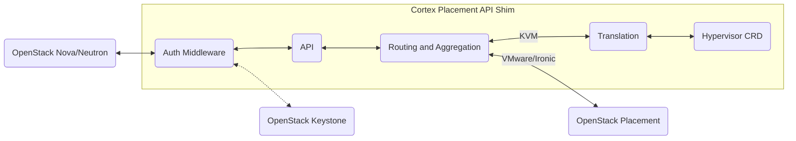

# Architecture Guide

This guide provides an overview of the Cortex architecture, its components, and how they interact.

## Architecture Decision Records (ADRs)

See the [Architecture Decision Records](./adrs) for more detailed information on specific architectural decisions.

## External Scheduler Delegation

Cortex can be integrated with scheduling services like Nova, OpenStack's compute service. Cortex is integrated in a delegation mode, which means the following.

When new VMs are created or existing ones moved, Nova selects the right compute host as follows:

1. **Filtering Phase:** Nova retrieves all possible compute hosts. Hosts on which the VM cannot be placed are filtered out.
2. **Weighing Phase:** Nova ranks the remaining hosts based on a set of criteria.
3. **Scheduling Phase:** Nova orders the hosts based on the ranking and schedules the VM on the highest-ranked host. If this process fails, Nova moves to the next host in the list.

Cortex inserts an additional step:

```diff
1. Filtering Phase
2. Weighing Phase
+ 3. Call Cortex
4. Scheduling Phase
```

Cortex receives the list of possible hosts and their weights from Nova. It then calculates a new ranking based on the current state of the data center and returns the updated list to Nova. Nova then continues with the scheduling phase.

> [!NOTE]
> Since, by default, Nova does not support calling an external service, this functionality needs to be added like in [SAP's fork of Nova](https://github.com/sapcc/nova/blob/stable/2023.2-m3/nova/scheduler/external.py).

### Forced Destinations

When Nova sets `force_hosts` or `force_nodes` on a request and the `_nova_check_type` scheduler hint is not set (or is empty), Cortex skips its entire filter/weigher pipeline and returns only the forced destinations. This replicates Nova's native behavior, where forced requests bypass the scheduler filters and land directly on the specified hosts. If `_nova_check_type` is set to a non-empty value (e.g. rebuild, evacuate, resize), the forced hosts still pass through the full pipeline because the filters need to validate the destination.

This behavior is controlled by `forcedDestinationEnabled` in the Helm config (defaults to true). Set it to false as a kill-switch to route forced requests through the normal scheduling pipeline instead. See `api/external/nova/messages.go` for the detection logic (`IsForcedDestination`, `ForcedHosts`).

## Placement API Shim

[Placement](https://github.com/openstack/placement) is OpenStack's resource inventory service. It provides an API to query the inventory of resources in the OpenStack cloud, such as compute nodes, their available resources, and the current resource usage. In the OpenStack realm, Placement is used by [Nova](https://github.com/openstack/nova) to carry out virtual machine scheduling, as well as [Neutron](https://github.com/openstack/neutron) for network resource allocation.

As part of the [CobaltCore](https://cobaltcore-dev.github.io/docs/) stack, we provide a Placement-like API shim, which translates requests from Nova and Neutron to the [Hypervisor CRD](https://github.com/cobaltcore-dev/openstack-hypervisor-operator) based on the KVM stack provided by [IronCore](https://ironcore.dev/), [Gardener](https://gardener.cloud/) and [Garden Linux](https://gardenlinux.io/). This means, instead of managing resource inventories in Placement's database, the Hypervisor CRD is used to track resource allocations and hypervisor capabilities.

### Feature Toggles

Each endpoint group of the shim is controlled by a **boolean feature toggle** in the Helm configuration (`features.<endpoint>`):

| Toggle | Behavior |
|---|---|
| `false` (default) | The shim is a pure **passthrough** for that endpoint: requests are forwarded to upstream Placement without any shim logic. |
| `true` | The shim maps the endpoint's KVM-related logic onto the KVM backend (the Hypervisor CRD) instead of forwarding. |

The following endpoint groups each have their own toggle:

| Helm key | Endpoints affected |
|---|---|
| `features.resourceProviders` | `/resource_providers` and sub-resources |
| `features.root` | `GET /` |
| `features.traits` | `/traits` |
| `features.resourceProviderTraits` | `/resource_providers/{uuid}/traits` |
| `features.resourceClasses` | `/resource_classes` |
| `features.inventories` | `/resource_providers/{uuid}/inventories` |
| `features.aggregates` | `/resource_providers/{uuid}/aggregates` |
| `features.allocations` | `/allocations` |
| `features.usages` | `/usages` |
| `features.allocationCandidates` | `/allocation_candidates` |
| `features.reshaper` | `/reshaper` |

This per-endpoint granularity allows operators to adopt KVM-backend behavior incrementally, enabling one endpoint group at a time.

The KVM-backend mapping is not yet implemented: an enabled toggle currently returns **501 Not Implemented**. The backend logic will be built against the live Hypervisor CRD watch and field indexes in a follow-up. Every endpoint dispatches through a single helper that either forwards (toggle off) or returns 501 (toggle on).

### Passthrough

Placement maintains hypervisors of various kinds, such as [Ironic](https://github.com/openstack/ironic) or VMware vCenter Servers, not only KVM. However, only KVM hypervisors can be managed by the Cortex Placement API Shim. This means, when Nova or Neutron ask for VMware or Ironic resource providers, the shim needs to forward this request to another Placement instance. We call this the passthrough, and it looks like this:


```mermaid
graph LR;
    nn(OpenStack Nova/Neutron) <--> auth
    subgraph shim [Cortex Placement API Shim]
    auth(Auth Middleware) <--> api(API)
    api <--> router(Routing and Aggregation)
    router <-- KVM --> tl
    tl(Translation)
    tl <--> crd(Hypervisor CRD)
    end
    auth <-.-> ks(OpenStack Keystone)
    router <-- VMware/Ironic --> pl(OpenStack Placement)
```

After a request was received by the API, it is processed in two ways depending on the kind of endpoint that was requested:

1. **Aggregated forwarding**: For requests that ask for a list of resource providers, such as `GET /resource_providers`, the shim needs to forward the request to both the KVM translation and the passthrough. The responses from both sides are then aggregated and returned to the caller.
2. **Per-request forwarding**: For requests that ask for a specific resource provider, such as `GET /resource_providers/{uuid}`, the shim needs to determine if the requested resource provider is managed by the KVM translation or the passthrough. This can be done by checking the UUID of the resource provider against a list of known KVM resource providers. If it is a KVM resource provider, the request is forwarded to the translation; otherwise, it is forwarded to the OpenStack Placement instance.

The translation layer is responsible for translating the requests and responses between the OpenStack Placement API and the Hypervisor CRD. This includes mapping resource provider attributes, inventory, and allocations to the corresponding fields in the Hypervisor CRD.

Upstream connectivity is optional at startup: if the upstream Placement API is unreachable, the shim logs a warning and continues booting.

### KVM-Backed Resource Providers

When `features.resourceProviders` is enabled, the shim will serve KVM resource providers directly from Kubernetes Hypervisor CRDs rather than forwarding to upstream Placement. This is the core architectural shift: KVM hypervisor inventory lives in Kubernetes instead of in Placement's database.

This mapping is not yet implemented; an enabled toggle currently returns **501 Not Implemented**. The hook points are wired live so the follow-up can build against them:

For efficient lookups, the shim indexes Hypervisor CRDs on three fields: `status.hypervisorId` (the OpenStack UUID), `metadata.uid` (the Kubernetes UID), and `metadata.name`. These indexes are registered at startup via the multicluster client, enabling O(1) lookups by any of these keys. A `WatchesMulticluster` on the Hypervisor CRD keeps the shim's view current.

### Root Endpoint

The `GET /` endpoint returns a version discovery document. With `features.root` disabled it is forwarded to upstream Placement as-is; when enabled the shim will serve a KVM-backend version document (currently 501).

### Traits

With `features.traits` disabled the trait endpoints (`GET /traits`, `GET /traits/{name}`, `PUT /traits/{name}`, `DELETE /traits/{name}`) are forwarded to upstream Placement as-is. When enabled the shim will serve traits from the KVM backend (currently 501).


### Authentication

The shim includes an optional Keystone token validation middleware, configured via the `auth` section in the Helm values. When enabled, every incoming request is checked against a policy table before reaching the handler.

**Policy evaluation** is first-match: each policy rule specifies an HTTP method and path pattern (e.g., `GET /usages`, `* /*`) and the roles that grant access. If no policy matches the request, it is denied with `403 Forbidden`. Policies with an empty roles list mark the path as publicly accessible.

**Role-based access** supports two scoping modes:
- **Unscoped**: The token must contain the named role, regardless of project.
- **Project-scoped**: The token's project ID must match a project ID extracted from the request. The project ID can be extracted from a URL query parameter or a top-level JSON body field, configurable per role.

**Token caching**: Validated tokens are cached in memory with SHA-256 hashed keys and a configurable TTL (default 5 minutes). The cache uses `singleflight` to deduplicate concurrent introspection calls for the same token, avoiding thundering-herd problems when many requests arrive with the same token simultaneously.
