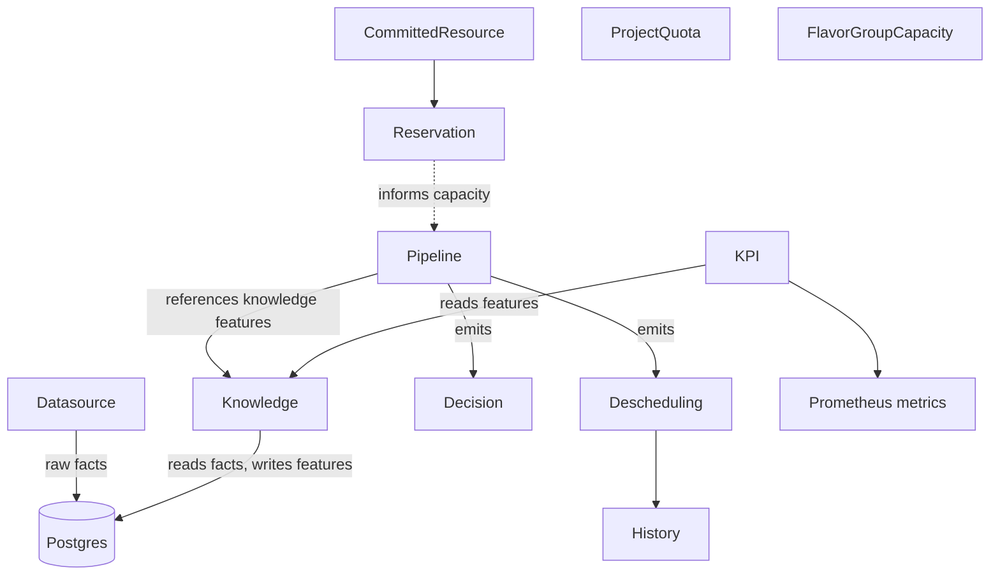

<!--
# SPDX-FileCopyrightText: Copyright SAP SE or an SAP affiliate company and cobaltcore-dev contributors
#
# SPDX-License-Identifier: Apache-2.0
-->

# CRD and controller model

Cortex is a Kubebuilder operator: its behaviour is authored as Kubernetes custom resources and
reconciled by controllers. This page explains how the resource kinds relate, how a change to a
resource propagates, and how the plugin system lets pipelines and knowledge be composed from named
steps. For exact fields see the [CRD reference](../reference/crds/readme.md).

## Everything is a cluster-scoped resource

All Cortex kinds live in the API group `cortex.cloud/v1alpha1` and are **cluster-scoped** — there is
no per-namespace placement policy; policy is a property of the cluster (and, in multicluster, of the
availability zone). Cortex owns eleven kinds:

`Datasource`, `Knowledge`, `KPI`, `Pipeline`, `Decision`, `Descheduling`, `History`, `Reservation`,
`CommittedResource`, `ProjectQuota`, `FlavorGroupCapacity`.

It also *consumes but does not own* external kinds: `Hypervisor` (`kvm.cloud.sap/v1`) and IronCore's
`Machine`, `MachinePool`, and `MachineClass`.

> [!NOTE]
> The `PROJECT` scaffold lists seven kinds; the remaining four (`CommittedResource`,
> `ProjectQuota`, `FlavorGroupCapacity`, `History`) were added to `api/v1alpha1` outside the
> original scaffold. The [CRD reference](../reference/crds/readme.md) documents all eleven.

## How resources relate

- A **Datasource** declares where raw facts come from and lands them in Postgres.
- A **Knowledge** resource declares a feature extraction over those facts.
- A **Pipeline** wires ordered filter/weigher (or detector) steps that consume features and produces
  **Decision** / **Descheduling** outputs; **History** records past decisions.
- **KPI** turns features into Prometheus metrics.
- **Reservation**, **CommittedResource**, **ProjectQuota**, and **FlavorGroupCapacity** model
  promised-but-unconsumed capacity and quota; see [Reservations](../guides/operate-reservations.md).

## How a change propagates

The controllers form a chain, each reacting to the resource before it:

1. A `Datasource` reconcile ingests raw facts on its sync schedule.
2. Knowledge controllers re-run affected extractors, writing fresh features.
3. Pipeline controllers pick up new features on the next placement request (filter-weigher) or the
   next scheduled run (detector).

Which controllers and tasks actually run is chosen per deployment through `enabledControllers` and
`enabledTasks` — see the [configuration reference](../reference/configuration.md). A `cortex-nova`
bundle, for example, enables the datasource, knowledge, KPI, and Nova pipeline controllers; a
`cortex-cinder` bundle enables the Cinder pipeline controller instead.

## The plugin model

Pipeline steps, knowledge extractors, and datasources are all *named* — a resource references a step
by name, and the binary resolves the name to code. There are three registration styles in the
codebase:

- **Scheduling plugins** (filters, weighers, detectors) **self-register** via `init()` into
  package-level `Index` maps that hold factory functions. Importing the package registers the step;
  the pipeline resolves the name at build time.
- **Knowledge extractors and KPIs** are registered in **hand-maintained static maps** — a step is
  available only if it has an entry.
- **Datasources** are dispatched by a **typed switch / map** keyed on the datasource kind.

To add a step you register it in the appropriate index and then reference it from a `Pipeline` (or
`Knowledge`/`KPI`) resource. See [Extend Cortex](../guides/extend-cortex.md).

## Validation and webhooks

Pipeline (and per-domain decision) controllers run admission webhooks that validate a resource's
step references before it is accepted, so an unknown step name is rejected at apply time rather than
failing silently at run time.

## Next steps

- Concept: [Overview](overview.md), [Multicluster](multicluster.md)
- Guide: [Extend Cortex](../guides/extend-cortex.md), [Configure knowledge](../guides/configure-knowledge.md)
- Reference: [CRD reference](../reference/crds/readme.md), [Configuration](../reference/configuration.md)
