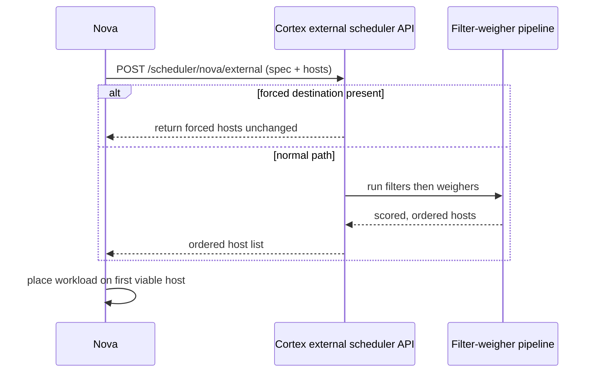

<!--
# SPDX-FileCopyrightText: Copyright SAP SE or an SAP affiliate company and cobaltcore-dev contributors
#
# SPDX-License-Identifier: Apache-2.0
-->

# Delegation model

Cortex improves placement without owning the workload lifecycle. It plugs into a platform scheduler
as an advisor: the platform still creates, tracks, and destroys workloads; Cortex only re-orders the
candidate hosts (or recommends a move). This page explains that delegation contract and the escape
hatches that keep operators in control. For setup see
[Configure shim endpoints](../guides/configure-shim-endpoints.md) and the pipeline
[configuration reference](../reference/configuration.md).

## Why delegate instead of replace

Replacing a platform's scheduler means owning correctness for the entire lifecycle — retries,
races, resource claims — and re-implementing it per platform. Delegation keeps that burden with the
platform, which already does it well, and lets Cortex focus on the one thing it does better: ranking
candidates using knowledge the platform does not have. The coupling is a thin, well-defined hook, so
the same approach works for Nova today and other platforms by analogy.

## The Nova external-scheduler hook

Nova supports an external scheduler: when enabled, it POSTs the current placement request and its
candidate hosts to an HTTP endpoint and uses the returned ordering.

The endpoint is `POST /scheduler/nova/external`, served by the Nova pipeline controller. Cortex only
ever *reorders and filters* the candidate set Nova supplied — it never invents hosts Nova did not
offer.

## Forced destinations bypass the pipeline

Operators must be able to pin a workload to a specific host regardless of what Cortex would prefer.
When a request carries `force_hosts` or `force_nodes`, Cortex short-circuits: `IsForcedDestination()`
detects the condition and `ForcedHosts()` returns those hosts directly, skipping filters and
weighers entirely.

This behaviour is governed by `forcedDestinationEnabled` (default `true`). With it enabled, a forced
request is always honoured; disabling it makes forced requests flow through the normal pipeline.

> [!NOTE]
> Because forced destinations bypass filters, they can place a workload on a host a filter would
> otherwise reject. That is intentional — it is the operator override.

## Other request-shaping knobs

The external scheduler API also honours:

- `novaLimitHostsToRequest` — cap the number of candidate hosts considered.
- `evacuationShuffleK` — randomize among the top-K during evacuation to spread load.

See the [configuration reference](../reference/configuration.md) for exact keys and defaults.

## Descheduling: advice, never action

For workloads already placed, detector pipelines emit *descheduling recommendations* as
`Descheduling` decisions. Cortex does not move workloads itself in the general case — it surfaces
what should move and leaves execution to an operator or an executor controller
(`nova-deschedulings-executor`). This preserves the same delegation principle: Cortex decides,
the platform (or an explicit executor) acts.

## Next steps

- Concept: [Placement API shim](placement-api-shim.md), [Overview](overview.md)
- Guide: [Configure shim endpoints](../guides/configure-shim-endpoints.md)
- Reference: [Configuration](../reference/configuration.md), [Decision CRD](../reference/crds/decision.md)
