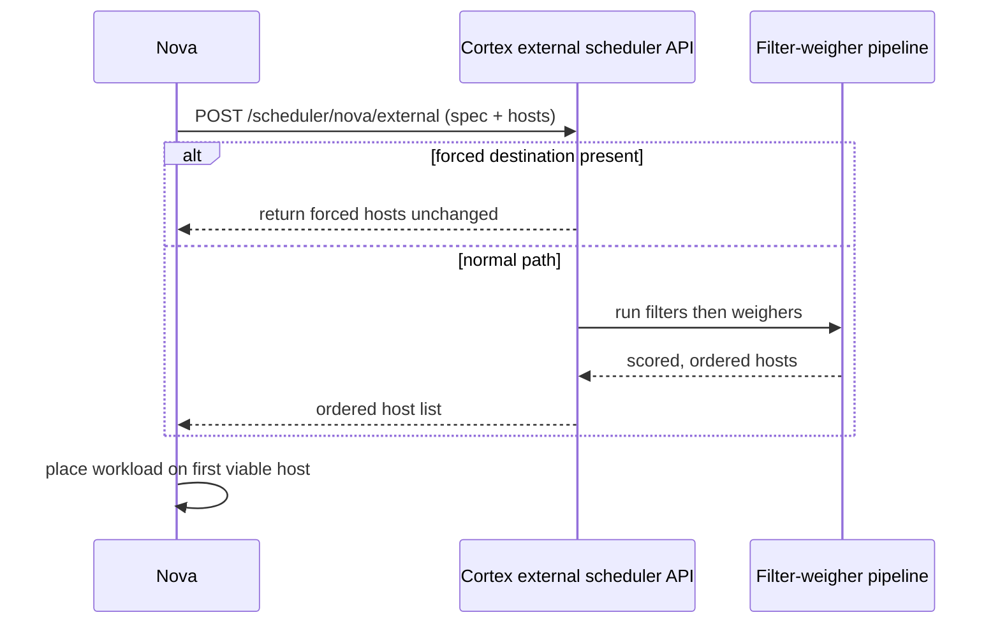

<!--
# SPDX-FileCopyrightText: Copyright SAP SE or an SAP affiliate company and cobaltcore-dev contributors
#
# SPDX-License-Identifier: Apache-2.0
-->

# Delegation model

Cortex improves placement without owning the workload lifecycle. It plugs into a platform scheduler
as an advisor: the platform still creates, tracks, and destroys workloads; Cortex only re-orders the
candidate hosts (or recommends a move). This page explains that delegation contract and the escape
hatches that keep operators in control. For setup see
[Configure shim endpoints](../guides/configure-shim-endpoints.md) and the pipeline
[configuration reference](../reference/configuration.md).

## Why delegate instead of replace

Replacing a platform's scheduler means owning correctness for the entire lifecycle — retries,
races, resource claims — and re-implementing it per platform. Delegation keeps that burden with the
platform, which already does it well, and lets Cortex focus on the one thing it does better: ranking
candidates using knowledge the platform does not have. The coupling is a thin, well-defined hook, so
the same approach works for Nova today and other platforms by analogy.

The distinction that makes this work is between *recommendation* and *execution*. Cortex produces a
recommendation — an ordering of candidates, or a suggestion that a workload move — and nothing more.
The platform decides whether and how to act on it: it claims the resource, handles the failure if
the chosen host is no longer viable, and remains the single authority on what is actually running
where. Keeping that boundary sharp is what lets Cortex be the single home for scheduling *logic*
without also having to become the single home for scheduling *state*. It can be added to a running
cloud without a migration, upgraded or rolled back without touching the platform's data path, and —
in the worst case — bypassed entirely, with the platform falling back to its own ordering.

## The Nova external-scheduler hook

Nova supports an external scheduler: when enabled, it POSTs the current placement request and its
candidate hosts to an HTTP endpoint and uses the returned ordering.

The endpoint is `POST /scheduler/nova/external`, served by the Nova pipeline controller. Cortex only
ever *reorders and filters* the candidate set Nova supplied — it never invents hosts Nova did not
offer.

## Forced destinations bypass the pipeline

Operators must be able to pin a workload to a specific host regardless of what Cortex would prefer.
When a request carries `force_hosts` or `force_nodes`, Cortex short-circuits: `IsForcedDestination()`
detects the condition and `ForcedHosts()` returns those hosts directly, skipping filters and
weighers entirely.

This behaviour is governed by `forcedDestinationEnabled` (default `true`). With it enabled, a forced
request is always honoured; disabling it makes forced requests flow through the normal pipeline.

> [!NOTE]
> Because forced destinations bypass filters, they can place a workload on a host a filter would
> otherwise reject. That is intentional — it is the operator override.

## Other request-shaping knobs

The external scheduler API also honours:

- `novaLimitHostsToRequest` — when `true`, restrict the returned list to hosts Nova included in the
  original request, dropping any host Cortex would otherwise surface. A boolean output filter, not a
  numeric cap.
- `evacuationShuffleK` — for evacuation-intent requests only, randomize among the top-K hosts to
  spread load. Set to `0` or a negative value to disable shuffling.

See the [configuration reference](../reference/configuration.md) for exact keys and defaults.

## Advisory today, fuller delegation planned

The external-scheduler hook is one point on a spectrum. It is worth naming where Cortex sits on it,
because the two ends imply very different amounts of responsibility.

- **Advisory mode (current).** The platform runs its own scheduler first, assembles the candidate
  hosts, and hands that set to Cortex. Cortex reorders and filters *within* that set and hands it
  back. The platform never gives up ownership of the candidate list — Cortex cannot surface a host
  the platform did not offer, and if Cortex is unreachable the platform still has its own ordering to
  fall back on. This is the safe, low-commitment integration, and it is what Cortex does for every
  domain today.
- **Delegation mode (planned).** At the other end, the platform would hand the *whole* placement
  decision to Cortex, which would build the candidate set itself from its own inventory — its
  Kubernetes-native view of hosts — rather than reordering a set the platform pre-computed. This
  removes the platform's scheduler from the path for those requests and lets Cortex apply knowledge
  the platform never had a chance to consider.

> [!NOTE]
> Full delegation mode is a planned direction, not current behaviour. Today Cortex always operates in
> advisory mode: it reorders and filters the candidate set the platform supplies.

## Concurrency and retries

Placement is concurrent: many requests race for the same finite capacity at once, and the host a
recommendation names may be gone by the time the platform tries to use it. Cortex therefore has to
reason *pessimistically* — assume a recommended host may be taken, and make sure a second request in
flight is not handed the same scarce slot. How the platform recovers when a recommendation does not
pan out shapes what Cortex must do.

Nova, concretely, recovers in a few different shapes depending on the operation:

- **Pre-fetched alternates.** The platform asks for an ordered list up front and, on failure, walks
  down it without asking again. Cortex's whole ranking matters here, not just the top choice.
- **Iterative retry.** The platform re-asks after a failure, telling Cortex which hosts to exclude
  (an `ignore_hosts`-style signal) so the next answer avoids the host that just failed.
- **Single-candidate, no retry.** Some operations (for example a rebuild in place) have exactly one
  viable target and simply fail if it does not work; there is nothing to re-rank.

To keep concurrent requests from double-spending the same capacity, a decision that is made but not
yet realized is recorded as an **in-flight reservation** — capacity held pessimistically for the
duration of the placement window so no parallel request is offered it. That state lives in the
reservation machinery; see [Operate reservations](../guides/operate-reservations.md).

> [!NOTE]
> The forced-destination bypass described above is an operator override today, but closing it for
> lifecycle operations that should always flow through the pipeline is a planned refinement. The
> deeper feedback channels (such as the platform telling Cortex which hosts to ignore on retry) are
> likewise a direction the integration is growing toward, not a complete, shipped contract. Treat the
> retry shapes here as the *reasoning* Cortex is built around, not a guarantee about every operation
> today.

## Descheduling: advice, never action

For workloads already placed, [detector pipelines](crd-controller-model.md) emit *descheduling
recommendations* as [`Descheduling`](../reference/crds/descheduling.md) decisions. Cortex does not move workloads itself in the general case — it surfaces
what should move and leaves execution to an operator or an executor controller
(`nova-deschedulings-executor`). This preserves the same delegation principle: Cortex decides,
the platform (or an explicit executor) acts.

## Next steps

- Concept: [Placement API shim](placement-api-shim.md), [Overview](overview.md)
- Guide: [Configure shim endpoints](../guides/configure-shim-endpoints.md)
- Reference: [Configuration](../reference/configuration.md), [Decision CRD](../reference/crds/decision.md)
