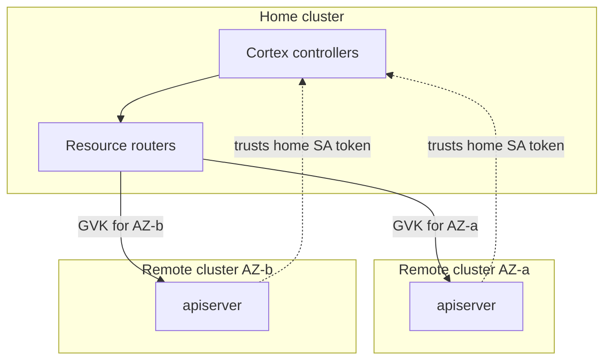

<!--
# SPDX-FileCopyrightText: Copyright SAP SE or an SAP affiliate company and cobaltcore-dev contributors
#
# SPDX-License-Identifier: Apache-2.0
-->

# Multicluster

Cortex can operate across several Kubernetes clusters, treating them as one logical control plane
while keeping each resource kind physically owned by the cluster responsible for it. This page
explains why Cortex is multicluster-aware and how it routes resources. For setup see
[Set up multicluster](../guides/set-up-multicluster.md); for config keys see the
[configuration reference](../reference/configuration.md).

## Why span clusters

Large clouds are partitioned — by availability zone, region, or failure domain — and it is often
desirable to keep the state describing a partition physically in that partition. At the same time,
placement logic wants a single, coherent view. Cortex reconciles these by designating a **home**
cluster that runs the controllers and one or more **remote** clusters that hold partition-local
resources, with Cortex routing each kind to the cluster that owns it.

## Home and remote clusters

- The **home** cluster runs the manager and its controllers.
- **Remote** clusters expose their apiservers to the home cluster and are configured to *trust the
  home cluster's service-account tokens*, so the home controllers can read and write remote
  resources with their own identity.

## Routing by GVK and availability zone

Routing is expressed through `ResourceRouters`: for each Group/Version/Kind, Cortex knows which
cluster serves it, keyed by availability zone. The `apiservers` config block declares this:

- `apiservers.home.gvks` — the GVKs the home cluster serves directly.
- `apiservers.remotes[]` — per remote, its `host`, CA, the `gvks` it serves, and `labels` (including
  the AZ) used to route.

When a controller reads or writes a routed kind, the router transparently directs the call to the
owning apiserver. See the [configuration reference](../reference/configuration.md).

## Failure surfaces

Two conditions are specific to multicluster and worth monitoring:

- **Remote reachability** — `cortex_multicluster_remote_apiserver_reachable` reports per-remote
  connectivity; the `CortexNovaMulticlusterRemoteApiserverUnreachable`-style alerts fire on loss.
- **Cross-cluster name conflicts** — because kinds are cluster-scoped, the same name appearing in
  two clusters is a conflict; `cortex_multicluster_cross_cluster_name_conflicts_total` counts them
  and an alert fires. See [Metrics and alerts](../reference/metrics.md).

## Next steps

- Concept: [CRD/controller model](crd-controller-model.md), [Overview](overview.md)
- Guide: [Set up multicluster](../guides/set-up-multicluster.md)
- Reference: [Configuration](../reference/configuration.md), [Metrics and alerts](../reference/metrics.md)
