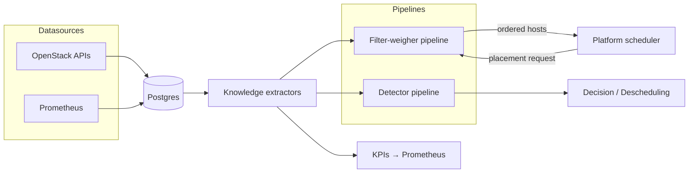

<!--
# SPDX-FileCopyrightText: Copyright SAP SE or an SAP affiliate company and cobaltcore-dev contributors
#
# SPDX-License-Identifier: Apache-2.0
-->

# Cortex overview

Cortex is a Kubernetes operator that makes smarter placement decisions for cloud workloads. Instead
of scheduling with only the point-in-time facts a cloud platform's own scheduler sees, Cortex
continuously ingests operational data, distills it into reusable *knowledge*, and runs that
knowledge through configurable *pipelines* to influence where a workload lands — or to recommend
moving one that is already placed.

This page explains why Cortex is shaped the way it is and how its parts fit together. For hands-on
steps see the [guides](../guides/install-a-domain-bundle.md); for exact fields see the
[reference](../reference/crds/readme.md).

## Why a placement operator

A cloud platform's built-in scheduler (Nova for compute, Cinder for block storage, and so on)
decides placement from the state it can cheaply observe at request time. That state is narrow: it
rarely reflects historical load, cross-project commitments, hardware health trends, or capacity that
is promised but not yet consumed. Encoding that richer picture into each platform scheduler is hard
and couples policy to the platform.

Cortex takes a different stance: it treats *placement intelligence* as its own concern, deployed
beside the platform. The platform still owns the workload lifecycle; Cortex supplies a better
ordering of candidates (or a descheduling recommendation) built from data the platform does not
track. Because the intelligence lives outside the platform, the same model serves compute, storage,
bare metal, and Kubernetes pods.

## The three components

Cortex is delivered as three deployables:

- **cortex core** — the `manager` binary, packaged through the `cortex` library chart and the
  per-domain bundles (`cortex-nova`, `cortex-cinder`, `cortex-manila`, `cortex-ironcore`,
  `cortex-pods`). This runs the controllers, the knowledge pipeline, and the external scheduler API.
- **cortex-postgres** — the datastore for ingested facts and derived knowledge, rendered from the
  `cortex-postgres` library chart.
- **cortex-shim** — the `shim` binary (`cortex-shim` library, `cortex-placement-shim` bundle) that
  presents an OpenStack Placement-API-compatible surface. See
  [Placement API shim](placement-api-shim.md).

## The end-to-end flow

Everything Cortex does follows one arc: raw facts become knowledge, knowledge feeds pipelines, and
pipelines emit decisions the platform acts on.

1. **Datasources** pull raw facts from OpenStack APIs and Prometheus into Postgres. See
   [Configure datasources, knowledge, and KPIs](../guides/configure-knowledge.md).
2. **Knowledge extractors** turn those raw rows into features — the reusable, query-ready facts a
   pipeline step consumes.
3. **Filter-weigher pipelines** answer a live placement request: filters remove unsuitable hosts,
   weighers score the survivors, and the platform receives a re-ordered candidate list.
4. **Detector pipelines** run on a schedule to spot already-placed workloads that should move,
   emitting descheduling recommendations.
5. **KPIs** publish knowledge as Prometheus metrics for dashboards and alerting.

## How pipelines combine steps

A filter-weigher pipeline is intentionally simple to reason about:

- **Filters** run sequentially. Each removes hosts it deems unsuitable; a host removed by any filter
  is gone.
- **Weighers** run in parallel over the survivors. Each emits an *activation* per host.
- Activations are aggregated into a final score with `weight + multiplier * tanh(activation)`, so no
  single weigher can dominate and scores stay bounded.

This model is deliberately shallow — flat and inspectable — so an operator can read a pipeline's
step list and predict its behaviour. See the [CRD/controller model](crd-controller-model.md) for how
steps are registered and [Extend Cortex](../guides/extend-cortex.md) to add one.

## Delegation, not replacement

Cortex never takes over the workload lifecycle. For Nova it hooks in as an *external scheduler*: the
platform calls Cortex, Cortex returns an ordering, and the platform proceeds. Operators keep escape
hatches — forced destinations bypass the pipeline entirely. See the
[delegation model](delegation-model.md).

## Where Cortex runs

Cortex can span multiple Kubernetes clusters, routing each resource kind to the cluster that owns it
by availability zone. See [Multicluster](multicluster.md). To hide informer lag during rapid
reconciliation it uses an in-process [pending-cache overlay](pending-cache-overlay.md).

## Next steps

- Concept: [Delegation model](delegation-model.md), [CRD/controller model](crd-controller-model.md)
- Guide: [Install a domain bundle](../guides/install-a-domain-bundle.md)
- Reference: [CRD reference](../reference/crds/readme.md)
