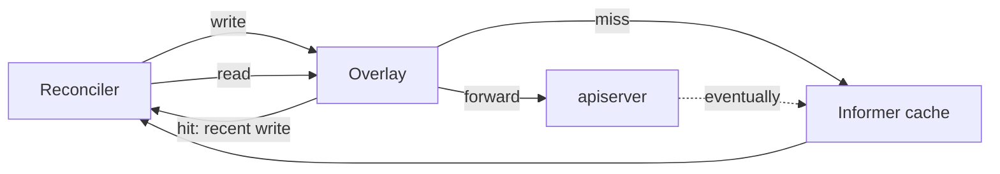

<!--
# SPDX-FileCopyrightText: Copyright SAP SE or an SAP affiliate company and cobaltcore-dev contributors
#
# SPDX-License-Identifier: Apache-2.0
-->

# Pending-cache overlay

Cortex controllers read Kubernetes resources through an informer cache, which lags behind writes by
a small, variable delay. During rapid reconciliation that lag can make a controller act on stale
state — for example, re-creating a resource it just created because the informer has not caught up.
The pending-cache overlay masks that lag. This page explains why it exists and how it behaves. For
the config keys see the [configuration reference](../reference/configuration.md).

## Why an overlay

The controller-runtime informer cache is eventually consistent: after a write, there is a window in
which a read still returns the old value (or no value). Most reconcilers tolerate this, but Cortex's
placement resources are written and re-read in tight loops, and a stale read there causes duplicate
work or oscillation. Rather than disable caching (which would hammer the apiserver), Cortex layers a
small in-process overlay on top of the cache that remembers its own recent writes.

## Write-through with tombstones

- On **write**, the overlay records the object (or a **tombstone** for a delete) and forwards the
  write to the apiserver.
- On **read**, the overlay is consulted first: if it holds a recent write for that key, the
  reconciler sees its own change immediately; otherwise the read falls through to the informer
  cache.
- Once the informer catches up, the overlay entry is redundant and is evicted.

Tombstones matter for deletes: without them, a just-deleted object could reappear from the lagging
cache. The overlay serves the tombstone so the reconciler sees the deletion.

## Bounded and per-GVK

The overlay is scoped and bounded so it cannot grow without limit or hide staleness forever:

- It is enabled per Group/Version/Kind via `cache.gvks` — only the kinds that need it pay for it.
- Every entry has a backstop **TTL** (`cache.ttl`, default `2m`): even if the informer never
  confirms, the entry is evicted after the TTL so the overlay can never mask a genuinely diverged
  state indefinitely.
- Occupancy is observable through `cortex_cache_overlay_entries` and `_entries_max`; the
  `CortexNovaCacheOverlayNotDraining` alert fires if entries stop draining, which indicates the
  informer is not catching up. See [Metrics and alerts](../reference/metrics.md).

The overlay is off by default (`cache.enabled=false`); enable it only for kinds with tight
write-read loops.

## Next steps

- Concept: [CRD/controller model](crd-controller-model.md), [Overview](overview.md)
- Reference: [Configuration](../reference/configuration.md), [Metrics and alerts](../reference/metrics.md)
