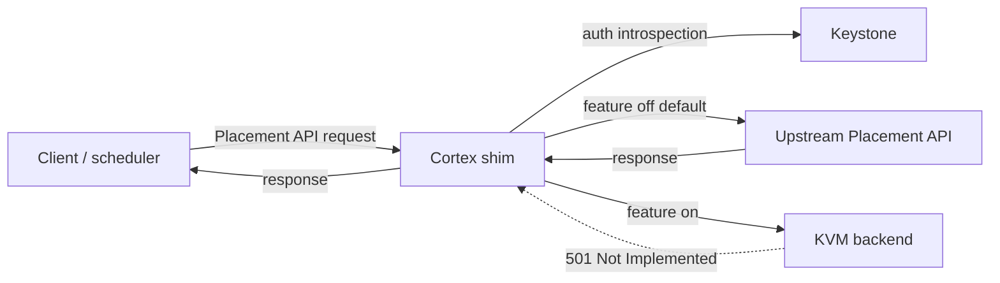

<!--
# SPDX-FileCopyrightText: Copyright SAP SE or an SAP affiliate company and cobaltcore-dev contributors
#
# SPDX-License-Identifier: Apache-2.0
-->

# Placement API shim

The Cortex shim presents an interface that speaks the OpenStack Placement API, sitting between
clients and a real Placement service. It exists so Cortex can observe — and eventually serve — the
placement traffic that shapes scheduling, without any client having to know Cortex is there. This
page explains why the shim is a separate component and how requests flow through it. For flags see
[CLI flags](../reference/cli-flags.md); for config keys see [Configuration](../reference/configuration.md).

## Why a separate shim

The Placement API is a hot path: schedulers hit it constantly to learn about resource providers,
inventories, and allocations. Cortex wants visibility into that traffic and, over time, the ability
to answer parts of it from its own knowledge (for example, a KVM-aware backend). Building that into
the manager would couple a latency-sensitive proxy to the manager's reconcile loops. Instead the
shim is a distinct binary (`shim`, chart `cortex-placement-shim`) tuned for request serving and
resilience.

The deeper motivation is that Cortex wants to become *hypervisor-aware* without asking any client to
know it exists. Placement is the natural seam: clients already speak it, so a component that speaks
the same protocol can sit in front of the real Placement service and be indistinguishable from it.
That lets Cortex, over time, serve the parts of the placement world it understands best — KVM hosts,
whose authoritative state Cortex intends to hold in Kubernetes-native custom resources — while
transparently forwarding everything else (VMware, bare metal) to upstream Placement. The prize is a
single, uniform Placement-shaped endpoint per region that no client has to be patched to use, behind
which Cortex can grow its own model at its own pace.

## Request flow: passthrough by default

The shim exposes the Placement API endpoint groups. Each group is independently switchable between
two modes via the `features.*` toggles (see [Configuration](../reference/configuration.md)):

- **Passthrough (default, toggle off)** — the request is proxied unchanged to the upstream Placement
  API and the response returned to the client. This is transparent: clients behave exactly as if
  talking to Placement directly.
- **KVM backend (toggle on)** — the request is meant to be answered from Cortex's own model.

> [!NOTE]
> The KVM backend is not yet implemented. Any endpoint group whose toggle is set to `true` currently
> returns `501 Not Implemented`. Leave the toggles at their default `false` for pure passthrough.

Toggles are per-endpoint-group (`resourceProviders`, `traits`, `inventories`, `allocations`,
`usages`, `allocationCandidates`, `reshaper`, and others), so an operator can migrate one surface at
a time once the backend exists.

## Routing by provider, not by caller

A Placement request is either *about a specific resource provider* (read this provider's inventory,
write that provider's allocations) or *aggregated* across many (list all providers, or all candidate
providers that could satisfy a request). The shim's routing model follows that split:

- **Per-provider requests** are routed by the identity of the *provider* the request concerns —
  which hypervisor it is about — not by which client sent it. A request touching a KVM host would be
  answered from Cortex's model; one touching a non-KVM provider is forwarded upstream.
- **Aggregated (list) requests** cannot be routed to a single place, so the shim fans out, collects
  the pieces, and merges them into one response.

Keying on the provider rather than the caller is what keeps access uniform: whether Nova, Neutron,
or another service is asking, the same provider yields the same answer, so the shim does not need a
per-client model of who is allowed to see what.

## One Placement endpoint for the region

Because the shim is protocol-compatible, the intended deployment repoints the service catalog at it
*globally* — every client in the region resolves Placement to the shim, not to upstream. The
alternative, steering only some clients to the shim, would create two disagreeing views of the same
world (one client sees Cortex's answer, another sees upstream's) and an artificial border that
placement decisions would have to reason across. A single endpoint gives every client one consistent
world state. The trade-off is blast radius: a single shared endpoint is also a single thing that,
if it misbehaves, affects everyone — which is exactly why the safety nets below matter.

## The onion: only introspect as far as needed

The shim is layered like an onion, and a request peels off at the outermost layer that can answer
it. A request the shim can forward without understanding — anything destined for upstream Placement —
peels off early and never touches the parts of the shim that model KVM. That is a deliberate safety
property: a non-KVM request's fate does not depend on the health of the KVM-serving code, and the
richer the layer a request must reach, the more that layer has been built to fail safe. The
client-decoupled design that follows from this — the request path staying up independently of the
controllers that populate Cortex's model — is described under
[Self-healing supervisor](#self-healing-supervisor) below; a watchdog surfaces a wedged inner layer
rather than letting it silently degrade the endpoint.

## Meta endpoints stay upstream

Some Placement endpoints are not about any particular provider at all — the microversion handshake,
the list of known resource classes, the list of known traits. These describe the *vocabulary* of the
Placement API itself, and upstream Placement remains the authority for them. The shim forwards them
rather than answering from its own model, so clients always negotiate against the real service's
capabilities. This is why the shim is a *partial* replacement even in its planned end state: it aims
to own the provider-specific data path for the hypervisors it understands, not to reimplement
Placement's self-description.

## Planned: KVM backend and cutover

Everything above describes the shape the shim is built for; the KVM-serving backend that fills it in
is not implemented yet, and every `features.*` toggle still returns `501` when enabled (see the note
above). The intended design, for context:

- **CRD-backed inventory.** Cortex would hold the authoritative inventory and allocations for KVM
  hosts in its own custom resources, and the shim would serve provider-specific Placement endpoints
  from that Kubernetes-native state instead of forwarding them.
- **A reconciling cutover.** Moving a surface from upstream to Cortex is not a flag flip but a
  reconciliation: a sync-controller would bring Cortex's model and upstream into agreement at a
  rendez-vous point, expose the remaining divergence as delta metrics so operators can watch it shrink
  to zero, and support moving in both directions so a migration can be rolled back as safely as it was
  rolled forward.

> [!NOTE]
> This section describes planned behaviour. Today the shim is a passthrough proxy with the safety and
> auth properties described elsewhere on this page; no endpoint is served from a Cortex-owned KVM
> model yet.

## Authentication

When an `auth` block is configured, the shim introspects the caller's `X-Auth-Token` against
Keystone and checks it against ordered policies (`METHOD /path` → allowed roles, optional project
scope). First match wins; no match denies with `403`; an empty role list makes an endpoint public.
When `auth` is absent, all requests pass through unauthenticated. Introspection results are cached
for `tokenCacheTTL`.

## Self-healing supervisor

The shim's controller-manager (cache + controllers) is not on the request path, but the request path
must stay up even if the manager cannot reach the apiserver. With `--self-heal` (default **on**) the
manager runs under a supervisor that rebuilds it with backoff on failure, while the REST API,
liveness probe, and metrics endpoint run in a durable outer process. The pod does not crash on
apiserver/cache hiccups; a looping manager is surfaced through the `cortex_placement_shim_manager_up`
gauge.

In self-heal mode the metrics server is plain `promhttp` (no TLS/authz), so `--metrics-secure` and
`--metrics-cert-path` are rejected when metrics are enabled. Set `--self-heal=false` for coupled
mode, where a manager failure exits the process. See [CLI flags](../reference/cli-flags.md).

## Next steps

- Concept: [Delegation model](delegation-model.md), [Overview](overview.md)
- Guide: [Configure shim endpoints](../guides/configure-shim-endpoints.md)
- Reference: [CLI flags](../reference/cli-flags.md), [Configuration](../reference/configuration.md)
