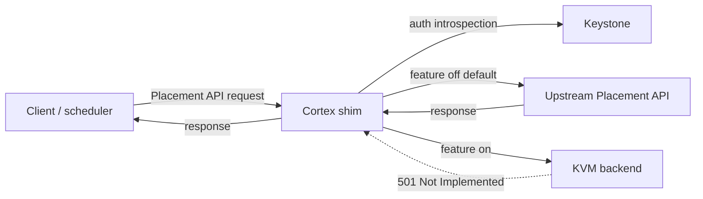

<!--
# SPDX-FileCopyrightText: Copyright SAP SE or an SAP affiliate company and cobaltcore-dev contributors
#
# SPDX-License-Identifier: Apache-2.0
-->

# Placement API shim

The Cortex shim presents an interface that speaks the OpenStack Placement API, sitting between
clients and a real Placement service. It exists so Cortex can observe — and eventually serve — the
placement traffic that shapes scheduling, without any client having to know Cortex is there. This
page explains why the shim is a separate component and how requests flow through it. For flags see
[CLI flags](../reference/cli-flags.md); for config keys see [Configuration](../reference/configuration.md).

## Why a separate shim

The Placement API is a hot path: schedulers hit it constantly to learn about resource providers,
inventories, and allocations. Cortex wants visibility into that traffic and, over time, the ability
to answer parts of it from its own knowledge (for example, a KVM-aware backend). Building that into
the manager would couple a latency-sensitive proxy to the manager's reconcile loops. Instead the
shim is a distinct binary (`shim`, chart `cortex-placement-shim`) tuned for request serving and
resilience.

## Request flow: passthrough by default

The shim exposes the Placement API endpoint groups. Each group is independently switchable between
two modes via the `features.*` toggles (see [Configuration](../reference/configuration.md)):

- **Passthrough (default, toggle off)** — the request is proxied unchanged to the upstream Placement
  API and the response returned to the client. This is transparent: clients behave exactly as if
  talking to Placement directly.
- **KVM backend (toggle on)** — the request is meant to be answered from Cortex's own model.

> [!NOTE]
> The KVM backend is not yet implemented. Any endpoint group whose toggle is set to `true` currently
> returns `501 Not Implemented`. Leave the toggles at their default `false` for pure passthrough.

Toggles are per-endpoint-group (`resourceProviders`, `traits`, `inventories`, `allocations`,
`usages`, `allocationCandidates`, `reshaper`, and others), so an operator can migrate one surface at
a time once the backend exists.

## Authentication

When an `auth` block is configured, the shim introspects the caller's `X-Auth-Token` against
Keystone and checks it against ordered policies (`METHOD /path` → allowed roles, optional project
scope). First match wins; no match denies with `403`; an empty role list makes an endpoint public.
When `auth` is absent, all requests pass through unauthenticated. Introspection results are cached
for `tokenCacheTTL`.

## Self-healing supervisor

The shim's controller-manager (cache + controllers) is not on the request path, but the request path
must stay up even if the manager cannot reach the apiserver. With `--self-heal` (default **on**) the
manager runs under a supervisor that rebuilds it with backoff on failure, while the REST API,
liveness probe, and metrics endpoint run in a durable outer process. The pod does not crash on
apiserver/cache hiccups; a looping manager is surfaced through the `cortex_placement_shim_manager_up`
gauge.

In self-heal mode the metrics server is plain `promhttp` (no TLS/authz), so `--metrics-secure` and
`--metrics-cert-path` are rejected when metrics are enabled. Set `--self-heal=false` for coupled
mode, where a manager failure exits the process. See [CLI flags](../reference/cli-flags.md).

## Next steps

- Concept: [Delegation model](delegation-model.md), [Overview](overview.md)
- Guide: [Configure shim endpoints](../guides/configure-shim-endpoints.md)
- Reference: [CLI flags](../reference/cli-flags.md), [Configuration](../reference/configuration.md)
