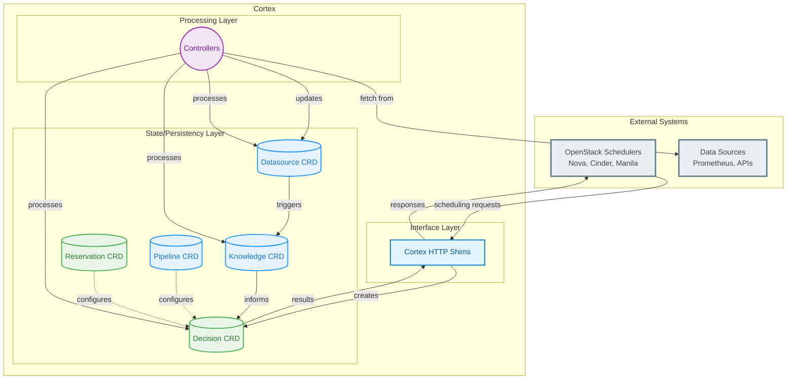
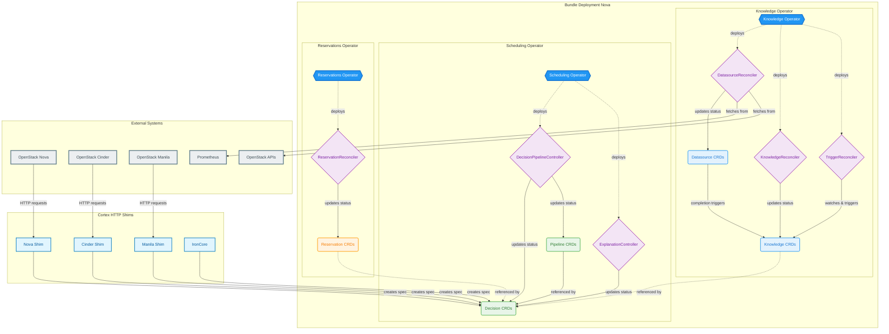

# Custom Resource Definitions (CRDs) 

## All Cortex owned CRDs
### Datasource CRD
 - **Purpose**: Defines external data sources and sync schedules, continuously sync infrastructure state from multiple services (OpenStack, Prometheus, etc.)
 - **Event Trigger**: Scheduled sync intervals or external webhooks
 - **Owner**: Knowledge Operator (service-specific reconcilers)
 
### Knowledge CRD
 - **Purpose**: Stores extracted features, Transforms raw data into actionable scheduling knowledge
 - **Event Trigger**: Datasource updates or dependency changes
 - **Owner**: Knowledge Operator (KnowledgeReconciler, TriggerReconciler)

### Decision CRD
 - **Purpose**: Records scheduling requests, decisions, and explanations
 - **Event Trigger**: External scheduler calls from various services
 - **Owner**: Scheduling Operator (service-specific controllers)

### Pipeline CRD
 - **Purpose**: Defines scheduling workflows, configures multi-step scheduling logic per bundle
 - **Event Trigger**: Configuration changes
 - **Owner**: Scheduling Operator (DeschedulingsPipelineController, DecisionPipelineController variants)

### Step CRD
 - **Purpose**: Track individual steps within pipelines (filters, weighers, etc.)
 - **Event Trigger**: Pipeline configuration changes
 - **Owner**: Scheduling Operator

### Descheduling CRD
 - **Purpose**: Recommendations for moving workloads
 - **Event Trigger**: Capacity events
 - **Owner**: Scheduling Operator (Cleanup controllers)

### Reservation CRD
 - **Purpose**: Manages capacity reservations, reserve resources
 - **Event Trigger**: Capacity requests
 - **Owner**: Reservations Operator (ReservationReconciler)

## Simplified Overview

## CRD Ownership and Bundle Context

Operators can be deployed together in bundles (e.g., Nova bundle) or separately. 

**Legend:**
- 🔷 **Hexagons**: Cortex Operators
- 🔘 **Rounded Rectangles**: CRDs 
- 🔶 **Diamonds**: Controllers/Reconcilers
- **Rectangles (Light Blue)**: Cortex HTTP Shims
- **Rectangles (Gray)**: External Systems
- **Solid arrows**: Direct actions (creates, updates, triggers)
- **Dotted arrows**: Management/reference relationships

