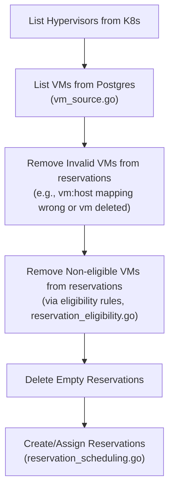
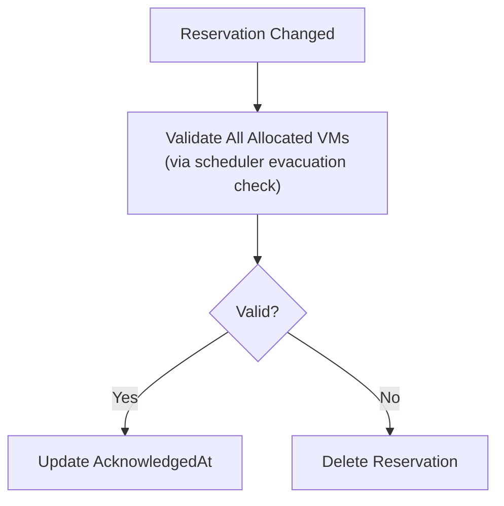
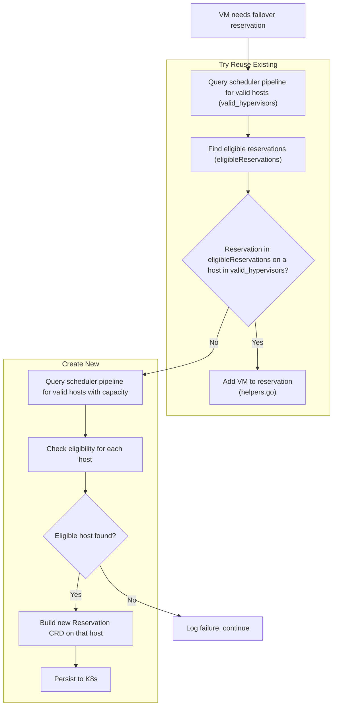
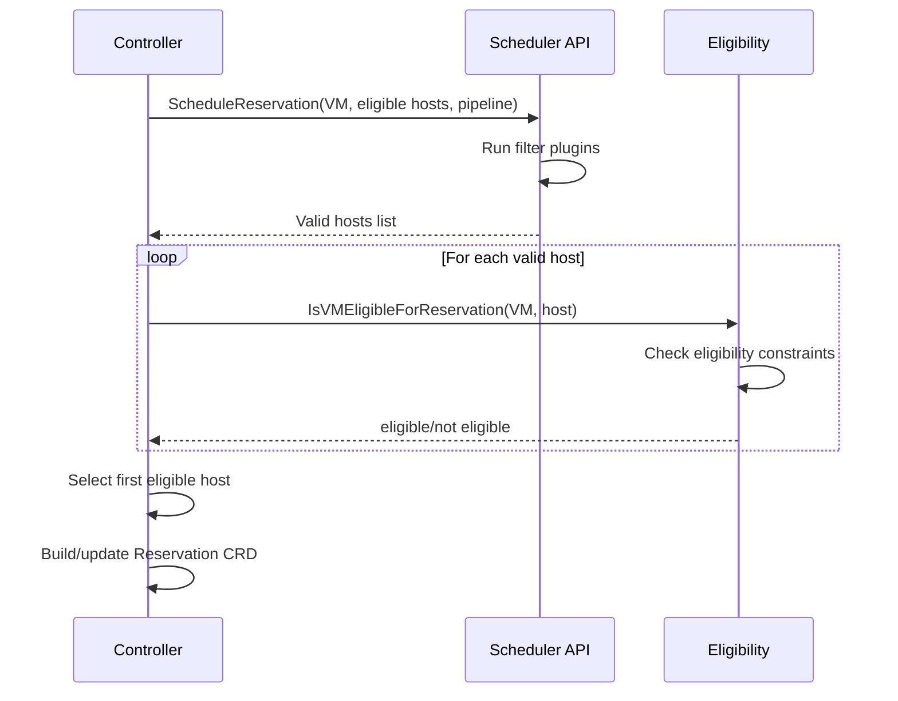

# Failover Reservation System

The failover reservation system ensures VMs have pre-reserved capacity on alternate hypervisors for evacuation. It's a Kubernetes controller that manages `Reservation` CRDs.

## File Structure

```text
internal/scheduling/reservations/failover/
├── config.go                    # Configuration struct (intervals, flavor requirements)
├── controller.go                # Handles lifecycle of Reservation CRD of type failover
├── vm_source.go                 # VM data source (reads from Nova DB via postgres)
├── reservation_eligibility.go   # Checks if a VM can use a failover reservation from a HA perspective (independent of normal scheduling constraints)
├── reservation_scheduling.go    # Scheduling (new and reusing) of failover reservations via our scheduling pipeline
└── helpers.go                   # Utility functions for reservation manipulation
```

## Reconciliation Flow

The controller has two reconciliation modes:

### Periodic Reconciliation 

*See: `controller.go`*




### Watch-based Reconciliation

*See: `controller.go`*



## Create/Assign Reservations Detail

*See: `reservation_scheduling.go`*



## Create new Reservation for a VM flow



## Key Components

### 1. Controller (`controller.go`)

The main orchestrator with dual reconciliation:
- **Periodic bulk processing**: Runs every `ReconcileInterval` (default 5s), processes all VMs
- **Watch-based validation**: Triggered by Reservation CRD changes, validates individual reservations

### 2. VM Source (`vm_source.go`)

Interface `VMSource` with `DBVMSource` implementation:
- Reads VMs from Nova postgres database (servers + flavors join)
- Can trust either postgres (`OSEXTSRVATTRHost`) or Hypervisor CRD for VM location
- Returns `VM` structs with UUID, flavor, resources, extra specs, AZ

### 3. Eligibility Constraints (`reservation_eligibility.go`)

Five constraints ensure safe failover without conflicts:

| # | Constraint | Purpose |
|---|------------|---------|
| 1 | VM cannot reserve slot on its own hypervisor | Failover must be to a different host |
| 2 | VM's N slots must be on N distinct hypervisors | Spread failover capacity |
| 3 | No two VMs using same reservation can be on same hypervisor | Avoid double-booking on failure |
| 4 | VMs sharing slots can't run on each other's hypervisors or slot hosts | Prevent cascading failures |
| 5 | No two VMs using a VM's slots can be on the same hypervisor | Ensure evacuation capacity |

### 4. Scheduling (`reservation_scheduling.go`)

Integrates with Nova external scheduler API using three pipelines.

## Scheduler Pipelines

We use three different scheduler pipelines for failover reservations, each serving a specific purpose:

### `kvm-valid-host-reuse-failover-reservation`
**Used when:** Trying to reuse an existing reservation for a VM.

**Why:** When reusing a reservation, capacity is already reserved on the target host. We only need to verify that the VM is compatible with the host (traits, capabilities, AZ, etc.) without checking if there's enough free capacity.

### `kvm-valid-host-new-failover-reservation`
**Used when:** Creating a new failover reservation.

**Why:** When creating a new reservation, we need to find a host that:
1. Is compatible with the VM (traits, capabilities, AZ, etc.)
2. Has enough free capacity to accommodate the VM if it needs to evacuate

This is the most restrictive pipeline since we're actually reserving new capacity.

### `kvm-acknowledge-failover-reservation`
**Used when:** Validating that an existing reservation is still valid (watch-based reconciliation).

**Why:** Periodically we need to verify that a VM could still evacuate to its reserved host. This sends an evacuation-style scheduling request with only the reservation's host as the eligible target. If the scheduler rejects it, the reservation is no longer valid and should be deleted so the periodic controller can create a new one on a valid host.

## Data Model

### VM Struct
```go
type VM struct {
    UUID              string
    FlavorName        string
    ProjectID         string
    CurrentHypervisor string
    AvailabilityZone  string
    Resources         map[string]resource.Quantity  // "memory", "vcpus"
    FlavorExtraSpecs  map[string]string
}
```

### Reservation CRD Status
```go
type FailoverReservationStatus struct {
    Allocations    map[string]string  // vmUUID -> hypervisor where VM runs
    LastChanged    *metav1.Time
    AcknowledgedAt *metav1.Time       // Set after validation passes
}
```

