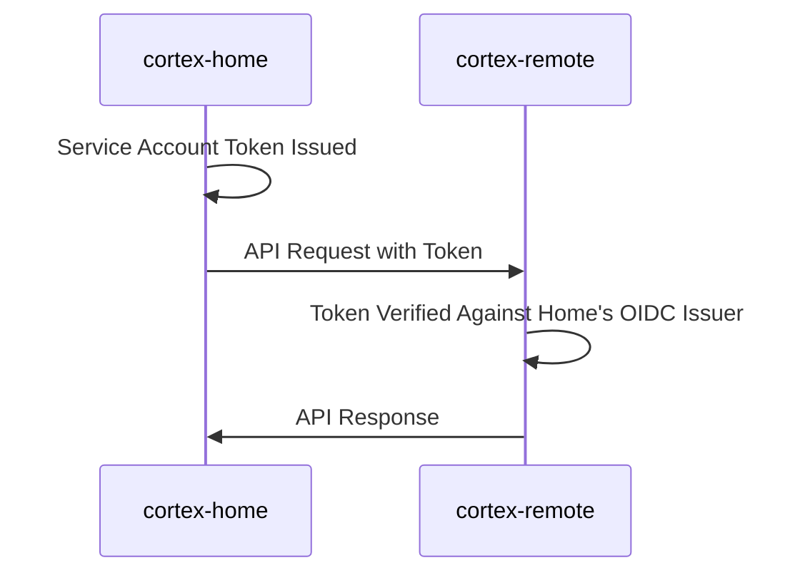

# Cortex Multi-Cluster Testing

Cortex provides support for multi-cluster deployments, where a "home" cluster hosts the cortex pods and one or more "remote" clusters are used to persist CRDs. A typical use case for this would be to offload the etcd storage for Cortex CRDs to a remote cluster, reducing the resource usage on the home cluster.

This guide will walk you through setting up a multi-cluster Cortex deployment using [kind](https://kind.sigs.k8s.io/). We will create two kind clusters: `cortex-home` and `cortex-remote`. The `cortex-home` cluster will host the Cortex control plane, while the `cortex-remote` cluster will be used to store CRDs.

To store its CRDs in the `cortex-remote` cluster, the `cortex-home` cluster needs to be able to authenticate to the `cortex-remote` cluster's API server. We will achieve this by configuring the `cortex-remote` cluster to trust the service account tokens issued by the `cortex-home` cluster. In this way, no external OIDC provider is needed, because the `cortex-home` cluster's own OIDC issuer for service accounts acts as the identity provider.

Here is a diagram illustrating the authentication flow:



## Home Cluster Setup

First we set up the `cortex-home` cluster. The provided kind configuration file `cortex-home.yaml` sets up the cluster with the necessary port mappings to allow communication between the two clusters. `cortex-home` will expose its API server on port `8443`, which `cortex-remote` will use to verify service account tokens through `https://host.docker.internal:8443`.

```bash
kind create cluster --config docs/guides/multicluster/cortex-home.yaml
```

Next, we need to expose the OIDC issuer endpoint of the `cortex-home` cluster's API server to the `cortex-remote` cluster. We do this by creating a `ClusterRoleBinding` that grants the `system:service-account-issuer-discovery` role to the `kube-system` service account in the `cortex-home` cluster.

```bash
kubectl --context kind-cortex-home apply -f docs/guides/multicluster/cortex-home-crb.yaml
```

To talk back to the `cortex-home` cluster's OIDC endpoint, the `cortex-remote` cluster needs to trust the root CA certificate used by the `cortex-home` cluster's API server. We can extract this certificate from the `extension-apiserver-authentication` config map in the `kube-system` namespace, and save it to a temporary file for later use.

```bash
kubectl --context kind-cortex-home --namespace kube-system \
  get configmap extension-apiserver-authentication \
  -o jsonpath="{.data['client-ca-file']}" > /tmp/root-ca-home.pem
```

## Remote Cluster Setup

With all the prerequisites in place, we can now set up the `cortex-remote` cluster. We create the cluster using the provided kind configuration file `cortex-remote.yaml`. This configuration will tell the `cortex-remote` cluster to trust the `cortex-home` cluster's API server as OIDC issuer for service account token verification. Also, the `cortex-remote` cluster will trust the root CA certificate we extracted earlier. The `cortex-remote` apiserver will be accessible at `https://host.docker.internal:8444`.

```bash
kind create cluster --config docs/guides/multicluster/cortex-remote.yaml
```

Next, we need to create a `ClusterRoleBinding` in the `cortex-remote` cluster that grants service accounts coming from the `cortex-home` cluster access to the appropriate resources. We do this by applying the provided `cortex-remote-crb.yaml` file.

```bash
kubectl --context kind-cortex-remote apply -f docs/guides/multicluster/cortex-remote-crb.yaml
```

## Deploying Cortex

Before we launch cortex make sure that the CRDs are installed in the `cortex-remote` cluster.

```bash
kubectl config use-context kind-cortex-remote
helm install helm/bundles/cortex-crds --generate-name
```

Also, we need to extract the root CA certificate used by the `cortex-remote` cluster's API server, so that we can configure the cortex pods in the `cortex-home` cluster to trust it.

```bash
kubectl --context kind-cortex-remote --namespace kube-system \
  get configmap extension-apiserver-authentication \
  -o jsonpath="{.data['client-ca-file']}" > /tmp/root-ca-remote.pem
```

Now we can deploy cortex to the `cortex-home` cluster, configuring it to use the `cortex-remote` cluster for CRD storage. We create a temporary Helm values override file that specifies the API server URL and root CA certificate for the `cortex-remote` cluster. In this example, we are configuring the `decisions.cortex.cloud/v1alpha1` resource to be stored in the `cortex-remote` cluster.

```bash
export TILT_OVERRIDES_PATH=/tmp/cortex-values.yaml
tee $TILT_OVERRIDES_PATH <<EOF
global:
  conf:
    apiServerOverrides:
    - gvk: cortex.cloud/v1alpha1/DecisionList
      host: https://host.docker.internal:8444
      caCert: |
$(cat /tmp/root-ca-remote.pem | sed 's/^/        /')
    - gvk: cortex.cloud/v1alpha1/Decision
      host: https://host.docker.internal:8444
      caCert: |
$(cat /tmp/root-ca-remote.pem | sed 's/^/        /')
EOF
```

Now we can start Cortex using Tilt, which will pick up the Helm values override file we just created.

```bash
kubectl config use-context kind-cortex-home
tilt up
```

## Outcome

With Cortex running in the `cortex-home` cluster and configured to use the `cortex-remote` cluster for CRD storage, we can verify that everything is working as expected with the following command:

```bash
kubectl --context kind-cortex-remote get decisions
```

This command should return the list of `Decision` resources stored in the `cortex-remote` cluster, confirming that Cortex is successfully using the remote cluster for CRD persistence.
