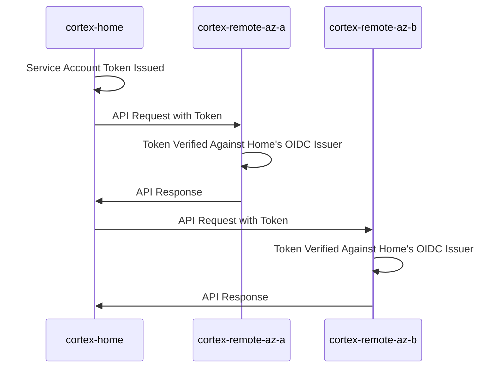

# Cortex Multi-Cluster Testing

> [!NOTE]
> If you want to skip the reading part, there's `run.sh` and `cleanup.sh` scripts in this directory that will set up and tear down the multi-cluster environment for you. If you want to test the

Cortex provides support for multi-cluster deployments, where a "home" cluster hosts the cortex pods and one or more "remote" clusters are used to persist CRDs. A typical use case for this would be to offload the etcd storage for Cortex CRDs to a remote cluster, reducing the resource usage on the home cluster. Similarly, another use case is to have multiple remote clusters that maintain all the compute workloads and expose resources that Cortex needs to access, such as the `Hypervisor` resource.

This guide will walk you through setting up a multi-cluster Cortex deployment using [kind](https://kind.sigs.k8s.io/). We will create three kind clusters: `cortex-home`, `cortex-remote-az-a`, and `cortex-remote-az-b`. The `cortex-home` cluster will host the Cortex control plane, while the `cortex-remote-az-a` and `cortex-remote-az-b` clusters will be used to store hypervisor CRDs.

To store its CRDs in the `cortex-remote-*` clusters, the `cortex-home` cluster needs to be able to authenticate to the `cortex-remote-*` clusters' API servers. We will achieve this by configuring the `cortex-remote-*` clusters to trust the service account tokens issued by the `cortex-home` cluster. In this way, no external OIDC provider is needed, because the `cortex-home` cluster's own OIDC issuer for service accounts acts as the identity provider.

Here is a diagram illustrating the authentication flow:


```mermaid
sequenceDiagram
    participant Home as cortex-home
    participant RemoteA as cortex-remote-az-a
    participant RemoteB as cortex-remote-az-b
    Home->>Home: Service Account Token Issued
    Home->>RemoteA: API Request with Token
    RemoteA->>RemoteA: Token Verified Against Home's OIDC Issuer
    RemoteA->>Home: API Response
    Home->>RemoteB: API Request with Token
    RemoteB->>RemoteB: Token Verified Against Home's OIDC Issuer
    RemoteB->>Home: API Response
```

## Home Cluster Setup

First we set up the `cortex-home` cluster. The provided kind configuration file `cortex-home.yaml` sets up the cluster with the necessary port mappings to allow communication between the three clusters. `cortex-home` will expose its API server on port `8443`, which `cortex-remote-az-a` and `cortex-remote-az-b` will use to verify service account tokens through `https://host.docker.internal:8443`.

```bash
kind create cluster --config docs/guides/multicluster/cortex-home.yaml
```

Next, we need to expose the OIDC issuer endpoint of the `cortex-home` cluster's API server to the `cortex-remote-*` clusters. We do this by creating a `ClusterRoleBinding` that grants the `system:service-account-issuer-discovery` role to the `kube-system` service account in the `cortex-home` cluster.

```bash
kubectl --context kind-cortex-home apply -f docs/guides/multicluster/cortex-home-crb.yaml
```

To talk back to the `cortex-home` cluster's OIDC endpoint, the `cortex-remote-*` clusters need to trust the root CA certificate used by the `cortex-home` cluster's API server. We can extract this certificate from the `extension-apiserver-authentication` config map in the `kube-system` namespace, and save it to a temporary file for later use.

```bash
kubectl --context kind-cortex-home --namespace kube-system \
  get configmap extension-apiserver-authentication \
  -o jsonpath="{.data['client-ca-file']}" > /tmp/root-ca-home.pem
```

## Remote Cluster Setup

With all the prerequisites in place, we can now set up the `cortex-remote-*` clusters. We create the clusters using the provided kind configuration files `cortex-remote-az-a.yaml` and `cortex-remote-az-b.yaml`. These configurations will tell the `cortex-remote-*` clusters to trust the `cortex-home` cluster's API server as OIDC issuer for service account token verification. Also, the `cortex-remote-*` clusters will trust the root CA certificate we extracted earlier. The `cortex-remote-*` apiservers will be accessible at `https://host.docker.internal:8444` and `https://host.docker.internal:8445`, respectively.

```bash
kind create cluster --config docs/guides/multicluster/cortex-remote-az-a.yaml
kind create cluster --config docs/guides/multicluster/cortex-remote-az-b.yaml
```

Next, we need to create a `ClusterRoleBinding` in the `cortex-remote-*` clusters that grants service accounts coming from the `cortex-home` cluster access to the appropriate resources. We do this by applying the provided `cortex-remote-crb.yaml` file.

```bash
kubectl --context kind-cortex-remote-az-a apply -f docs/guides/multicluster/cortex-remote-crb.yaml
kubectl --context kind-cortex-remote-az-b apply -f docs/guides/multicluster/cortex-remote-crb.yaml
```

## Deploying Cortex

Before we launch cortex make sure that the CRDs are installed in the `cortex-remote-*` clusters.

```bash
kubectl config use-context kind-cortex-remote-az-a
helm install helm/bundles/cortex-crds --generate-name
kubectl config use-context kind-cortex-remote-az-b
helm install helm/bundles/cortex-crds --generate-name
```

Let's also install the hypervisor crd to all three cluster which is needed as an external dependency for this example:
```bash
curl -L https://raw.githubusercontent.com/cobaltcore-dev/openstack-hypervisor-operator/refs/heads/main/charts/openstack-hypervisor-operator/crds/kvm.cloud.sap_hypervisors.yaml > /tmp/hypervisor-crd.yaml
kubectl --context kind-cortex-home apply -f /tmp/hypervisor-crd.yaml
kubectl --context kind-cortex-remote-az-a apply -f /tmp/hypervisor-crd.yaml
kubectl --context kind-cortex-remote-az-b apply -f /tmp/hypervisor-crd.yaml
```

Also, we need to extract the root CA certificate used by the `cortex-remote-*` clusters' API servers, so that we can configure the cortex pods in the `cortex-home` cluster to trust them.

```bash
kubectl --context kind-cortex-remote-az-a --namespace kube-system \
  get configmap extension-apiserver-authentication \
  -o jsonpath="{.data['client-ca-file']}" > /tmp/root-ca-remote-az-a.pem
kubectl --context kind-cortex-remote-az-b --namespace kube-system \
  get configmap extension-apiserver-authentication \
  -o jsonpath="{.data['client-ca-file']}" > /tmp/root-ca-remote-az-b.pem
```

Now we can deploy cortex to the `cortex-home` cluster, configuring it to use the `cortex-remote-*` clusters for CRD storage. We create a temporary Helm values override file that specifies the API server URLs and root CA certificate for the `cortex-remote-*` clusters. In this example, we are configuring the `kvm.cloud.sap/v1/Hypervisor` resource to be stored in the `cortex-remote-*` clusters.

```bash
export TILT_OVERRIDES_PATH=/tmp/cortex-values.yaml
tee $TILT_OVERRIDES_PATH <<EOF
global:
  conf:
    apiservers:
      remotes:
      - host: https://host.docker.internal:8444
        gvks:
        - kvm.cloud.sap/v1/Hypervisor
        - kvm.cloud.sap/v1/HypervisorList
        labels:
          az: cortex-remote-az-a
        caCert: |
$(cat /tmp/root-ca-remote-az-a.pem | sed 's/^/          /')
      - host: https://host.docker.internal:8445
        gvks:
        - kvm.cloud.sap/v1/Hypervisor
        - kvm.cloud.sap/v1/HypervisorList
        labels:
          az: cortex-remote-az-b
        caCert: |
$(cat /tmp/root-ca-remote-az-b.pem | sed 's/^/          /')
EOF
```

Additionally, we will add some hypervisors cortex can reconcile on:
```bash
kubectl --context kind-cortex-remote-az-a apply -f docs/guides/multicluster/hypervisors-az-a.yaml
kubectl --context kind-cortex-remote-az-b apply -f docs/guides/multicluster/hypervisors-az-b.yaml
```

Now we can start Cortex using Tilt, which will pick up the Helm values override file we just created.

```bash
kubectl config use-context kind-cortex-home
export ACTIVE_DEPLOYMENTS="nova" && tilt up
```

## Outcome

With Cortex running in the `cortex-home` cluster and configured to use the `cortex-remote-*` clusters for hypervisors, you can see it's processing your resources in multiple remotes:

```
2026-03-17T13:55:48Z	INFO	adding remote cluster for resource	{"gvk": "kvm.cloud.sap/v1, Kind=Hypervisor", "host": "https://host.docker.internal:8444", "labels": {"az":"cortex-remote-az-a"}}
2026-03-17T13:55:48Z	INFO	adding remote cluster for resource	{"gvk": "kvm.cloud.sap/v1, Kind=HypervisorList", "host": "https://host.docker.internal:8444", "labels": {"az":"cortex-remote-az-a"}}
2026-03-17T13:55:48Z	INFO	adding remote cluster for resource	{"gvk": "kvm.cloud.sap/v1, Kind=Hypervisor", "host": "https://host.docker.internal:8445", "labels": {"az":"cortex-remote-az-b"}}
2026-03-17T13:55:48Z	INFO	adding remote cluster for resource	{"gvk": "kvm.cloud.sap/v1, Kind=HypervisorList", "host": "https://host.docker.internal:8445", "labels": {"az":"cortex-remote-az-b"}}
...
2026-03-17T13:56:06Z	INFO	Reconciling resource	{"controller": "hypervisor-overcommit-controller", "namespace": "", "name": "hypervisor-1-az-b", "reconcileID": "283342c3-5efe-4afc-a906-67d4c17dcba9"}
2026-03-17T13:56:06Z	INFO	Desired overcommit ratios based on traits	{"controller": "hypervisor-overcommit-controller", "namespace": "", "name": "hypervisor-1-az-b", "reconcileID": "283342c3-5efe-4afc-a906-67d4c17dcba9", "desiredOvercommit": {}}
2026-03-17T13:56:06Z	INFO	Overcommit ratios are up to date, no update needed	{"controller": "hypervisor-overcommit-controller", "namespace": "", "name": "hypervisor-1-az-b", "reconcileID": "283342c3-5efe-4afc-a906-67d4c17dcba9"}
2026-03-17T13:56:06Z	INFO	Reconciling resource	{"controller": "hypervisor-overcommit-controller", "namespace": "", "name": "hypervisor-2-az-b", "reconcileID": "87d2937c-e0b0-415d-8fbf-c31d60a39370"}
2026-03-17T13:56:06Z	INFO	Desired overcommit ratios based on traits	{"controller": "hypervisor-overcommit-controller", "namespace": "", "name": "hypervisor-2-az-b", "reconcileID": "87d2937c-e0b0-415d-8fbf-c31d60a39370", "desiredOvercommit": {}}
2026-03-17T13:56:06Z	INFO	Overcommit ratios are up to date, no update needed	{"controller": "hypervisor-overcommit-controller", "namespace": "", "name": "hypervisor-2-az-b", "reconcileID": "87d2937c-e0b0-415d-8fbf-c31d60a39370"}
2026-03-17T13:56:06Z	INFO	Reconciling resource	{"controller": "hypervisor-overcommit-controller", "namespace": "", "name": "hypervisor-1-az-a", "reconcileID": "d44c7d72-d994-46f3-8f32-04b0aa550ac3"}
2026-03-17T13:56:06Z	INFO	Desired overcommit ratios based on traits	{"controller": "hypervisor-overcommit-controller", "namespace": "", "name": "hypervisor-1-az-a", "reconcileID": "d44c7d72-d994-46f3-8f32-04b0aa550ac3", "desiredOvercommit": {}}
2026-03-17T13:56:06Z	INFO	Overcommit ratios are up to date, no update needed	{"controller": "hypervisor-overcommit-controller", "namespace": "", "name": "hypervisor-1-az-a", "reconcileID": "d44c7d72-d994-46f3-8f32-04b0aa550ac3"}
2026-03-17T13:56:06Z	INFO	Reconciling resource	{"controller": "hypervisor-overcommit-controller", "namespace": "", "name": "hypervisor-2-az-a", "reconcileID": "10cc780b-a44c-4a59-8cc5-518a88146088"}
2026-03-17T13:56:06Z	INFO	Desired overcommit ratios based on traits	{"controller": "hypervisor-overcommit-controller", "namespace": "", "name": "hypervisor-2-az-a", "reconcileID": "10cc780b-a44c-4a59-8cc5-518a88146088", "desiredOvercommit": {}}
2026-03-17T13:56:06Z	INFO	Overcommit ratios are up to date, no update needed	{"controller": "hypervisor-overcommit-controller", "namespace": "", "name": "hypervisor-2-az-a", "reconcileID": "10cc780b-a44c-4a59-8cc5-518a88146088"}
```
