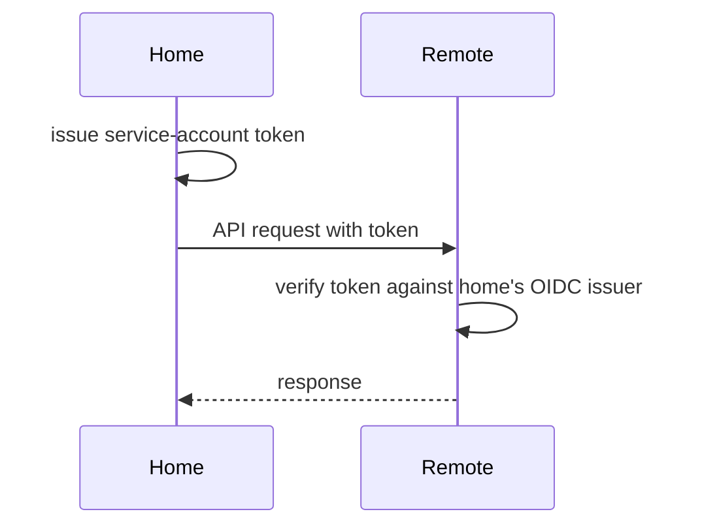

<!--
# SPDX-FileCopyrightText: Copyright SAP SE or an SAP affiliate company and cobaltcore-dev contributors
#
# SPDX-License-Identifier: Apache-2.0
-->

# Set up multicluster

This guide configures Cortex to run in a home cluster while routing selected resource kinds to
remote clusters by availability zone. For the concept — home vs. remote, GVK routing, token trust —
see [Multicluster](../concepts/multicluster.md).

A ready-to-run local example (three `kind` clusters) lives in
[`multicluster/`](multicluster/) — the `run.sh`, `cleanup.sh`, and `schedule.sh` scripts and their
manifests set up and tear down the full environment. This guide explains the same steps for a real
deployment.

## Before you begin

- A home cluster with Cortex installed — see [Install a domain bundle](install-a-domain-bundle.md).
- One or more remote clusters, each with the `cortex-crds` bundle installed.
- Network reachability from the home cluster to each remote apiserver.

## How trust works

Remote clusters authenticate the home cluster by trusting the home cluster's own service-account
token issuer as an OIDC provider — no external identity provider is required. The home cluster
issues a token; the remote apiserver verifies it against the home cluster's OIDC issuer. A
`ClusterRoleBinding` on each remote grants those home service accounts access to the routed kinds.



## Step 1 — Expose the home OIDC issuer

Grant service-account issuer discovery on the home cluster and extract its CA so remotes can reach
the OIDC endpoint (mirrors `cortex-home-crb.yaml` in the example):

```bash
kubectl --context home apply -f docs/guides/multicluster/cortex-home-crb.yaml
kubectl --context home -n kube-system get configmap extension-apiserver-authentication \
  -o jsonpath="{.data['client-ca-file']}" > /tmp/root-ca-home.pem
```

## Step 2 — Grant the home cluster access on each remote

Apply the remote `ClusterRoleBinding` and install the CRDs on each remote:

```bash
kubectl --context remote-az-a apply -f docs/guides/multicluster/cortex-remote-crb.yaml
kubectl --context remote-az-a exec ... # or:
helm --kube-context remote-az-a install cortex-crds helm/bundles/cortex-crds
```

Extract each remote's CA for the home config:

```bash
kubectl --context remote-az-a -n kube-system get configmap extension-apiserver-authentication \
  -o jsonpath="{.data['client-ca-file']}" > /tmp/root-ca-remote-az-a.pem
```

## Step 3 — Configure routing on the home cluster

Add an `apiservers.remotes[]` entry per remote, listing the GVKs it serves and the AZ label used to
route. Feed this through `global.conf` (see [Configuration](../reference/configuration.md)):

```yaml
global:
  conf:
    apiservers:
      remotes:
        - host: https://remote-az-a-apiserver:6443
          gvks:
            - kvm.cloud.sap/v1/Hypervisor
            - kvm.cloud.sap/v1/HypervisorList
            - cortex.cloud/v1alpha1/History
            - cortex.cloud/v1alpha1/HistoryList
          labels:
            availabilityZone: az-a
          caCert: |
            <contents of /tmp/root-ca-remote-az-a.pem>
```

Apply the updated values (`helm upgrade`), then restart or let the manager reload.

> [!NOTE]
> If a remote's CA rotates frequently and does not chain to a stable root, set
> `insecureSkipTLSVerify: true` instead of `caCert`. This disables TLS verification for that remote
> — only use it when the network path is otherwise secured.

## Step 4 — Verify routing

The manager logs a routing line per GVK per remote on startup:

```
INFO  adding remote cluster for resource  {"gvk": "kvm.cloud.sap/v1, Kind=Hypervisor", "host": "https://remote-az-a-apiserver:6443", "labels": {"availabilityZone":"az-a"}}
```

Check reachability and conflict metrics (see [Metrics and alerts](../reference/metrics.md)):

```
cortex_multicluster_remote_apiserver_reachable{host="..."} 1
cortex_multicluster_cross_cluster_name_conflicts_total 0
```

## Run the local example

```bash
./docs/guides/multicluster/run.sh      # create home + az-a + az-b kind clusters and start Cortex
./docs/guides/multicluster/schedule.sh # exercise a scheduling request across clusters
./docs/guides/multicluster/cleanup.sh  # tear everything down
```

## Troubleshooting

- **Remote unreachable** — `cortex_multicluster_remote_apiserver_reachable` is `0`; check network
  path and the CA/`insecureSkipTLSVerify` setting.
- **Name conflicts** — the same cluster-scoped name in two clusters increments
  `cortex_multicluster_cross_cluster_name_conflicts_total`; rename or re-partition.
- **403 from remote** — the remote `ClusterRoleBinding` does not grant the home service account
  access to that kind.

## Next steps

- Concept: [Multicluster](../concepts/multicluster.md)
- Reference: [Configuration](../reference/configuration.md), [Metrics and alerts](../reference/metrics.md)
