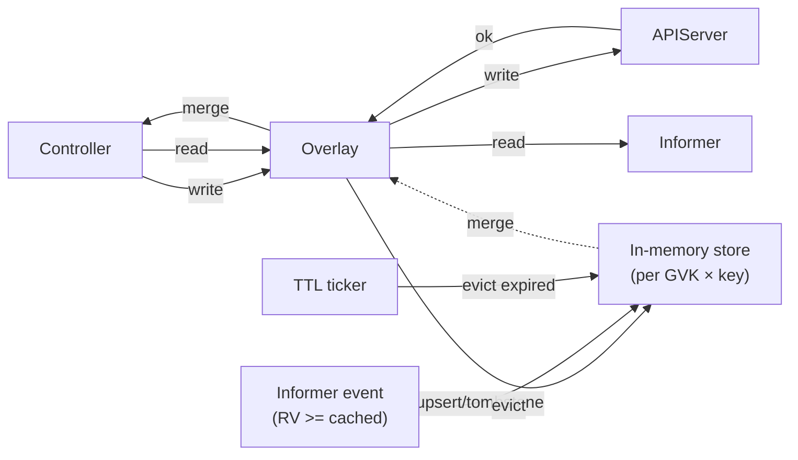

<!--
# SPDX-FileCopyrightText: Copyright SAP SE or an SAP affiliate company and cobaltcore-dev contributors
#
# SPDX-License-Identifier: Apache-2.0
-->

# Pending Cache Overlay

The pending cache is an in-process write-through overlay on `client.Client` that masks informer lag for configurable GVKs. After a successful write to the apiserver, the overlay keeps the written object in memory so that subsequent reads return the fresh version immediately, rather than the stale informer snapshot. Entries are evicted as soon as the informer observes the write, with a TTL fallback for safety.

## Why It Exists

controller-runtime's default client reads from informers. Between the moment a controller writes (or patches) an object and the moment the informer delivers the event, there is a window — typically tens to hundreds of milliseconds — during which any read returns the pre-write version. For scheduling workloads where multiple reconciles may touch the same objects in quick succession, this lag causes read-after-write inconsistencies: a controller creates a Reservation, then immediately lists Reservations and does not see the one it just created.

The overlay closes this window transparently without switching to direct apiserver reads (which would defeat the purpose of informers at scale).

## How It Works

Entry lifecycle:

1. **Write** — The overlay forwards Create/Update/Patch/Delete to the inner client. On success it stores the returned object (or a tombstone for deletes) keyed by GVK + namespace/name, stamped with the object's UID and ResourceVersion.
2. **Read** — Get and List delegate to the inner (informer-backed) client, then merge the overlay: live entries override or supplement the informer result; tombstones suppress objects so deletes appear immediately.
3. **Eviction (primary)** — An informer event handler compares the observed object's UID and ResourceVersion against the cached entry. If the UID matches and the observed RV is >= the cached RV, the entry is removed.
4. **Eviction (fallback)** — A background ticker removes entries whose TTL has expired, guarding against entries that never appear in the informer (e.g. after a crash or a missed event).

Writes to the same object are serialized by a per-object keyed mutex (`pkg/cache/lock.go`) so the inner write and the overlay mutation are atomic per key. The mutex map is reference-counted and entries are cleaned up when no writers are in flight, preventing unbounded growth over the manager's lifetime.

For List queries with field selectors, the overlay re-evaluates overlay entries against the selector using registered `IndexerFunc`s (captured via `IndexField`). This ensures overlay-only entries that do not match the query are excluded, and entries whose queried fields changed are correctly filtered.

## Integration with the Multicluster Client

The overlay plugs in through the `multicluster.ClusterWrapper` interface. `cache.Wrapper` satisfies this interface structurally (no import of `pkg/multicluster`). When the cache is enabled, `main.go` creates a `cache.Wrapper` and appends it to `multicluster.Client.Wrappers`. During `InitFromConf`, every cluster (home and remotes) passes through the wrapper, which calls `cache.WrapCluster` to produce an `overlayCluster` that intercepts `GetClient()` and `GetFieldIndexer()`. The overlay's own lifecycle (eviction handlers + TTL cleanup) is registered as a `manager.Runnable` — it does not re-start the inner cluster.

The wrapper also accepts a shared `Monitor` so a single Prometheus collector can distinguish entries across clusters by the rest config host.

## Configuration

Helm values under the `cache` key (see `helm/bundles/cortex-nova/values.yaml`):

| Key | Type | Default | Description |
|---|---|---|---|
| `cache.enabled` | bool | `false` | Turn the overlay on. When false, clusters are used unwrapped with zero overhead. |
| `cache.gvks` | list of strings | `[]` | GVKs to overlay, formatted as `"<group>/<version>/<Kind>"`. Calls for unlisted GVKs pass through unchanged. |
| `cache.ttl` | duration | `2m` | Maximum lifetime of an overlay entry before TTL eviction. |

Currently `cortex-nova` enables the cache for `cortex.cloud/v1alpha1/Reservation`.

## Monitoring and Alerts

The `Monitor` (`pkg/cache/monitor.go`) is a `prometheus.Collector` that exposes two gauge-family metrics per (GVK, host) pair:

- **`cortex_cache_overlay_entries`** — current number of overlay entries (live + tombstone) at scrape time.
- **`cortex_cache_overlay_entries_max`** — high-watermark since the last scrape, reset on each collect. Because entries are extremely short-lived (evicted within milliseconds), a plain gauge would almost always read zero; the watermark captures transient spikes.

A sustained non-zero watermark is a strong signal that eviction is broken. The PrometheusRule **`CortexNovaCacheOverlayNotDraining`** fires (severity: warning) when `cortex_cache_overlay_entries` stays above the `alerts.thresholds.cacheOverlayMaxEntries` threshold (default 50) for 5 minutes. Investigate the informer for the affected GVK/cluster and the overlay eviction logs.

## Code Pointers

| What | Where |
|---|---|
| Overlay struct, CRUD methods, merge logic | `pkg/cache/client.go` |
| `overlayCluster` and `Wrapper` (ClusterWrapper integration) | `pkg/cache/cluster.go` |
| `Config` and `RootConfig` | `pkg/cache/config.go` |
| `Start`, eviction handlers, TTL cleanup | `pkg/cache/runnable.go` |
| Prometheus `Monitor` collector | `pkg/cache/monitor.go` |
| Per-object keyed mutex | `pkg/cache/lock.go` |
| Wiring into the manager and multicluster client | `cmd/manager/main.go` (search for `cache.`) |
| Helm values and alert rule | `helm/bundles/cortex-nova/values.yaml`, `helm/bundles/cortex-nova/templates/alerts.yaml` |
