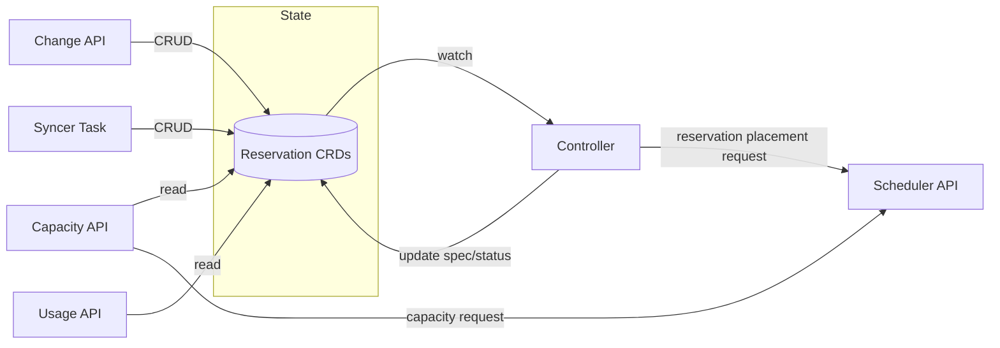
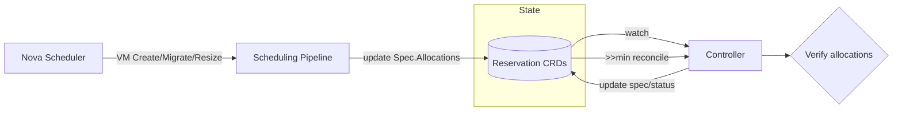

# Committed Resource Reservation System

The committed resource (CR) reservation system manages capacity commitments, i.e. strict reservation guarantees. 
When customers pre-commit to resource usage, Cortex reserves capacity on hypervisors to guarantee availability.
Cortex receives commitments, exposes usage and capacity data, and provides acceptance/rejection via APIs.

## Implementation

The CR reservation implementation is located in `internal/scheduling/reservations/commitments/`. Key components include:
- Controller logic (`controller.go`)
- API endpoints (`api_*.go`)
- Capacity and usage calculation logic (`capacity.go`, `usage.go`)
- Syncer for periodic state sync (`syncer.go`)

## Configuration and Observability

**Configuration**: Helm values for intervals, API flags, and pipeline configuration are defined in `helm/bundles/cortex-nova/values.yaml`. Key configuration includes:
- API endpoint toggles (change-commitments, report-usage, report-capacity)
- Reconciliation intervals (grace period, active monitoring)
- Scheduling pipeline selection per flavor group

**Metrics and Alerts**: Defined in `helm/bundles/cortex-nova/alerts/nova.alerts.yaml` with prefixes:
- `cortex_committed_resource_change_api_*`
- `cortex_committed_resource_usage_api_*`
- `cortex_committed_resource_capacity_api_*`

## Lifecycle Management

### State (CRDs)
Defined in `api/v1/reservations_types.go`, which contains definitions for CR reservations and failover reservations (see [./failover-reservations.md](./failover-reservations.md)).

A reservation CRD represents a single reservation slot on a hypervisor, which holds multiple VMs.
A single CR entry typically refers to multiple reservation CRDs (slots).

### CR Reservation Lifecycle

Reservations are managed through the Change API, Syncer Task, and Controller reconciliation.

| Component | Event | Timing | Action |
|-----------|-------|--------|--------|
| **Change API / Syncer** | CR Create, Resize, Delete | Immediate/Hourly | Create/update/delete Reservation CRDs |
| **Controller** | Placement | On creation | Find host via scheduler API, set `TargetHost` |
| **Controller** | Optimize unused slots | >> minutes | Assign PAYG VMs or re-place reservations |

### VM Lifecycle

VM allocations are tracked within reservations:

| Component | Event | Timing | Action |
|-----------|-------|--------|--------|
| **Scheduling Pipeline** | Placement call for: VM Create, Migrate, Resize | Immediate | Update VM in `Spec.Allocations` |
| **Controller** | Reservation CRD update: `Status`/`Spec` `.Allocations` | 1 min | Verify via Nova API and Hypervisor CRD; update `Status`/`Spec` `.Allocations` |
| **Controller** | Regular VM lifecycle check (VM off, deletion); maybe watch Hypervisor CRD VMs | >> min | Verify allocations |

**Allocation States**:
- `Spec.Allocations` — Expected VMs (from scheduling events)
- `Status.Allocations` — Confirmed VMs (verified on host)

**Note**: VM allocations may not consume all resources of a reservation slot. A reservation with 128 GB may have VMs totaling only 96 GB if that's what fits the project's needs. Allocations may exceeding reservation capacity (e.g., after VM resize).

### Change-Commitments API

The change-commitments API receives batched commitment changes from Limes and manages reservations accordingly.

**Request Semantics**: A request can contain multiple commitment changes across different projects and flavor groups. The semantic is **all-or-nothing** — if any commitment in the batch cannot be fulfilled (e.g., insufficient capacity), the entire request is rejected and rolled back.

**Operations**: Cortex performs CRUD operations on local Reservation CRDs to match the new desired state:
- Creates new reservations for increased commitment amounts
- Deletes existing reservations for decreased commitments
- Preserves existing reservations that already have VMs allocated when possible

### Syncer Task

The syncer task runs periodically and fetches all commitments from Limes. It syncs the local Reservation CRD state to match Limes' view of commitments. Theoretically, this should find no differences of local state and Limes state.

### Controller (Reconciliation)

The controller watches Reservation CRDs and performs two types of reconciliation:

**Placement** - Finds hosts for new reservations (calls scheduler API)

**Allocation Verification** - Tracks VM lifecycle on reservations:
- New VMs (< 15min): Checked via Nova API every 1 minute
- Established VMs: Checked via Hypervisor CRD every 5 min - 1 hour
- Missing VMs: Removed after verification

### Usage API

This API reports for a given project the total committed resources and usage per flavor group. For each VM, it reports whether the VM accounts to a specific commitment or PAYG. This assignment is deterministic and may differ from the actual Cortex internal assignment used for scheduling.

