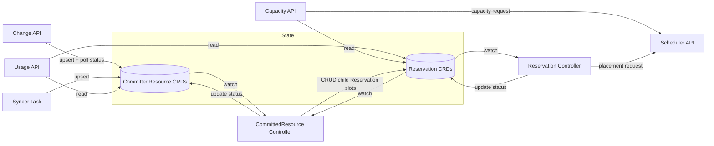
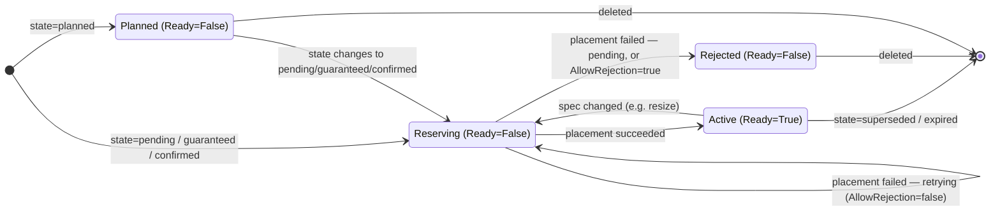
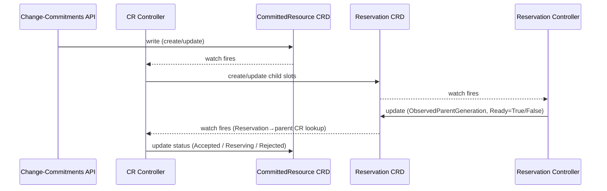
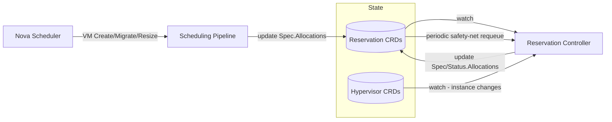
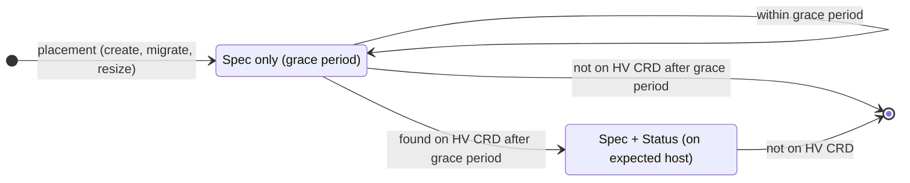

# Committed Resource Reservation System

Cortex reserves hypervisor capacity for customers who pre-commit resources (committed resources, CRs), and exposes usage and capacity data via APIs.


- [Committed Resource Reservation System](#committed-resource-reservation-system)
  - [Configuration and Observability](#configuration-and-observability)
  - [Lifecycle Management](#lifecycle-management)
    - [State (CRDs)](#state-crds)
    - [CR Commitment Lifecycle](#cr-commitment-lifecycle)
      - [CommittedResource Controller](#committedresource-controller)
    - [Reservation Lifecycle](#reservation-lifecycle)
      - [VM Lifecycle](#vm-lifecycle)
      - [Capacity Blocking](#capacity-blocking)
      - [Reservation Controller](#reservation-controller)
    - [Change-Commitments API](#change-commitments-api)
    - [Syncer Task](#syncer-task)
    - [Usage API](#usage-api)

The CR reservation implementation is located in `internal/scheduling/reservations/commitments/`. Key components include:
- `CommittedResource` controller (`committed_resource_controller.go`) — acceptance, rejection, child Reservation CRUD
- `Reservation` controller (`reservation_controller.go`) — placement, VM allocation verification
- API endpoints (`api_*.go`)
- Capacity and usage calculation logic (`capacity.go`, `usage.go`)
- Syncer for periodic state sync (`syncer.go`)

## Configuration and Observability

**Configuration**: Helm values for intervals, API flags, and pipeline configuration are defined in `helm/bundles/cortex-nova/values.yaml`. Key configuration includes:
- API endpoint toggles (change-commitments, report-usage, report-capacity) — each endpoint can be disabled independently
- Reconciliation intervals (grace period, active monitoring)
- Scheduling pipeline selection per flavor group

**Metrics and Alerts**: Defined in `helm/bundles/cortex-nova/alerts/nova.alerts.yaml` with prefixes:
- `cortex_committed_resource_change_api_*`
- `cortex_committed_resource_usage_api_*`
- `cortex_committed_resource_capacity_api_*`

## Lifecycle Management

The system is organized around two CRD types and two controllers. `CommittedResource` CRDs represent customer commitments; `Reservation` CRDs represent individual hypervisor capacity slots. Each has its own controller with a well-defined responsibility boundary.



### State (CRDs)

**`CommittedResource` CRD** (`committed_resource_types.go`) — primary source of truth for a commitment accepted by Cortex. One CRD per commitment UUID. Spec holds the commitment identity (project, flavor group, ...). Status holds the acceptance outcome (`Ready` condition with reason `Planned`/`Reserving`/`Rejected`) and the accepted amount.

**`Reservation` CRD** (`reservation_types.go`) — a single reservation slot on a hypervisor, owned by a `CommittedResource`. One `CommittedResource` typically drives multiple `Reservation` CRDs (one per flavor-sized slot). See [./failover-reservations.md](./failover-reservations.md) for the failover reservation type.

### CR Commitment Lifecycle

The CR commitment lifecycle covers everything from a commitment being accepted by Limes through to Cortex confirming or rejecting it. The `CommittedResource` CRD is the entry point; the `CommittedResource` controller owns the acceptance decision.

**Limes state → Cortex action:**

| Limes State | Meaning | Cortex action |
|---|---|---|
| `planned` | Future start, no guarantee yet | No Reservations — capacity not blocked |
| `pending` | Limes asking for a yes/no decision now | One-shot attempt — accept or reject; no retry |
| `guaranteed` / `confirmed` | Capacity must be honoured | Place Reservations and keep them in sync; see failure handling below |
| `superseded` / `expired` | Commitment no longer active | Remove all child Reservations |

**CommittedResource status conditions (Cortex-side):**



#### CommittedResource Controller

The controller's job is to keep child `Reservation` CRDs in sync with the desired state expressed in `Spec.Amount`. The key rules:

- **`pending`**: Cortex is being asked for a yes/no decision. If placement fails for any reason, child Reservations are removed and the CR is marked Rejected. The caller (e.g. the change-commitments API) reads the outcome and reports back to Limes. No retry.

- **`guaranteed` / `confirmed`**: Cortex is expected to honour the commitment. The default is to keep retrying until placement succeeds (`Ready=False, Reason=Reserving`). Callers that can accept "no" as an answer set `Spec.AllowRejection=true` (the change-commitments API sets this for confirming requests — new commitments, resizes); the controller then rejects on failure instead of retrying.

- **On rejection**: rolls back child Reservations to the last successfully placed quantity (`Status.AcceptedAmount`). For a CR that was never accepted, this means removing all child Reservations.

The controller communicates with the Reservation controller only through CRDs — no direct calls.

**Reconcile trigger flow:**



### Reservation Lifecycle

| Component | Event | Timing | Action |
|-----------|-------|--------|--------|
| **Reservation Controller** | `Reservation` created | Immediate (watch) | Find host via scheduler API, set `TargetHost` |
| **Scheduling Pipeline** | VM Create, Migrate, Resize | Immediate | Add VM to `Spec.Allocations` |
| **Reservation Controller** | Reservation CRD updated | `committedResourceRequeueIntervalGracePeriod` (default: 1 min) | Defer verification for new VMs still spawning; update `Status.Allocations` |
| **Reservation Controller** | Hypervisor CRD updated (VM appeared/disappeared) | Immediate (event-driven) | Verify allocations via Hypervisor CRD; remove gone VMs from `Spec.Allocations` |
| **Reservation Controller** | Periodic safety-net | `committedResourceRequeueIntervalActive` (default: 5 min) | Same as above; catches any missed events |
| **Reservation Controller** | Optimize unused slots | >> minutes | Assign PAYG VMs or re-place reservations |

#### VM Lifecycle

VM allocations are tracked within reservations:



**Allocation fields**:
- `Spec.Allocations` — Expected VMs (written by the scheduling pipeline on placement)
- `Status.Allocations` — Confirmed VMs (written by the controller after verifying the VM is on the expected host)

**VM allocation state diagram**:

The controller uses the **Hypervisor CRD** as the sole source of truth for VM allocation verification:
- **Hypervisor CRD** — used for all allocation checks; reflects the set of instances the hypervisor operator observes on the host



**Note**: VM allocations may not consume all resources of a reservation slot. A reservation with 128 GB may have VMs totaling only 96 GB if that fits the project's needs. Allocations may exceed reservation capacity (e.g., after VM resize).

#### Capacity Blocking

**Blocking rules by allocation state:**

| State | In HV Allocation? | Reservation must block? |
|---|---|---|
| No allocations | — | Full `Spec.Resources` |
| Confirmed (Spec + Status) | Yes — already subtracted | No — subtract from reservation block |
| Spec only (not yet running) | No — not yet on host | Yes — must remain in reservation block |

**Formal calculation (stable state, `Spec.TargetHost == Status.Host`):**

```
confirmed            = sum of resources for VMs in both Spec.Allocations and Status.Allocations
spec_only_unblocked  = sum of resources for VMs in Spec.Allocations only, NOT having an active pessimistic blocking reservation on this host
remaining            = max(0, Spec.Resources - confirmed)
block                = max(remaining, spec_only_unblocked)
```

**Interaction with pessimistic blocking reservations:**

When a VM is in flight (Nova choosing between candidates), a pessimistic blocking reservation exists on each candidate host. For any SpecOnly VM that has such a reservation on the same host, the pessimistic blocking reservation is the authority — the CR reservation must not double-count it. The `spec_only_unblocked` term excludes those VMs.

See the pessimistic blocking reservations documentation for the full interaction semantics.

**Migration state (`Spec.TargetHost != Status.Host`):**

When a reservation is being migrated to a new host, block the full `max(Spec.Resources, spec_only_unblocked)` on **both** hosts — no subtraction of confirmed VMs. VMs may be split across hosts mid-migration and the split is not reliably known from reservation data alone; conservatively blocking both hosts prevents overcommit during the transition. The over-blocking resolves once migration completes and `Spec.TargetHost == Status.Host` again.

**Corner cases:**

- **Confirmed VMs exceed reservation size** (e.g., after VM resize): `Spec.Resources - confirmed` goes negative. Clamp to `0` — otherwise the filter would add capacity back to the host.

- **Spec-only VM larger than remaining reservation** (e.g., confirmed VMs have consumed most of the slot, and a new VM awaiting startup is larger than what remains): `remaining < spec_only_unblocked`. Block `spec_only_unblocked` — the VM will consume those resources when it starts, and they are not yet in HV Allocation.

- **VM live migration within a reservation** (VM moves away from the reservation's host): handled implicitly by `hv.Status.Allocation`. Libvirt reports resource consumption on both source and target during live migration, so both hosts' `hv.Status.Allocation` already reflects the in-flight state. No special filter logic needed. The reservation controller will eventually remove the VM from the reservation once it's confirmed on the wrong host past the grace period.

#### Reservation Controller

The `Reservation` controller (`CommitmentReservationController`) watches `Reservation` CRDs and `Hypervisor` CRDs. `MaxConcurrentReconciles=1` prevents overbooking during concurrent placements.

**Placement** — finds hosts for new reservations (calls scheduler API)

**Allocation Verification** — tracks VM lifecycle on reservations. The controller uses the Hypervisor CRD as the sole source of truth, with two triggers:
- New VMs (within `committedResourceAllocationGracePeriod`, default: 15 min): verification deferred — VM may still be spawning; requeued every `committedResourceRequeueIntervalGracePeriod` (default: 1 min)
- Established VMs: verified reactively when the Hypervisor CRD changes (VM appeared or disappeared in `Status.Instances`), with `committedResourceRequeueIntervalActive` (default: 5 min) as a safety-net fallback
- Missing VMs: removed from `Spec.Allocations` when not found on the Hypervisor CRD after the grace period

**Reservation migration is not supported yet.**

### Change-Commitments API

The change-commitments API receives batched commitment changes from Limes and applies them using a **write-intent, watch-for-outcome** pattern: the handler creates or updates `CommittedResource` CRDs and polls their `Status.Conditions` until each reaches a terminal state — it does not interact with `Reservation` CRDs directly.

**Request Semantics**: A request can contain multiple commitment changes across different projects and flavor groups. The semantic is **all-or-nothing** — if any commitment in the batch cannot be fulfilled (e.g., insufficient capacity), the entire request is rejected and rolled back.

**Operations**:
1. For each commitment in the batch, create or update a `CommittedResource` CRD. `Spec.AllowRejection` mirrors the request's `RequiresConfirmation` flag: `true` for changes where Limes needs a yes/no answer (new commitments, resizes), `false` for non-confirming changes (deletions, status-only transitions) where Limes doesn't act on the rejection reason
2. Poll `CommittedResource.Status.Conditions[Ready]` until each reaches a terminal state: `Reason=Accepted` (success), `Reason=Planned` (deferred; accepted), or `Reason=Rejected` (failure) — only for confirming changes; non-confirming changes return immediately without polling
3. On any failure or timeout, restore all modified `CommittedResource` CRDs to their pre-request specs (or delete newly-created ones)

The `CommittedResource` controller handles all downstream `Reservation` CRUD. `AllowRejection=true` tells it to reject and roll back child Reservations on placement failure rather than retrying indefinitely.

### Syncer Task

The syncer task runs periodically and syncs local `CommittedResource` CRD state to match Limes' view of commitments, correcting drift from missed API calls or restarts. It writes `CommittedResource` CRDs only — Reservation CRUD is the controller's responsibility.

### Usage API

For each flavor group `X` that accepts commitments, Cortex exposes three resource types:
- `hw_version_X_ram` — RAM in units of the smallest flavor in the group (`HandlesCommitments=true`)
- `hw_version_X_cores` — CPU cores derived from RAM via fixed ratio (`HandlesCommitments=false`)
- `hw_version_X_instances` — instance count (`HandlesCommitments=false`)

For each VM, the API reports whether it accounts to a specific commitment or PAYG. This assignment is deterministic and may differ from the actual Cortex internal assignment used for scheduling.
