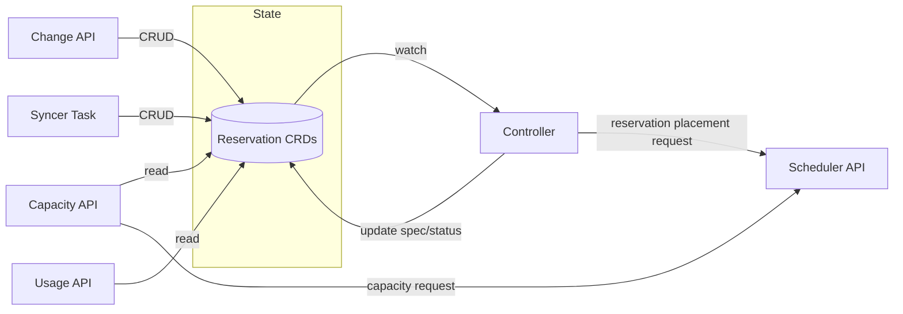
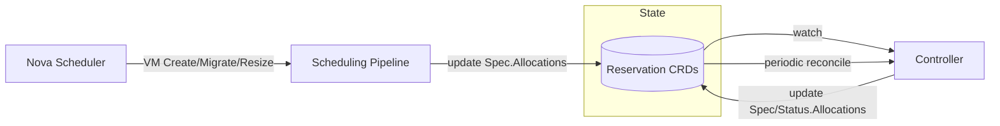
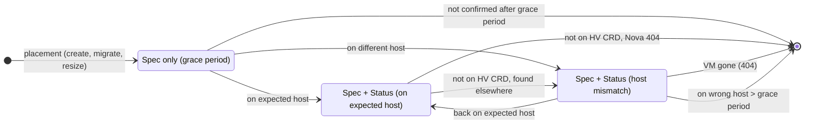

# Committed Resource Reservation System

The committed resource (CR) reservation system manages capacity commitments, i.e. strict reservation guarantees. 
When customers pre-commit to resource usage, Cortex reserves capacity on hypervisors to guarantee availability.
Cortex receives commitments, exposes usage and capacity data, and provides acceptance/rejection via APIs.

## Implementation

The CR reservation implementation is located in `internal/scheduling/reservations/commitments/`. Key components include:
- Controller logic (`controller.go`)
- API endpoints (`api_*.go`)
- Capacity and usage calculation logic (`capacity.go`, `usage.go`)
- Syncer for periodic state sync (`syncer.go`)

## Configuration and Observability

**Configuration**: Helm values for intervals, API flags, and pipeline configuration are defined in `helm/bundles/cortex-nova/values.yaml`. Key configuration includes:
- API endpoint toggles (change-commitments, report-usage, report-capacity)
- Reconciliation intervals (grace period, active monitoring)
- Scheduling pipeline selection per flavor group

**Metrics and Alerts**: Defined in `helm/bundles/cortex-nova/alerts/nova.alerts.yaml` with prefixes:
- `cortex_committed_resource_change_api_*`
- `cortex_committed_resource_usage_api_*`
- `cortex_committed_resource_capacity_api_*`

## Lifecycle Management

### State (CRDs)
Defined in `api/v1alpha1/reservation_types.go`, which contains definitions for CR reservations and failover reservations (see [./failover-reservations.md](./failover-reservations.md)).

A reservation CRD represents a single reservation slot on a hypervisor, which holds multiple VMs.
A single CR entry typically refers to multiple reservation CRDs (slots).

### CR Reservation Lifecycle

Reservations are managed through the Change API, Syncer Task, and Controller reconciliation.

| Component | Event | Timing | Action |
|-----------|-------|--------|--------|
| **Change API / Syncer** | CR Create, Resize, Delete | Immediate/Hourly | Create/update/delete Reservation CRDs |
| **Controller** | Placement | On creation | Find host via scheduler API, set `TargetHost` |
| **Controller** | Optimize unused slots | >> minutes | Assign PAYG VMs or re-place reservations |

### VM Lifecycle

VM allocations are tracked within reservations:

| Component | Event | Timing | Action |
|-----------|-------|--------|--------|
| **Scheduling Pipeline** | VM Create, Migrate, Resize | Immediate | Add VM to `Spec.Allocations` |
| **Controller** | Reservation CRD updated | `committedResourceRequeueIntervalGracePeriod` (default: 1 min) | Verify new VMs via Nova API; update `Status.Allocations` |
| **Controller** | Periodic check | `committedResourceRequeueIntervalActive` (default: 5 min) | Verify established VMs via Hypervisor CRD; remove gone VMs from `Spec.Allocations` |

**Allocation fields**:
- `Spec.Allocations` — Expected VMs (written by the scheduling pipeline on placement)
- `Status.Allocations` — Confirmed VMs (written by the controller after verifying the VM is on the expected host)

**VM allocation state diagram**:

The controller uses two sources to verify VM allocations, depending on how recently the VM was placed:
- **Nova API** — used during the grace period (`committedResourceAllocationGracePeriod`, default: 15 min) where the VM may still be starting up; provides real-time host assignment
- **Hypervisor CRD** — used for established allocations; reflects the set of instances the hypervisor operator observes on the host

**Note**: VM allocations may not consume all resources of a reservation slot. A reservation with 128 GB may have VMs totaling only 96 GB if that fits the project's needs. Allocations may exceed reservation capacity (e.g., after VM resize).

### Change-Commitments API

The change-commitments API receives batched commitment changes from Limes and manages reservations accordingly.

**Request Semantics**: A request can contain multiple commitment changes across different projects and flavor groups. The semantic is **all-or-nothing** — if any commitment in the batch cannot be fulfilled (e.g., insufficient capacity), the entire request is rejected and rolled back.

**Operations**: Cortex performs CRUD operations on local Reservation CRDs to match the new desired state:
- Creates new reservations for increased commitment amounts
- Deletes existing reservations for decreased commitments
- Preserves existing reservations that already have VMs allocated when possible

### Syncer Task

The syncer task runs periodically and fetches all commitments from Limes. It syncs the local Reservation CRD state to match Limes' view of commitments. In steady state this finds no differences, but it corrects any drift caused by missed API calls or controller restarts.

### Controller (Reconciliation)

The controller watches Reservation CRDs and performs two types of reconciliation:

**Placement** - Finds hosts for new reservations (calls scheduler API)

**Allocation Verification** - Tracks VM lifecycle on reservations. VMs take time to appear on a host after scheduling, so new allocations are verified more frequently via the Nova API for real-time status, while established allocations are verified via the Hypervisor CRD:
- New VMs (within `committedResourceAllocationGracePeriod`, default: 15 min): checked via Nova API every `committedResourceRequeueIntervalGracePeriod` (default: 1 min)
- Established VMs: checked via Hypervisor CRD every `committedResourceRequeueIntervalActive` (default: 5 min)
- Missing VMs: removed from `Spec.Allocations` after Nova API confirms 404

### Usage API

This API reports for a given project the total committed resources and usage per flavor group. For each VM, it reports whether the VM accounts to a specific commitment or PAYG. This assignment is deterministic and may differ from the actual Cortex internal assignment used for scheduling.

