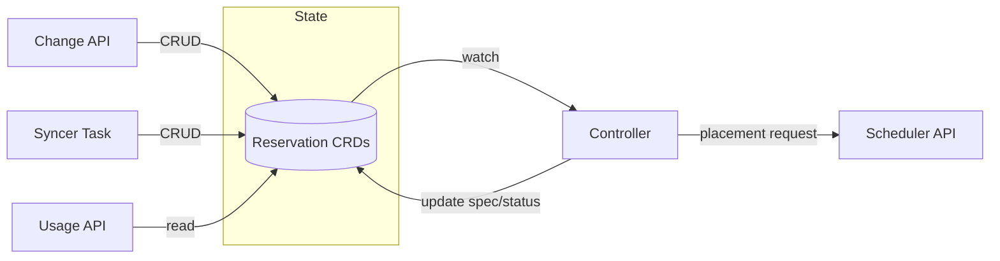

# Committed Resource Reservation System

The committed resource reservation system manages capacity commitments, i.e. strict reservation guarantees usable by projects. 
When customers pre-commit to resource usage, Cortex reserves capacity on hypervisors to guarantee availability.
The system integrates with Limes (via the LIQUID protocol) to receive commitments, expose usage and capacity data, and provides acceptance/rejection feedback.

## File Structure

```text
internal/scheduling/reservations/commitments/
├── config.go                          # Configuration (intervals, API flags, secrets)
├── controller.go                      # Reconciliation of reservations
├── syncer.go                          # Periodic sync task with Limes, ensures local state matches Limes' commitments
├── reservation_manager.go             # Reservation CRUD operations
├── api.go                             # HTTP API initialization
├── api_change_commitments.go          # Handle commitment changes from Limes and updates local reservations accordingly
├── api_report_usage.go                # Report VM usage per project, accounting to commitments or PAYG
├── api_report_capacity.go             # Report capacity per AZ
├── api_info.go                        # Readiness endpoint with versioning (of underlying flavor group configuration)
├── capacity.go                        # Capacity calculation from Hypervisor CRDs
├── usage.go                           # VM-to-commitment assignment logic
├── flavor_group_eligibility.go        # Validates VMs belong to correct flavor groups
└── state.go                           # Commitment state helper functions
```

## Operations

### Configuration

| Helm Value | Description |
|------------|-------------|
| `committedResourceEnableChangeCommitmentsAPI` | Enable/disable the change-commitments endpoint |
| `committedResourceEnableReportUsageAPI` | Enable/disable the usage reporting endpoint |
| `committedResourceEnableReportCapacityAPI` | Enable/disable the capacity reporting endpoint |
| `committedResourceRequeueIntervalActive` | How often to revalidate active reservations |
| `committedResourceRequeueIntervalRetry` | Retry interval when knowledge not ready |
| `committedResourceChangeAPIWatchReservationsTimeout` | Timeout waiting for reservations to become ready while processing commitment changes via API |
| `committedResourcePipelineDefault` | Default scheduling pipeline |
| `committedResourceFlavorGroupPipelines` | Map of flavor group to pipeline name |
| `committedResourceSyncInterval` | How often the syncer reconciles Limes commitments to Reservation CRDs |

Each API endpoint can be disabled independently. The periodic sync task can be disabled by removing it (`commitments-sync-task`) from the list of enabled tasks in the `cortex-nova` Helm chart.

### Observability

Alerts and metrics are defined in `helm/bundles/cortex-nova/alerts/nova.alerts.yaml`. Key metric prefixes:
- `cortex_committed_resource_change_api_*` - Change API metrics
- `cortex_committed_resource_usage_api_*` - Usage API metrics
- `cortex_committed_resource_capacity_api_*` - Capacity API metrics

## Architecture Overview



Reservations are managed through the Change API, Syncer Task, and Controller reconciliation. The Usage API provides read-only access to report usage data back to Limes.

### Change-Commitments API

The change-commitments API receives batched commitment changes from Limes. A request can contain multiple commitment changes across different projects and flavor groups. The semantic is **all-or-nothing**: if any commitment in the batch cannot be fulfilled (e.g., insufficient capacity), the entire request is rejected and rolled back.

Cortex performs CRUD operations on local Reservation CRDs to match the new desired state:
- Creates new reservations for increased commitment amounts
- Deletes existing reservations
- Cortex preserves existing reservations that already have VMs allocated when possible

### Syncer Task

The syncer task runs periodically and fetches all commitments from Limes. It syncs the local Reservation CRD state to match Limes' view of commitments.

### Controller (Reconciliation)

The controller watches Reservation CRDs and performs reconciliation:

1. **For new reservations** (no target host assigned):
   - Calls Cortex for scheduling to find a suitable host
   - Assigns the target host and marks the reservation as Ready

2. **For existing reservations** (already have a target host):
   - Validates that allocated VMs are still on the expected host
   - Updates allocations if VMs have migrated or been deleted
   - Requeues for periodic revalidation

### Usage API

This API reports for a given project the total committed resources and usage per flavor group. For each VM, it reports whether the VM accounts to a specific commitment or PAYG. This assignment is deterministic and may differ from the actual Cortex internal assignment used for scheduling.

