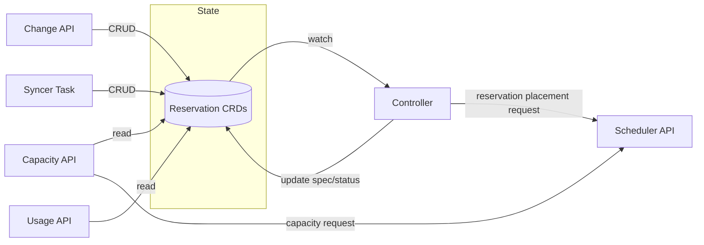
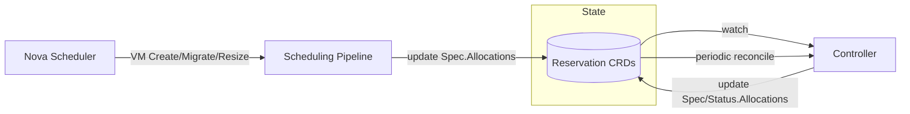
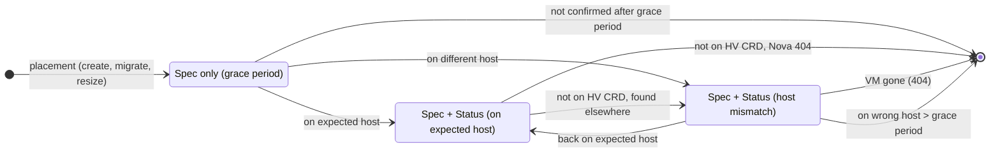

# Committed Resource Reservation System

Cortex reserves hypervisor capacity for customers who pre-commit resources (committed resources, CRs), and exposes usage and capacity data via APIs.


- [Committed Resource Reservation System](#committed-resource-reservation-system)
  - [Configuration and Observability](#configuration-and-observability)
  - [Lifecycle Management](#lifecycle-management)
    - [State (CRDs)](#state-crds)
    - [CR Reservation Lifecycle](#cr-reservation-lifecycle)
    - [VM Lifecycle](#vm-lifecycle)
    - [Capacity Blocking](#capacity-blocking)
    - [Change-Commitments API](#change-commitments-api)
    - [Syncer Task](#syncer-task)
    - [Controller (Reconciliation)](#controller-reconciliation)
    - [Usage API](#usage-api)

The CR reservation implementation is located in `internal/scheduling/reservations/commitments/`. Key components include:
- Controller logic (`controller.go`)
- API endpoints (`api_*.go`)
- Capacity and usage calculation logic (`capacity.go`, `usage.go`)
- Syncer for periodic state sync (`syncer.go`)

## Configuration and Observability

**Configuration**: Helm values for intervals, API flags, and pipeline configuration are defined in `helm/bundles/cortex-nova/values.yaml`. Key configuration includes:
- API endpoint toggles (change-commitments, report-usage, report-capacity) — each endpoint can be disabled independently
- Reconciliation intervals (grace period, active monitoring)
- Scheduling pipeline selection per flavor group

**Metrics and Alerts**: Defined in `helm/bundles/cortex-nova/alerts/nova.alerts.yaml` with prefixes:
- `cortex_committed_resource_change_api_*`
- `cortex_committed_resource_usage_api_*`
- `cortex_committed_resource_capacity_api_*`

## Lifecycle Management

### State (CRDs)
Defined in `api/v1alpha1/reservation_types.go`, which contains definitions for CR reservations and failover reservations (see [./failover-reservations.md](./failover-reservations.md)).

A reservation CRD represents a single reservation slot on a hypervisor, which holds multiple VMs.
A single CR entry typically refers to multiple reservation CRDs (slots).


### CR Reservation Lifecycle



Reservations are managed through the Change API, Syncer Task, and Controller reconciliation.

| Component | Event | Timing | Action |
|-----------|-------|--------|--------|
| **Change API / Syncer** | CR Create, Resize, Delete | Immediate/Hourly | Create/update/delete Reservation CRDs |
| **Controller** | Placement | On creation | Find host via scheduler API, set `TargetHost` |
| **Controller** | Optimize unused slots | >> minutes | Assign PAYG VMs or re-place reservations |

### VM Lifecycle

VM allocations are tracked within reservations:



| Component | Event | Timing | Action |
|-----------|-------|--------|--------|
| **Scheduling Pipeline** | VM Create, Migrate, Resize | Immediate | Add VM to `Spec.Allocations` |
| **Controller** | Reservation CRD updated | `committedResourceRequeueIntervalGracePeriod` (default: 1 min) | Verify new VMs via Nova API; update `Status.Allocations` |
| **Controller** | Periodic check | `committedResourceRequeueIntervalActive` (default: 5 min) | Verify established VMs via Hypervisor CRD; remove gone VMs from `Spec.Allocations` |

**Allocation fields**:
- `Spec.Allocations` — Expected VMs (written by the scheduling pipeline on placement)
- `Status.Allocations` — Confirmed VMs (written by the controller after verifying the VM is on the expected host)

**VM allocation state diagram**:

The controller uses two sources to verify VM allocations, depending on how recently the VM was placed:
- **Nova API** — used during the grace period (`committedResourceAllocationGracePeriod`, default: 15 min) where the VM may still be starting up; provides real-time host assignment
- **Hypervisor CRD** — used for established allocations; reflects the set of instances the hypervisor operator observes on the host



**Note**: VM allocations may not consume all resources of a reservation slot. A reservation with 128 GB may have VMs totaling only 96 GB if that fits the project's needs. Allocations may exceed reservation capacity (e.g., after VM resize).

### Capacity Blocking

**Blocking rules by allocation state:**

| State | In HV Allocation? | Reservation must block? |
|---|---|---|
| No allocations | — | Full `Spec.Resources` |
| Confirmed (Spec + Status) | Yes — already subtracted | No — subtract from reservation block |
| Spec only (not yet running) | No — not yet on host | Yes — must remain in reservation block |

**Formal calculation (stable state, `Spec.TargetHost == Status.Host`):**

```
confirmed            = sum of resources for VMs in both Spec.Allocations and Status.Allocations
spec_only_unblocked  = sum of resources for VMs in Spec.Allocations only, NOT having an active pessimistic blocking reservation on this host
remaining            = max(0, Spec.Resources - confirmed)
block                = max(remaining, spec_only_unblocked)
```

**Interaction with pessimistic blocking reservations:**

When a VM is in flight (Nova choosing between candidates), a pessimistic blocking reservation exists on each candidate host. For any SpecOnly VM that has such a reservation on the same host, the pessimistic blocking reservation is the authority — the CR reservation must not double-count it. The `spec_only_unblocked` term excludes those VMs.

See [pessimistic-blocking-reservations.md](./pessimistic-blocking-reservations.md) for the full interaction semantics.

**Migration state (`Spec.TargetHost != Status.Host`):**

When a reservation is being migrated to a new host, block the full `max(Spec.Resources, spec_only_unblocked)` on **both** hosts — no subtraction of confirmed VMs. VMs may be split across hosts mid-migration and the split is not reliably known from reservation data alone; conservatively blocking both hosts prevents overcommit during the transition. The over-blocking resolves once migration completes and `Spec.TargetHost == Status.Host` again.

**Corner cases:**

- **Confirmed VMs exceed reservation size** (e.g., after VM resize): `Spec.Resources - confirmed` goes negative. Clamp to `0` — otherwise the filter would add capacity back to the host.

- **Spec-only VM larger than remaining reservation** (e.g., confirmed VMs have consumed most of the slot, and a new VM awaiting startup is larger than what remains): `remaining < spec_only_unblocked`. Block `spec_only_unblocked` — the VM will consume those resources when it starts, and they are not yet in HV Allocation.

- **VM live migration within a reservation** (VM moves away from the reservation's host): handled implicitly by `hv.Status.Allocation`. Libvirt reports resource consumption on both source and target during live migration, so both hosts' `hv.Status.Allocation` already reflects the in-flight state. No special filter logic needed. The reservation controller will eventually remove the VM from the reservation once it's confirmed on the wrong host past the grace period.

### Change-Commitments API

The change-commitments API receives batched commitment changes from Limes and manages reservations accordingly.

**Request Semantics**: A request can contain multiple commitment changes across different projects and flavor groups. The semantic is **all-or-nothing** — if any commitment in the batch cannot be fulfilled (e.g., insufficient capacity), the entire request is rejected and rolled back.

**Operations**: Cortex performs CRUD operations on local Reservation CRDs to match the new desired state:
- Creates new reservations for increased commitment amounts
- Deletes existing reservations for decreased commitments
- Preserves existing reservations that already have VMs allocated when possible

### Syncer Task

The syncer task runs periodically and syncs local Reservation CRD state to match Limes' view of commitments, correcting drift from missed API calls or restarts.

### Controller (Reconciliation)

The controller watches Reservation CRDs and performs two types of reconciliation:

**Placement** - Finds hosts for new reservations (calls scheduler API)

**Allocation Verification** - Tracks VM lifecycle on reservations. VMs take time to appear on a host after scheduling, so new allocations are verified more frequently via the Nova API for real-time status, while established allocations are verified via the Hypervisor CRD:
- New VMs (within `committedResourceAllocationGracePeriod`, default: 15 min): checked via Nova API every `committedResourceRequeueIntervalGracePeriod` (default: 1 min)
- Established VMs: checked via Hypervisor CRD every `committedResourceRequeueIntervalActive` (default: 5 min)
- Missing VMs: removed from `Spec.Allocations` after Nova API confirms 404

### Usage API

For each flavor group `X` that accepts commitments, Cortex exposes three resource types:
- `hw_version_X_ram` — RAM in units of the smallest flavor in the group (`HandlesCommitments=true`)
- `hw_version_X_cores` — CPU cores derived from RAM via fixed ratio (`HandlesCommitments=false`)
- `hw_version_X_instances` — instance count (`HandlesCommitments=false`)

For each VM, the API reports whether it accounts to a specific commitment or PAYG. This assignment is deterministic and may differ from the actual Cortex internal assignment used for scheduling.