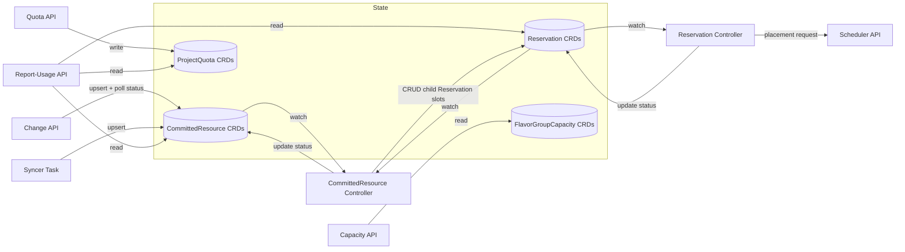
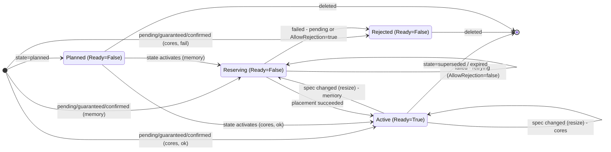
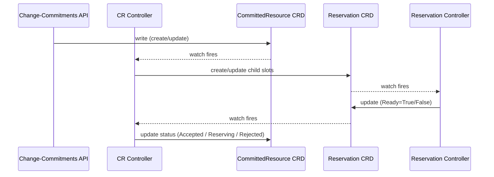
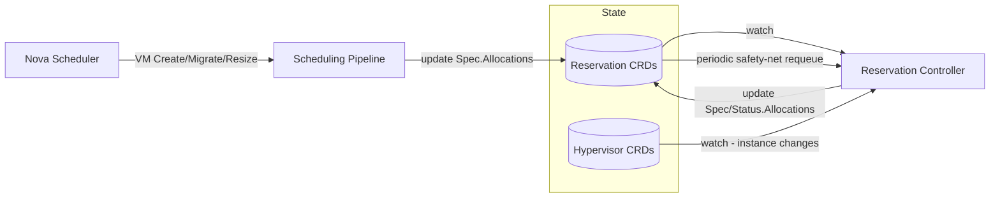

# Committed Resource Reservation System

Cortex reserves hypervisor capacity for customers who pre-commit resources (committed resources, CRs), and exposes usage and capacity data to Limes via the LIQUID API.

Implementation: `internal/scheduling/reservations/commitments/`

- [Committed Resource Reservation System](#committed-resource-reservation-system)
  - [Architecture Overview](#architecture-overview)
  - [Limes State → Cortex Action](#limes-state--cortex-action)
  - [Resource Types](#resource-types)
  - [Commitment Lifecycle](#commitment-lifecycle)
  - [Reservation Lifecycle](#reservation-lifecycle)
    - [Capacity Blocking](#capacity-blocking)
    - [InFlightReservation](#inflightreservation)
  - [APIs](#apis)
    - [Change-Commitments](#change-commitments)
    - [Quota](#quota)
    - [Report-Usage](#report-usage)
    - [Report-Capacity](#report-capacity)
    - [Capacity Reporting Reference](#capacity-reporting-reference)
      - [FlavorGroupCapacity CRD — per-flavor fields](#flavorgroupcapacity-crd--per-flavor-fields)
      - [FlavorGroupCapacity CRD — group-level fields](#flavorgroupcapacity-crd--group-level-fields)
      - [Prometheus metrics](#prometheus-metrics)
      - [Report-Capacity REST endpoint](#report-capacity-rest-endpoint)
  - [Syncer Task](#syncer-task)
  - [Placement Observability](#placement-observability)
  - [Configuration and Observability](#configuration-and-observability)

## Architecture Overview

The system is organized around two CRD types and two controllers. `CommittedResource` CRDs represent customer commitments; `Reservation` CRDs represent individual hypervisor capacity slots held on behalf of a commitment.


```mermaid
flowchart LR
    subgraph State
        CR[(CommittedResource CRDs)]
        Res[(Reservation CRDs)]
        PQ[(ProjectQuota CRDs)]
        FGCap[(FlavorGroupCapacity CRDs)]
    end

    Syncer[Syncer Task]
    ChangeAPI[Change API]
    QuotaAPI[Quota API]
    CapacityAPI[Capacity API]
    CRCtrl[CommittedResource Controller]
    ResCtrl[Reservation Controller]
    UsageAPI[Report-Usage API]
    Scheduler[Scheduler API]

    ChangeAPI -->|upsert + poll status| CR
    QuotaAPI -->|write| PQ
    Syncer -->|upsert| CR
    UsageAPI -->|read| CR
    UsageAPI -->|read| Res
    UsageAPI -->|read| PQ
    CapacityAPI -->|read| FGCap
    CR -->|watch| CRCtrl
    CRCtrl -->|CRUD child Reservation slots| Res
    CRCtrl -->|update status| CR
    Res -->|watch| CRCtrl
    Res -->|watch| ResCtrl
    ResCtrl -->|placement request| Scheduler
    ResCtrl -->|update status| Res
```

`FlavorGroupCapacity` CRDs are maintained by the capacity controller (outside this subsystem) and read by the Report-Capacity endpoint. `ProjectQuota` CRDs are written by the Quota API and read by the Report-Usage endpoint.

## Limes State → Cortex Action

| Limes State | Cortex action |
|---|---|
| `planned` | No capacity reserved |
| `pending` | One-shot acceptance attempt — accept or reject; no retry |
| `guaranteed` / `confirmed` | Accept and keep in sync; retry indefinitely unless `AllowRejection=true` |
| `superseded` / `expired` | Release all held capacity |

`AllowRejection` mirrors the request's `RequiresConfirmation` flag. When set, the controller rejects and rolls back on failure rather than retrying. On any rejection, capacity is rolled back to the last successfully accepted amount (or fully released if never accepted).

## Resource Types

Cortex handles two resource types with different acceptance mechanisms:

**Memory (`_ram`)** — Cortex creates `Reservation` CRDs on specific hypervisors. Acceptance requires the scheduler to place the required slots. If placement fails, the commitment is rejected or retried based on its state and `AllowRejection`.

**CPU cores (`_cores`)** — No `Reservation` CRDs are created. Cortex does an arithmetic headroom check: requested cores vs. total CPU capacity for the flavor group and AZ (from `FlavorGroupCapacity`) minus cores already held by active CRs. Lightweight, no scheduler interaction.

The two types share lifecycle states and acceptance/rejection semantics — they differ only in how capacity is verified and held.

## Commitment Lifecycle


```mermaid
stateDiagram-v2
    direction LR
    state "Planned (Ready=False)" as Planned
    state "Reserving (Ready=False)" as Reserving
    state "Active (Ready=True)" as Active
    state "Rejected (Ready=False)" as Rejected

    [*] --> Planned : state=planned
    [*] --> Reserving : pending/guaranteed/confirmed (memory)
    [*] --> Active : pending/guaranteed/confirmed (cores, ok)
    [*] --> Rejected : pending/guaranteed/confirmed (cores, fail)
    Planned --> Reserving : state activates (memory)
    Planned --> Active : state activates (cores, ok)
    Reserving --> Active : placement succeeded
    Reserving --> Rejected : failed - pending or AllowRejection=true
    Reserving --> Reserving : failed - retrying (AllowRejection=false)
    Active --> Reserving : spec changed (resize) - memory
    Active --> Active : spec changed (resize) - cores
    Active --> [*] : state=superseded / expired
    Rejected --> [*] : deleted
    Planned --> [*] : deleted
```

The reconcile trigger chain for memory commitments:


```mermaid
sequenceDiagram
    participant API as Change-Commitments API
    participant CRCtrl as CR Controller
    participant CRCRD as CommittedResource CRD
    participant ResCRD as Reservation CRD
    participant ResCtrl as Reservation Controller

    API->>CRCRD: write (create/update)
    CRCRD-->>CRCtrl: watch fires
    CRCtrl->>ResCRD: create/update child slots
    ResCRD-->>ResCtrl: watch fires
    ResCtrl->>ResCRD: update (Ready=True/False)
    ResCRD-->>CRCtrl: watch fires
    CRCtrl->>CRCRD: update status (Accepted / Reserving / Rejected)
```

## Reservation Lifecycle

*Applies to memory commitments only.*

A `Reservation` CRD represents one flavor-sized slot on a specific hypervisor. The Reservation controller uses the **Hypervisor CRD as the sole source of truth** for VM presence — no Nova API calls.


```mermaid
flowchart LR
    subgraph State
        Res[(Reservation CRDs)]
        HV[(Hypervisor CRDs)]
    end
    A[Nova Scheduler] -->|VM Create/Migrate/Resize| B[Scheduling Pipeline]
    B -->|update Spec.Allocations| Res
    Res -->|watch| C[Reservation Controller]
    HV -->|watch - instance changes| C
    Res -->|periodic safety-net requeue| C
    C -->|update Spec/Status.Allocations| Res
```

VM allocation has two fields with distinct semantics: `Spec.Allocations` (expected — written by the scheduling pipeline) and `Status.Allocations` (confirmed — written by the controller after the VM is verified on the expected hypervisor). New VMs stay in `Spec` only during a grace period to allow for startup time. After the grace period, absence from the Hypervisor CRD removes the VM.

When a VM is confirmed on a reservation for the first time, the controller proactively removes it from `Spec.Allocations` on all other candidate reservations. This frees phantom capacity blocks immediately rather than waiting for each candidate's grace period to expire.

`MaxConcurrentReconciles=1` on the Reservation controller is intentional — parallel reconciles would allow concurrent placements to race and double-book a slot.

### Capacity Blocking

Each active Reservation blocks capacity on its target hypervisor so the scheduler cannot double-allocate. The block is recalculated on every reconcile:

**Stable state (`Spec.TargetHost == Status.Host`):**

```
confirmed            = resources of VMs in both Spec and Status allocations
spec_only_unblocked  = resources of Spec-only VMs without an active InFlightReservation on this host
remaining            = max(0, Spec.Resources - confirmed)
block                = max(remaining, spec_only_unblocked)
```

The `spec_only_unblocked` term exists because an InFlightReservation on the same host already blocks those resources pessimistically — the CR reservation must not double-count them.

**Migration state (`Spec.TargetHost != Status.Host`):** Block full `max(Spec.Resources, spec_only_unblocked)` on **both** hosts. VMs may be split across hosts mid-migration; conservative blocking on both prevents overcommit until migration completes.

**Corner cases worth noting:**
- Confirmed VMs exceed reservation size (e.g. after resize): clamp `remaining` to 0, never negative
- Spec-only VM larger than remaining slot: block `spec_only_unblocked` — those resources will land when the VM starts
- Live migration within a reservation: handled implicitly by `hv.Status.Allocation`, which libvirt reports on both source and target during migration; no special logic needed

### InFlightReservation

A short-lived `InFlightReservation` CRD is created at the end of each VM placement run, one per candidate host returned to Nova. It pessimistically blocks capacity on every candidate while Nova decides where the VM lands — preventing a second concurrent placement from booking the same slot.

Created by the scheduling pipeline; deleted once the VM is confirmed on a host or after a timeout. Skipped for non-VM-placement runs (reservation scheduling, capacity probes, failover — all set `SkipInflight`).

## APIs

### Change-Commitments

`POST /commitments/v1/change-commitments`

**Write-intent, watch-for-outcome**: the handler writes `CommittedResource` CRDs and polls their `Ready` condition until terminal. It does not interact with Reservation CRDs directly.

**All-or-nothing semantics**: if any commitment in a batch cannot be fulfilled, the entire request is rolled back. All modified CRDs are restored to their pre-request specs.

### Quota

`PUT /commitments/v1/projects/:project_id/quota`

Persists Limes quota as `ProjectQuota` CRDs (one per project × AZ). The quota controller reconciles actual usage into each CRD's status. Writes are idempotent; concurrent writes are resolved with retry-on-conflict.

### Report-Usage

`POST /commitments/v1/projects/:project_id/report-usage`

Reports current usage per flavor group (ram, cores, instances). VM-to-commitment assignment is **pre-computed** by a background usage reconciler that writes into `CommittedResource.Status` — it is not calculated inline at request time. This assignment is deterministic but may differ from Cortex's internal scheduling assignment.

For flavor groups with `HandlesCommitments=true`, the response includes per-AZ quota from `ProjectQuota` CRDs.

### Report-Capacity

`POST /commitments/v1/report-capacity`

Reports available capacity per flavor group and AZ, read from pre-computed `FlavorGroupCapacity` CRDs. If a CRD's `Ready` condition is stale, usage is omitted from the response (capacity is still reported) to avoid underreporting during a controller outage.

### Capacity Reporting Reference

This section maps every reporting surface to the values it exposes, the resource dimensions it considers, and the cluster state it reflects.

#### FlavorGroupCapacity CRD — per-flavor fields

| Field | Dimensions | Cluster state | Notes |
|---|---|---|---|
| `TotalCapacityVMSlots` | Min(memory, CPU) | Empty datacenter | All reservation types ignored; competing groups not subtracted |
| `TotalCapacityHosts` | Min(memory, CPU) | Empty datacenter | Host count for `TotalCapacityVMSlots` |
| `PlaceableVMs` | Min(memory, CPU) | Current + reservations | If this flavor consumed all remaining capacity; competing groups not subtracted |
| `PlaceableHosts` | Min(memory, CPU) | Current + reservations | Host count for `PlaceableVMs` |

#### FlavorGroupCapacity CRD — group-level fields

| Field | Dimensions | Cluster state | Notes |
|---|---|---|---|
| `FreeCapacity` | Memory + Cores (separate) | Current + reservations | Raw sum across candidate hosts; may double-count across groups sharing hosts |
| `ExclusivelyFreeCapacity` | Memory + Cores (separate) | Current + reservations | Round-robin split result — sum across all groups never exceeds installed capacity |
| `ExclusivelyFreeSlots` | Min(memory, CPU) → Memory | Current + reservations | `ExclusivelyFreeCapacity[memory] / smallestFlavorMemBytes`; the memory pool is CPU-gated: the round-robin excludes hosts where the flavor doesn't fit on CPU before summing bytes |
| `TotalCapacity` | Memory + Cores (separate) | Empty datacenter | `max(TotalCapacityVMSlots × flavorResources)` over all flavors in the group |
| `CommittedCapacity` | Memory (slot units) | — | Active CR accepted amounts in smallest-flavor slot units |
| `RunningInstances` / `RunningResources` | Memory + Cores | — | Actual running VMs in this group × AZ |

#### Prometheus metrics

All metrics carry `flavor_group` and `az` labels; per-flavor metrics additionally carry `flavor_name`.

| Metric suffix | Source field | Dimensions | Cluster state |
|---|---|---|---|
| `_vm_slots_empty_datacenter` | `TotalCapacityVMSlots` | Min(memory, CPU) | Empty datacenter |
| `_vm_slots_placeable` | `PlaceableVMs` | Min(memory, CPU) | Current + reservations |
| `_hosts_empty_datacenter` | `TotalCapacityHosts` | Min(memory, CPU) | Empty datacenter |
| `_hosts_placeable` | `PlaceableHosts` | Min(memory, CPU) | Current + reservations |
| `_free_capacity_gib` | `FreeCapacity[memory]` | Memory only | Current + reservations — may overlap across groups |
| `_exclusively_free_capacity_gib` | `ExclusivelyFreeCapacity[memory]` | Memory only | Current + reservations |
| `_exclusively_free_slots` | `ExclusivelyFreeSlots` | Min(memory, CPU) → Memory | Current + reservations |
| `_committed_gib` | `CommittedCapacityBytes` | Memory | — |
| `_committed_reservations` | `CommittedCapacity` | Memory (slot units) | — |
| `_running_instances` | `RunningInstances` | — | — |

#### Report-Capacity REST endpoint

Capacity and usage are derived from `FlavorGroupCapacity` CRDs and reported per AZ for three resource types per group:

| Resource | Capacity formula | Usage formula | Notes |
|---|---|---|---|
| `_instances` | `runningInstances + ExclusivelyFreeSlots` | `runningInstances` | `ExclusivelyFreeSlots` is CPU-and-memory-gated (round-robin), final slot count via memory division |
| `_ram` (fixed core ratio) | same as `_instances` | `runningInstances` | Slot count stands in for RAM |
| `_ram` (variable) | `(runningMemBytes + ExclusivelyFreeCapacity[memory]) / ramUnitBytes` | `runningMemBytes / ramUnitBytes` | Both in declared units (e.g. GiB); `ramUnitBytes` configured per group |
| `_cores` | `runningCoresCount + ExclusivelyFreeCapacity[cores]` | `runningCoresCount` | CPU-dimension-driven |

## Syncer Task

Runs periodically and reconciles local `CommittedResource` CRD state against Limes' view, correcting drift from missed API calls or restarts. Writes `CommittedResource` CRDs only — capacity management remains the controller's responsibility.

## Placement Observability

The `internal/scheduling/nova/crs/` package classifies every placement decision by CR slot coverage and emits Prometheus metrics. This answers: "For each VM placement or no-host-found, what was the CR slot situation?"

| Metric | Labels | Description |
|--------|--------|-------------|
| `cortex_nova_no_host_found_total` | `cr_slot`, `flavor_group`, `intent` | No-host-found results classified by CR coverage |
| `cortex_nova_placement_total` | `flavor_group`, `intent`, `cr_slot` | Successful placements classified by CR slot outcome |

PAYG placements (flavor not in any configured group) are not counted.

**`cr_slot` values for no-host-found:**

| Value | Meaning |
|---|---|
| `no_cr` | Project has no active CommittedResources for the flavor group |
| `cr_exhausted` | CommittedResources exist but are fully occupied |
| `slot_exhausted` | CR has remaining capacity but no candidate host has a usable reservation slot |
| `slot_blocked` | A usable slot exists but scheduling constraints excluded all such hosts |

**`cr_slot` values for successful placements:**

| Value | Meaning |
|---|---|
| `no_cr` | No active CR or CR capacity fully exhausted |
| `slot_missed` | CR has remaining capacity but no candidate host has a slot with remaining memory > 0 |
| `slot_used` | CR has remaining capacity and at least one candidate host has a usable slot |

## Configuration and Observability

**Configuration**: `helm/bundles/cortex-nova/values.yaml` — API endpoint toggles, reconciliation intervals, scheduling pipeline selection, and per-flavor-group resource flags.

**Metrics and Alerts**: `helm/bundles/cortex-nova/templates/alerts.yaml`, prefixes:
- `cortex_committed_resource_change_api_*`
- `cortex_committed_resource_usage_api_*`
- `cortex_committed_resource_capacity_api_*`
